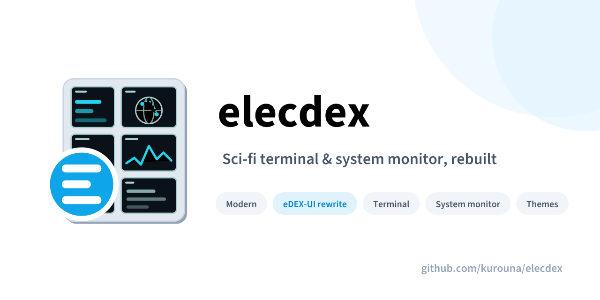
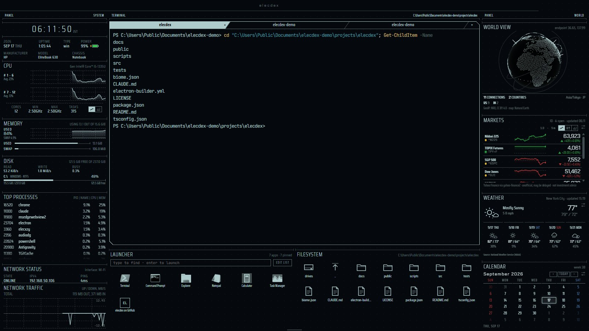
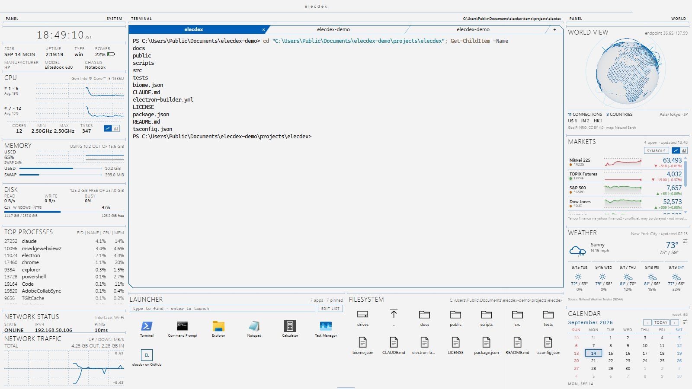
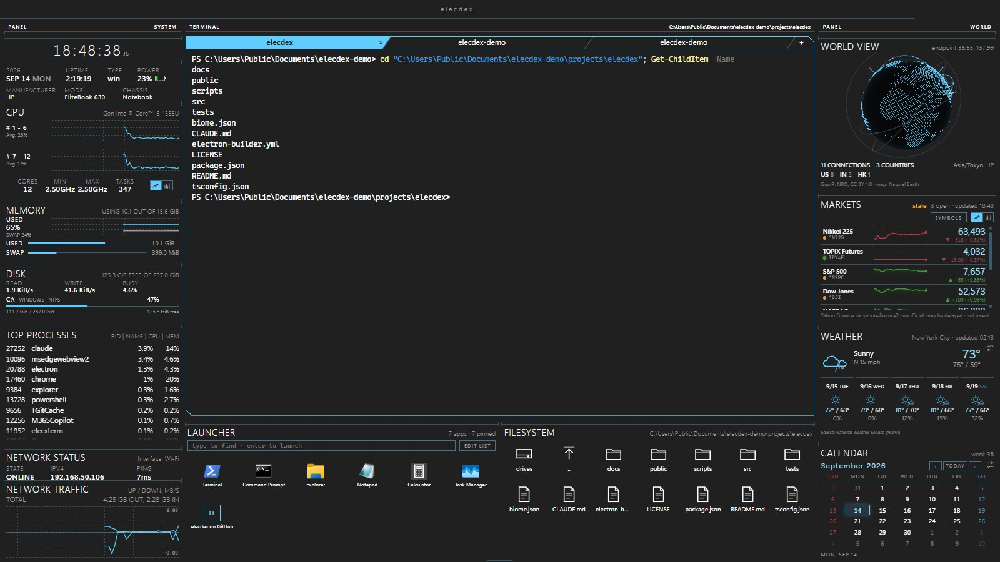
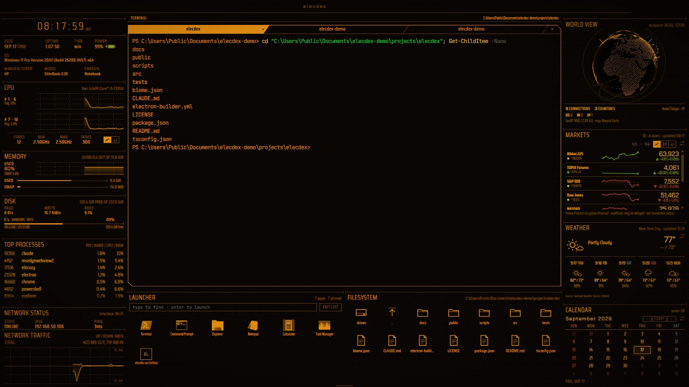
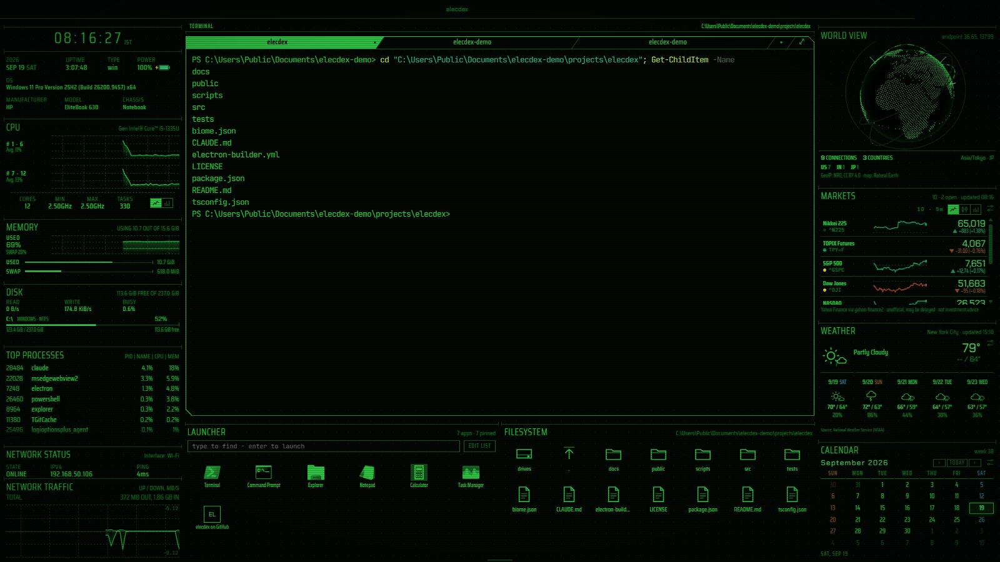
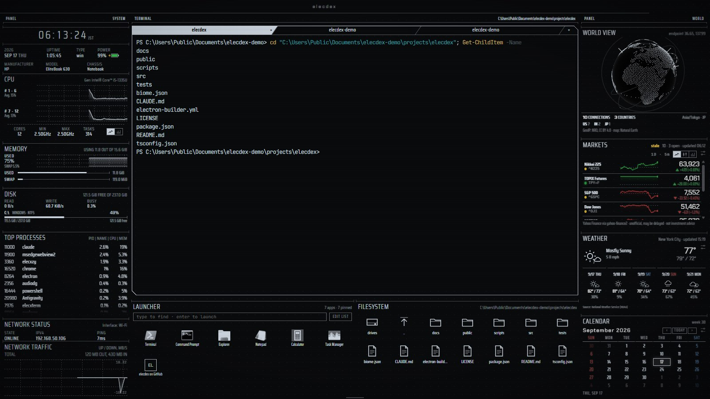
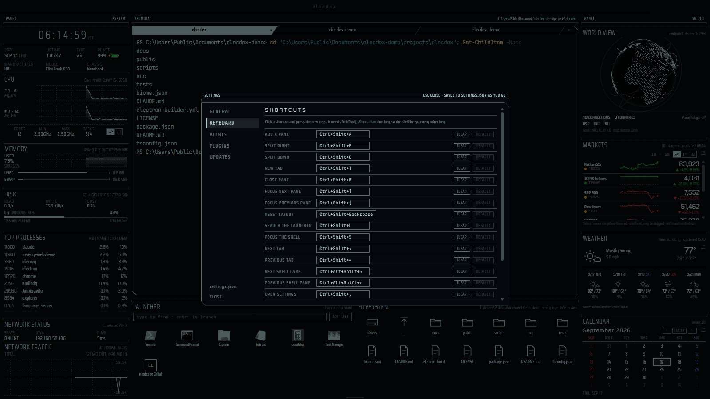
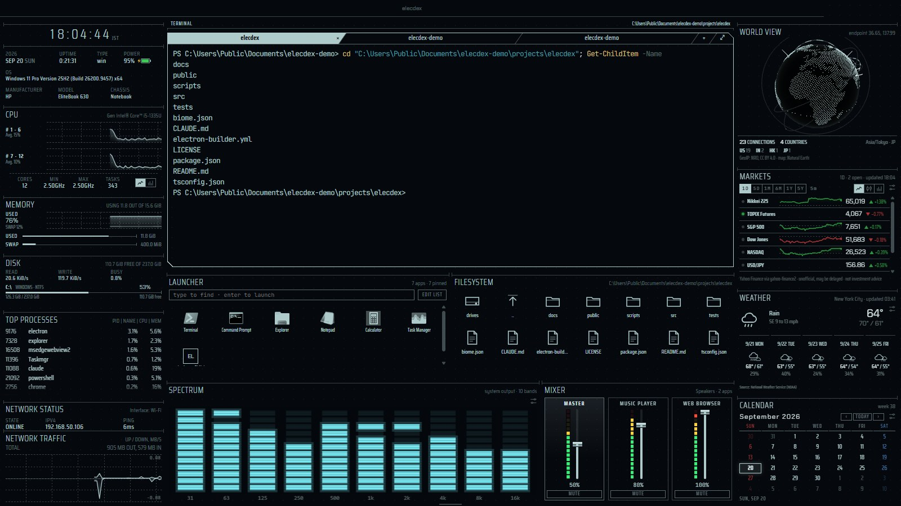

<p align="center">
  
</p>

[](https://www.gnu.org/licenses/gpl-3.0)
[](https://zenn.dev/kurouna)
[](https://x.com/elecxzy)

# elecdex

A science-fiction desktop terminal emulator and system monitor — a ground-up rewrite of
[eDEX-UI](https://github.com/GitSquared/edex-ui) (archived in 2021) on a current, secure stack,
for Windows, macOS and Linux.

<p align="center">
  
</p>

> **v0.0.4 — pre-release.** Everything below works today; builds are unsigned.
> Design notes and every decision with its reason: [docs/architecture.md](docs/architecture.md).

## Features

- **Terminal** — real shells (PowerShell, bash, zsh, fish) in unlimited tabs and splits. Shell
  integration reports the working directory and exit codes, on Windows too, and a session keeps
  its scrollback when its pane is moved or reloaded. The shell has focus at start; selecting text
  copies it and a right-click pastes.
- **System monitor** — clock with time zone, system strip with a battery gauge, per-core CPU (as
  graphs or bars), memory and swap over time, disks with read/write activity, top processes,
  network status and traffic. The default layout idles at about 13% of one core.
- **World view** — a globe of where the machine's connections go, placed with a bundled GeoIP
  database; nothing is looked up online.
- **Files and apps** — a file browser that follows the shell (click to `cd` or insert a path),
  and a launcher for the Start Menu, `/Applications` or `.desktop` entries plus your own, most
  used first.
- **Weather, markets and calendar** — forecasts for anywhere (JMA in Japan, the National Weather
  Service in the United States, MET Norway elsewhere), a market board from Yahoo Finance, and a
  month calendar with optional Japanese holidays.
- **RSS** — headlines from the RSS and Atom feeds you list, newest first, in a pane you add when
  you want it.
- **Earthquakes and tsunamis** — for Japan (JMA) or the world (USGS and NOAA): alerts at the
  intensity or magnitude you choose (off by default), tsunami warnings kept in sight while in
  effect, a quakes pane listing recent earthquakes, and their epicentres marked on the globe.
- **Spectrum and mixer** — a spectrum analyser of what the computer is playing, drawn like a
  1990s car stereo's display (fluorescent cyan or amber, LED, or the theme's colour), and a mixer
  for the system volume and each app playing sound, in panes you add when you want them.
- **Layout** — every pane can be moved by dragging its title, closed, split, tabbed, resized and
  brought back; the layout is saved and can be reset.
- **Look and feel** — six themes that switch live: Tron, Amber, Phosphor and White for the HUD,
  and Business (Dark) and Business (Light) in Windows 11 colours, system fonts and full-colour
  icons for an ordinary working day. A CRT power-on boot sequence after a Linux-style boot log of
  this machine's real facts (a pane added later powers on the same way), scanlines and glow,
  synthesised interface sounds, a themed title bar and a status bar that slides in from the bottom edge. Short
  entrance effects - a wave of dates for each month, a forecast rising in, new headlines and
  earthquakes sliding in with a three-second highlight - follow the motion setting: with motion
  reduced (or the system's reduce-motion setting), nothing moves.
- **Settings** — a settings dialog for theme, motion, sound, the terminal's start folder, the launcher, rebindable keyboard
  shortcuts and the update check, all saved to a hand-editable `settings.json`.

<table>
  <tr>
    <td></td>
    <td></td>
  </tr>
  <tr>
    <td align="center">Business (Light)</td>
    <td align="center">Business (Dark)</td>
  </tr>
  <tr>
    <td></td>
    <td></td>
  </tr>
  <tr>
    <td align="center">Amber</td>
    <td align="center">Phosphor</td>
  </tr>
  <tr>
    <td></td>
    <td></td>
  </tr>
  <tr>
    <td align="center">White</td>
    <td align="center">Settings → Keyboard</td>
  </tr>
  <tr>
    <td colspan="2"></td>
  </tr>
  <tr>
    <td colspan="2" align="center">Spectrum and mixer</td>
  </tr>
</table>

## Install

Download the installer for your platform from
[Releases](https://github.com/kurouna/elecdex/releases):

| Platform | File |
| --- | --- |
| Windows x64 / arm64 | `elecdex-win-x64-<version>.exe` / `elecdex-win-arm64-<version>.exe` |
| macOS Apple silicon / Intel | `elecdex-mac-arm64-<version>.dmg` / `elecdex-mac-x64-<version>.dmg` |
| Linux x64 | `elecdex-linux-x86_64-<version>.AppImage` or `elecdex-linux-amd64-<version>.deb` |
| Linux arm64 | `elecdex-linux-arm64-<version>.AppImage` or `elecdex-linux-arm64-<version>.deb` |

The builds are not code-signed yet. Windows SmartScreen shows "Windows protected your PC" — choose
*More info → Run anyway*. On macOS, open the app once with right-click → *Open* (or allow it in
*System Settings → Privacy & Security*).

elecdex starts fullscreen. **F11** leaves fullscreen and **Ctrl+Shift+Q** quits; `--windowed`
starts in a window and `--no-intro` skips the boot sequence.

## Keyboard

| Shortcut | Action |
| --- | --- |
| Ctrl+Shift+E | split the focused pane (a tab: its whole group) to the right |
| Ctrl+Shift+O | split the focused pane (a tab: its whole group) downward |
| Ctrl+Shift+T | new tab beside the focused pane |
| Ctrl+Shift+W | close the focused pane (or its × button, shown on hover) |
| Ctrl+Shift+[ / ] | move focus between panes |
| Ctrl+Shift+← / → | previous / next tab in the focused tab group, such as the shell's tabs |
| Ctrl+Alt+Shift+← / → | from a shell: previous / next shell pane (or group of shell tabs) |
| Ctrl+Shift+A | add a pane: any widget, right of, below or as a tab beside the focused pane |
| Ctrl+Shift+Backspace | reset to the default layout |
| Ctrl+Shift+L | search the launcher (adds a launcher pane if there is none) |
| Ctrl+Shift+S | focus the shell in its selected tab (adds a shell pane if there is none) |
| Ctrl+Shift+, | settings |
| F11 | toggle fullscreen |
| Ctrl+Shift+M | minimize the window (Windows, Linux) |
| Ctrl+Shift+Q | quit |
| Arrow keys on a divider | resize (Shift for larger steps) |

The shell has focus when elecdex starts. In a shell, selecting text copies it and a right-click
pastes, as in PuTTY or Windows Terminal; Ctrl+C stays the shell's interrupt. Outside a tab group
Ctrl+Shift+← / → still reach the shell, where PSReadLine selects by word.

Every shortcut except the divider keys can be rebound in *Settings → Keyboard*: click one and
press the new keys. A shortcut needs Ctrl (Cmd on macOS), Alt or a function key, so every other
key still reaches the shell, and a chord already in use is flagged. The status bar (move the
pointer to the bottom edge) has buttons for adding a pane, resetting the layout, settings, theme,
sound and exit. In fullscreen on Windows and Linux, moving the pointer into the top-right corner
brings down minimize, leave-fullscreen and quit buttons.

To move a pane, drag it by its title (a pane without one, such as the clock, by the rule along its
top) and drop it on another pane: it goes in beside that pane, on the side nearest the pointer. Hold
Ctrl (Cmd on macOS) while dropping to add it to that pane as a tab instead. A shell tab drags out on
its own, and a tab group's header moves the whole group. Escape cancels. A moved shell keeps its
session.

A tab group can hold any panes, not only shells, so a pane you need now and then can share a place
with the shells instead of taking room of its own - RSS or the weather behind the shell tabs, for
example. Put a pane in a group by Ctrl-dragging it onto the group as above, or focus a pane of the
group, open the picker (Ctrl+Shift+A or the status bar's add button) and choose **⧉ new tab**
before the widget. Clicking the tabs then switches between them; a shell in a background tab keeps
running, and its session and screen are there when you switch back. Groups do not nest: a tab
holds one pane.

## Panes

The default layout is arranged by what the panes are for — **left, this machine:** clock, system,
CPU, memory, disk, top processes, network status and traffic; **centre, work:** three shell tabs
over the launcher and the file browser; **right, the world outside:** world view, markets,
weather and calendar.

- **Terminal** — the pane is headed TERMINAL with the selected shell's full path; each tab is
  named after its folder (home too, by its own name), with parent folders added only when two tabs would read
  the same, and shows the shell and full path on hover. A non-zero exit code is flagged on the
  tab. New shells start in the home folder, or in the folder set under *Settings → General →
  Terminal* ("~" for home; a folder that no longer exists falls back to home).
- **System** — date and weekday, uptime, OS, and power with a battery gauge (green, red below 20%).
- **CPU** — two graphs of the cores' average load, or a bar per logical core (toggle in the pane).
- **Memory** — the share in use and swap over the last minute, scrolling in step with the CPU
  graphs, with bars for the amounts now.
- **Disk** — each volume as a bar of used space against its size (amber from 90%, red from 97%),
  with space left, filesystem and whether it is removable or on the network; above them the read
  and write rates and how busy the disks are (not shown on macOS, which has no cheap reading).
- **Launcher** — the platform's applications plus your own entries, most used first. Type to
  filter, Enter to launch. Icons take the theme's accent and show their own colours on hover (always, in the Business themes); on
  Windows they are drawn by the Windows shell, as the Start Menu shows them. Add
  entries under `launcher.items` in `settings.json` (the pane's EDIT LIST button opens it):

  ```json
  "launcher": {
    "showSystem": true,
    "items": [
      { "name": "Project notes", "target": "C:\\Users\\me\\notes.md" },
      { "name": "Docs", "target": "https://github.com/kurouna/elecdex" },
      { "name": "Node REPL", "target": "C:\\Program Files\\nodejs\\node.exe", "args": ["-i"] }
    ]
  }
  ```

- **Filesystem** — the followed shell's directory as a grid; click a folder to `cd` into it, a
  file to type its quoted path at the prompt.
- **World view** — connections by country on a turning globe. "You are here" is the country of
  the system time zone (or of the locale, when the zone names none); the OS location service is
  never asked.
- **Markets** — indices, currencies and anything Yahoo Finance quotes, about once a minute, as
  sparklines, candlesticks or bars of the change. The settings button picks the range - 1D (5-minute
  bars), 5D (30-minute), 1M (hourly), 6M (daily), 1Y (weekly) or 5Y (monthly) - and edits the list,
  each symbol optionally followed by a label: `^N225 日経平均, JPY=X ドル円, 7203.T トヨタ`. 1D
  measures from the previous close, longer ranges from the close before the range began. Built-in
  names follow the app language (`--lang=en-US` forces English). Yahoo has no live TOPIX index, so
  the default board shows the CME yen TOPIX future (`TPY=F`).
- **Weather** — the settings button → PLACE opens a picker over a bundled list of large cities and
  capitals and JMA's forecast offices, or takes `lat, lon`. Japan uses JMA, the United States the
  National Weather Service (or MET Norway, by choice), everywhere else MET Norway. °C or °F, and
  the week forecast on or off, per pane; the default is New York City.
- **RSS** — not in the default layout: add it from the picker (Ctrl+Shift+A). It starts empty and
  fetches nothing until its settings button lists feed URLs, one per line (RSS 2.0, RSS 1.0 or Atom, up to 10
  per pane). The newest 20 headlines across its feeds are shown, each with its feed and the time
  (today) or date (earlier), and the list scrolls when the pane is shorter. A click opens the
  article in the browser. Each feed is checked **every 15 minutes** while a pane lists it — less
  often only when the feed itself asks (Cache-Control, Expires or `<ttl>`), and never less than
  hourly — with conditional requests, so an unchanged feed is not downloaded again. A feed that
  fails keeps its last headlines and marks the pane STALE. Several panes listing the same feed
  share one request, and closing the last one stops it. A headline that arrives while the pane is
  open slides in at its place and is highlighted for three seconds; if the list is scrolled down,
  what is being read stays put and a "↑ n new" pill leads back up.
- **Quakes** — not in the default layout: add it from the picker. Recent earthquakes, newest
  first, from the source chosen in *Settings → Alerts*: **Japan** (the Japan Meteorological Agency:
  the maximum seismic intensity, shindo, amber from 3 and red from 5-, and distant earthquakes JMA
  reports) or **the world** (the USGS: magnitude 4.5 and up, amber from 5 and red from 6). Each row
  has the place, time, magnitude and depth, and opens the source's page. A tsunami warning, watch or
  advisory in effect shows as a strip above the list. The pane shows what alerts are set to, and its
  settings button opens them. A new earthquake slides in highlighted in its colour, with the same
  "↑ n new" pill as the RSS pane when the list is scrolled down. While the pane is open, or alerts are on, the source is checked
  **every minute** (conditionally, so an unchanged list costs no download); with neither, nothing is
  fetched. The world view then marks the day's earthquakes at their epicentres, sized by magnitude
  and coloured like the list, and an earthquake from the last hour pulses. **Not an earthquake early
  warning:** reports come a minute or more after the shaking, and the pane and alerts say so.
- **Earthquake and tsunami alerts** — *Settings → Alerts*, off by default. The source is automatic
  (Japan when the system time zone is Tokyo or the locale is ja-JP, the world otherwise) or chosen.
  When on, an earthquake at or above the chosen maximum intensity (Japan, default 5-, 5弱) or
  magnitude (world, default 6.0) shows a banner at the top of the screen with the place, intensity
  or magnitude and depth, updated as later reports arrive; a severe one stays until closed, a weaker
  one goes after a minute. A **tsunami** warning, watch or advisory (JMA's 大津波警報・津波警報・津波注意報
  for Japan, NOAA's Pacific and National Tsunami Warning Centers for the world; can be turned off)
  shows a card with its level, the areas with expected arrival and height, and the issuer's
  headline. Closing it folds it into a small tab while it is in effect, and when it is lifted the
  card says so. A raised level is announced again. An alert sound plays (with interface sounds on),
  and a system notification appears when elecdex is not in front; both can be turned off. Each
  earthquake is announced once, and only while recent (30 minutes for Japan, an hour for the world),
  so starting the app later does not announce old news.
- **Calendar** — the month with today marked; ‹ › or the mouse wheel change month, and the dates
  sweep in the way it moved. The settings
  button ticks holiday calendars (Japan for now, computed locally), and the next holiday is named
  below the month.
- **Spectrum** — not in the default layout: add it from the picker. The system's sound output in
  7, 10 or 16 bands, in columns of segments with held peaks; the settings button picks the style
  (VFD cyan, the default, VFD amber, LED or the theme), the band count, bars, a mirrored pattern
  or peaks only, and peak hold. It listens only while the pane is on screen - not in a background
  tab - and draws only while there is sound, 20 frames a second (about a third of a core while
  sound plays, a tenth while it is silent, on an i5-1335U). Capture runs in a hidden window of its own, and only
  the levels reach the pane; nothing is recorded. Tested on Windows; macOS should work through
  the same screen-capture route (with screen recording permission) but is untested. On Linux,
  where Electron has no loopback capture, `parec` (pulseaudio-utils, for PulseAudio or PipeWire)
  records the monitor of the default output instead.
- **Mixer** — not in the default layout: add it from the picker. The output device's volume and
  mute, and on Windows and Linux each app playing sound, with faders, mute buttons and, on
  Windows, peak meters. macOS has the master volume only. Read while the pane is on screen: on
  Windows through one long-lived PowerShell, on macOS with AppleScript and on Linux with
  pactl (PulseAudio or PipeWire; pactl from PulseAudio 16 or later), or WirePlumber's wpctl for
  the master volume where pactl is missing.

## Plugins

A plugin adds a pane. It is a TypeScript or JavaScript file, or a folder with an `index.ts`, in the
`plugins` folder under the app's userData (*Settings → Plugins → open plugins folder*); edits load
as you save, and `elecdex-plugin.d.ts` beside them gives an editor the API's types. A new plugins
folder comes with a **pomodoro timer** (`examples/plugins/pomodoro` in this repository): focus
sessions, short breaks and a long break every few rounds, with a VFD meter, a chime and a
notification when a phase ends, carrying on across restarts.

Plugins are off until turned on in *Settings → Plugins*, which lists what each may do - read
metric sources, reach named hosts (each request made by the app and checked against that list),
use its own sign-in session for a site, keep running with no pane open, notify - and asks before
the first run and again if a plugin later asks for more. A plugin runs in a Web Worker of its own,
with no access to the page, your files or the network, and draws only through blocks the app
renders in the theme (text, numbers, meters, charts, tables, lists, buttons). A plugin that stops
answering is stopped without holding up the app. The API and the rules are in
[docs/plugins.md](docs/plugins.md).

## Themes and settings

Everything in the settings dialog is saved at once to `settings.json` in the app's userData
folder, which can also be edited by hand while the app runs. A file that does not parse is left where it
is (the defaults apply until it is fixed), and is copied to `settings.json.bak` before a change
from the app replaces it:

```json
{
  "theme": "amber",
  "sound": { "enabled": true, "volume": 0.5 },
  "motion": "system",
  "terminal": { "startDirectory": "~/work" },
  "keybindings": { "app.quit": null },
  "updates": { "check": true },
  "quakes": { "source": "auto", "notify": true, "minIntensity": "5-", "minMagnitude": 6, "tsunami": true, "system": true, "sound": true }
}
```

To add a theme, drop a JSON file into the `themes` folder next to it (*Settings → General →
themes folder*). It appears straight away; one with a built-in's `id` replaces that theme.

```json
{
  "id": "ice",
  "name": "Ice",
  "accent": { "h": 200, "s": 60, "l": 70 },
  "surfaces": { "s0": "#000000", "s1": "#010203", "s2": "#040506", "line": "#101820" },
  "terminal": { "ansiPull": 0.5, "ansi": { "red": "#ff5f56" } },
  "effects": { "scanlines": false, "glow": 0.2 }
}
```

Colours are `#rrggbb`; `status` (hues for danger / warn / ok / info), `fonts` and `text`
(`primary` and `muted` text colours; text is the accent without it), `mode` (`"light"` for a
light ground: darker status colours, and the terminal raises faint colours to 4.5:1) and
`effects.iconTint` (`false` shows launcher icons in their own colours) are optional.
The layout lives in `layout.json` beside them; a hand-edited file is validated on load, and one
that cannot be read is moved aside to `layout.json.bak` rather than discarded.

## Why a rewrite

eDEX-UI was archived with, in its author's words, a codebase "in dire need of a fresh
refactoring". elecdex keeps the idea and drops the implementation:

| eDEX-UI | elecdex |
| --- | --- |
| PTY tunnelled over a localhost WebSocket (ports 3000+) | `MessageChannelMain`, one channel per session; no listening socket |
| `nodeIntegration: true`, `contextIsolation: false`, `@electron/remote` | `sandbox: true`, `contextIsolation: true`, a single typed preload bridge; the renderer has no network or filesystem access |
| `cluster` fork per core; every widget polls `systeminformation` on its own timer | one `utilityProcess` and a subscription-driven scheduler that stops when nobody is watching; on Windows, one long-lived sampler instead of a PowerShell per reading (monitoring cost measured 144% → 14% of one core) |
| CWD tracked by polling `/proc`, `lsof` and `ps` — unsupported on Windows | shell integration (`OSC 7` / `OSC 133`), so Windows works too |
| Five hardcoded screen regions, five terminal tabs | a persisted layout tree: unlimited panes, splits and tabs |
| No bundler; minify-as-postprocess | electron-vite (Vite + Rollup) |

## Develop

Stack: Electron 44 · TypeScript 7 (native) · electron-vite 5 / Vite 7 · Svelte 5 (runes) ·
`@xterm/xterm` 6 · node-pty 1.1 · systeminformation · three · zod 4 · Biome 2 · Vitest 5 ·
Playwright · electron-builder 26

```bash
npm ci
npm run dev -- -- --windowed --no-intro   # the second -- hands flags to Electron; npm start is the same
```

```bash
npm run verify       # lint + typecheck + unit/component tests
npm run build        # bundle main / preload / renderer into out/
npm run test:e2e     # Playwright against the built app (run build first)
npm run package      # installers into release/
```

No native toolchain is needed on **Windows or macOS**: node-pty ships prebuilt N-API binaries that
Electron loads as-is. On **Linux** node-pty compiles once during install (`python3`, `make`, a C++
compiler); npm 11 asks for approval first: `npm install-scripts approve node-pty && npm rebuild
node-pty`.

The Electron binary is downloaded by this project's `postinstall` script (Electron 44 has no
install script of its own, and electron-vite does not trigger its download-on-first-use), which
also makes node-pty's macOS `spawn-helper` executable. After `--ignore-scripts`, run
`npx install-electron` once.

End-to-end tests never contact a real service: weather, markets and the update check are pointed
at closed ports or local stubs (JMA's earthquake and tsunami lists with the forecasts, and the USGS
and NOAA feeds), and RSS feeds are served by a local server.

```
src/shared/     contracts shared by all processes (API types, IPC channel names, schemas, pure logic)
src/main/       app lifecycle, window, IPC handlers, pty, weather, markets, feeds, quakes, launcher, updates
src/preload/    the one and only contextBridge surface
src/renderer/   Svelte 5 UI: layout tree, widgets, dialogs, design tokens
src/services/   utilityProcess: the metrics collector
tests/          unit (vitest) · component (vitest + jsdom) · e2e (playwright _electron)
scripts/        asset generators (icon, banner, globe data, city list, README screenshots)
```

### Releasing

1. Set `version` in `package.json`, commit, and push.
2. Tag that commit `v<version>` and push the tag: `git tag v0.1.0 && git push origin v0.1.0`.
3. The Release workflow checks the tag against `package.json`, runs lint, typecheck and unit tests,
   creates a GitHub pre-release with generated notes, and attaches installers for Windows (x64,
   arm64), macOS (arm64, x64) and Linux (AppImage and deb, x64 and arm64).
4. Review the pre-release and, when it is ready, untick "Set as a pre-release". The update check
   ignores pre-releases, so only then do running copies announce it.

## Data sources

| Data | Source | Notes |
| --- | --- | --- |
| Weather, Japan | [Japan Meteorological Agency](https://www.jma.go.jp/) forecast JSON: `https://www.jma.go.jp/bosai/forecast/data/forecast/<office code>.json` | Read directly as JSON, not scraped from the web page. This is the data JMA's own [forecast page](https://www.jma.go.jp/bosai/forecast/) loads, not a documented API, so it is parsed leniently and the last forecast stays on screen if it fails. Fetched only while a weather pane shows a place in Japan, around JMA's publication times (0, 5, 11 and 17 o'clock JST), with conditional requests. Used under JMA's [terms of use](https://www.jma.go.jp/jma/kishou/info/coment.html), which ask for the credit 「出典：気象庁ホームページ（https://www.jma.go.jp/bosai/forecast/）を加工して作成」; the pane shows it, naming the forecast page the JSON belongs to. |
| Weather, United States | [National Weather Service](https://www.weather.gov/) (api.weather.gov) | Open data. The point lookup is kept for a day; the forecast is asked for about hourly, only while a pane shows the place. |
| Weather, everywhere else | [MET Norway](https://api.met.no/) Locationforecast 2.0 | [CC BY 4.0](https://api.met.no/doc/License), credited in the pane. Requests follow the [terms of service](https://api.met.no/doc/TermsOfService): an identifying User-Agent, coordinates to four decimals, nothing before the `Expires` of the last response (and at least 30 minutes apart), If-Modified-Since. |
| City list for the weather picker | [GeoNames](https://www.geonames.org/) (cities of 500,000 people or more, and capitals) | [CC BY 4.0](https://creativecommons.org/licenses/by/4.0/); bundled. Nothing typed in the picker is sent anywhere. |
| Market quotes | [Yahoo Finance](https://finance.yahoo.com/), through yahoo-finance2 | Unofficial API, not endorsed by Yahoo; quotes may be delayed and are not investment advice (the pane says so). Fetched only while a markets pane is open: one batched request a minute (every five minutes when every listed market is closed), and each chart every five minutes (1D) to hourly (6M and longer). |
| Earthquakes | [Japan Meteorological Agency](https://www.jma.go.jp/) earthquake list JSON: `https://www.jma.go.jp/bosai/quake/data/list.json` | The data JMA's own [earthquake page](https://www.jma.go.jp/bosai/map.html#contents=earthquake_map) loads (about a month of reports), read as JSON. Fetched only while a quakes pane is open or earthquake alerts are on: once a minute, as its `max-age=60` asks, with If-None-Match, so an unchanged list is a 304. Used under JMA's [terms of use](https://www.jma.go.jp/jma/kishou/info/coment.html); the pane credits 「出典：気象庁ホームページ（URL）を加工して作成」 and the alerts name JMA. Not the Earthquake Early Warning. |
| Tsunamis, Japan | JMA tsunami list JSON: `https://www.jma.go.jp/bosai/tsunami/data/list.json` and each report it names | Checked with the earthquake list (usually an empty list, a 304 after the first request); a new report's details are fetched once. Warnings, major warnings and advisories count; forecasts and liftings do not. Credited like the earthquakes. |
| Earthquakes, world | [USGS](https://earthquake.usgs.gov/) real-time feed `summary/4.5_day.geojson` | Public domain. Fetched only while the world source is in use by a quakes pane or alerts: once a minute (its `max-age=60`), conditionally. |
| Tsunamis, world | [NOAA Tsunami Warning Centers](https://www.tsunami.gov/): the Pacific (`PHEBAtom.xml`) and National (`PAAQAtom.xml`) Atom feeds | Public domain. Each holds the centre's latest bulletin; warnings, watches, advisories and threat messages count, information statements do not. Checked with the USGS feed, conditionally. Alerts say to follow local authorities. |
| RSS feeds | The feed URLs you list in an RSS pane | Fetched by the app, never by the page, only while a pane lists them: every 15 minutes (or as the feed asks, at most hourly), conditionally (If-None-Match / If-Modified-Since), two at a time, up to 2 MB each, without cookies and with an `elecdex/<version>` User-Agent. Headlines are shown as plain text; the last ones per feed are kept in `feeds-cache.json` in the app's data folder. Nothing is sent to any other site. |
| Update check | [GitHub Releases API](https://docs.github.com/rest/releases/releases#get-the-latest-release) | One request for the latest published release, 15 seconds after start and then daily, while enabled (the default). Nothing is downloaded or installed: a newer release shows a notice that opens its page. |

## Third-party assets

| Asset | Source | License |
| --- | --- | --- |
| Display font | [Chakra Petch](https://fonts.google.com/specimen/Chakra+Petch) | SIL OFL 1.1 |
| UI font | [Saira Condensed](https://fonts.google.com/specimen/Saira+Condensed) | SIL OFL 1.1 |
| Monospace font | [JetBrains Mono](https://www.jetbrains.com/lp/mono/) | SIL OFL 1.1 |
| IP geolocation | [`@ip-location-db/geo-whois-asn-country-mmdb`](https://github.com/sapics/ip-location-db), data by the [NRO](https://www.nro.net/) | [CC BY 4.0](https://creativecommons.org/licenses/by/4.0/) (the npm package is labelled CC0-1.0; its bundled NRO_LICENSE requires attribution to nro.net) |
| Globe land and country shapes | [Natural Earth](https://www.naturalearthdata.com/) via [world-atlas](https://github.com/topojson/world-atlas) | Public domain / ISC (build time only) |
| Country codes and time zones | [i18n-iso-countries](https://github.com/michaelwittig/node-i18n-iso-countries), [countries-and-timezones](https://github.com/manuelmhtr/countries-and-timezones) | MIT (build time only) |
| README banner font | [Source Sans 3](https://fonts.google.com/specimen/Source+Sans+3) | SIL OFL 1.1 (outlined into the SVG at build time) |
| Market data client | [yahoo-finance2](https://github.com/gadicc/yahoo-finance2) | MIT (bundled into the main process) |

The geolocation database is bundled, so there is no account, no API key and no first-run
download, and IP lookups never leave the machine.

---

## License / ライセンス

This software is released under the [GNU General Public License v3.0](./LICENSE), the same license
as eDEX-UI.  
本ソフトウェアは、eDEX-UI と同じ [GNU General Public License v3.0](./LICENSE) のもとで公開されています。

## Acknowledgements / 謝辞

This application is deeply inspired by the design and philosophy of the following pioneering
project. We express our utmost respect and gratitude to its creator and contributors:

本アプリケーションは、以下の先駆的なプロジェクトの設計と哲学に深くインスパイアされています。
この優れたソフトウェアを生み出した開発者およびコミュニティの皆様に、最大限の敬意と謝意を表します。

- **[eDEX-UI](https://github.com/GitSquared/edex-ui)**
  - Copyright (c) 2017-2021 Gabriel "Squared" Saillard
  - Created by Gabriel "Squared" Saillard ([gaby.dev](https://gaby.dev))
  - Licensed under the GNU General Public License v3.0

---

<p align="center">Copyright © 2026 elecxzy project</p>
