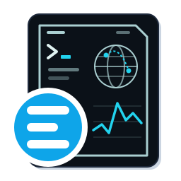

<p align="center"></p>

# elecdex

A science-fiction desktop terminal emulator and system monitor — a ground-up rewrite of
[eDEX-UI](https://github.com/GitSquared/edex-ui) (archived in 2021) on a current stack.

> **Status: Phase 5 — themes and sound.** The eDEX-UI HUD, rebuilt: live CPU, memory,
> process, network and system widgets around a multi-tab terminal, a file browser that follows
> the terminal's directory (Windows included) and a JMA weather forecast, in a persisted layout
> tree, behind eDEX-UI's boot sequence with each pane switching on like a CRT. Three themes
> (Tron, Amber, Phosphor) switch live, and interface sounds are synthesised.
> The default layout idles at about 10% of one core. The globe (Phase 6) is still a placeholder.
> See [docs/architecture.md](docs/architecture.md) and [docs/plugins.md](docs/plugins.md).

## Why a rewrite

eDEX-UI was archived with, in its author's words, a codebase "in dire need of a fresh
refactoring". elecdex keeps the idea and drops the implementation:

| eDEX-UI | elecdex |
| --- | --- |
| PTY tunnelled over a localhost WebSocket (ports 3000+) | `MessageChannelMain`, one channel per session; no listening socket |
| `nodeIntegration: true`, `contextIsolation: false`, `@electron/remote` | `sandbox: true`, `contextIsolation: true`, a single typed preload bridge |
| `cluster` fork per core; every widget polls `systeminformation` on its own timer | one `utilityProcess` and a subscription-driven scheduler that stops when nobody is watching; on Windows, one long-lived sampler instead of a PowerShell per reading (monitoring cost measured 144% → 14% of one core) |
| CWD tracked by polling `/proc`, `lsof` and `ps` — unsupported on Windows | shell integration (`OSC 7` / `OSC 133`), so Windows works too |
| Five hardcoded screen regions, five terminal tabs | a persisted layout tree: unlimited panes, splits and tabs |
| No bundler; minify-as-postprocess | electron-vite (Vite + Rollup) |

## Stack

Electron 44 · TypeScript 7 (native) · electron-vite 5 / Vite 7 · Svelte 5 (runes) ·
`@xterm/xterm` 6 · node-pty 1.1 · systeminformation · three + threlte · zod · Biome 2 ·
Vitest 5 · Playwright · electron-builder 26

## Develop

No native toolchain is needed on **Windows or macOS**. node-pty is an N-API addon that ships
prebuilt, ABI-stable binaries which Electron loads as-is, so `npm ci` never invokes node-gyp and
you do not need Visual Studio or Xcode. On **Linux** node-pty has no prebuild and compiles once
during install, which needs `python3`, `make` and a C++ compiler (e.g. `build-essential`).

The Electron binary itself is downloaded on first launch rather than during install.

```bash
npm install
npm run dev          # electron-vite dev, with HMR in the renderer
```

```bash
npm run verify       # lint + typecheck + unit/component tests
npm run build        # bundle main / preload / renderer into out/
npm run test:e2e     # Playwright against the built app (run build first)
npm run package      # installers into release/
```

`npm run dev -- --windowed` (or passing `--windowed` to the packaged binary) starts in a normal
window instead of fullscreen, and `--no-intro` skips the boot sequence. The boot sequence also
plays only once per window (a reload skips it), any key or click cuts it short, and it is
skipped when the OS asks for reduced motion.

## Keyboard

| Shortcut | Action |
| --- | --- |
| Ctrl+Shift+E | split the focused pane to the right |
| Ctrl+Shift+O | split the focused pane downward |
| Ctrl+Shift+T | new tab beside the focused pane |
| Ctrl+Shift+W | close the focused pane (or its × button, shown on hover) |
| Ctrl+Shift+[ / ] | move focus between panes |
| Ctrl+Shift+Backspace | reset to the default layout |
| Ctrl+Shift+A | add a pane: pick any widget, placed right of, below or as a tab beside the focused pane (also the + PANE button) |
| Ctrl+Shift+Q | quit (or the EXIT button in the footer, clicked twice) |
| F11 | toggle fullscreen |
| Arrow keys on a divider | resize (Shift for larger steps) |

The layout is saved to `layout.json` in the app's userData directory. Editing it by hand is
supported: it is validated and normalised on load, and a file that cannot be read is moved
aside to `layout.json.bak` rather than discarded.

## Themes and settings

Pick a theme from the footer; it applies at once, terminal included, with no reload. The
footer also toggles interface sounds. Settings live in `settings.json` in the userData
directory and can be edited by hand while the app runs:

```json
{ "theme": "amber", "sound": { "enabled": true, "volume": 0.5 }, "motion": "system" }
```

To add a theme, drop a JSON file into the `themes` folder next to it. It appears in the menu
straight away; one with a built-in's `id` replaces that theme.

```json
{
  "id": "ice",
  "name": "Ice",
  "accent": { "h": 200, "s": 60, "l": 70 },
  "surfaces": { "s0": "#000000", "s1": "#010203", "s2": "#040506", "line": "#101820" },
  "terminal": { "ansiPull": 0.5, "ansi": { "red": "#ff5f56" } },
  "effects": { "scanlines": false, "glow": 0.2 }
}
```

Colours are `#rrggbb`; `status` (hues for danger / warn / ok) and `fonts` are optional.
The glow effect costs a couple of percent of a core at idle.

## Layout

```
src/shared/     contracts shared by all three processes (API types, IPC channel names, schemas)
src/main/       app lifecycle, window, IPC handlers, pty, metrics broker, settings, themes
src/preload/    the one and only contextBridge surface
src/renderer/   Svelte 5 UI: layout tree, widgets, design tokens
src/services/   utilityProcess entrypoints (metrics, geoip)
tests/          unit (vitest) · component (vitest + jsdom) · e2e (playwright _electron)
```

## Third-party assets

| Asset | Source | License |
| --- | --- | --- |
| Display font | [Chakra Petch](https://fonts.google.com/specimen/Chakra+Petch) | SIL OFL 1.1 |
| UI font | [Saira Condensed](https://fonts.google.com/specimen/Saira+Condensed) | SIL OFL 1.1 |
| Monospace font | [JetBrains Mono](https://www.jetbrains.com/lp/mono/) | SIL OFL 1.1 |
| IP geolocation | [`@ip-location-db/geo-whois-asn-country-mmdb`](https://github.com/sapics/ip-location-db) | CC0-1.0 |
| Globe geometry | [Natural Earth](https://www.naturalearthdata.com/) | Public domain |

The geolocation database is bundled, so there is no account to create, no API key and no
first-run download — and IP lookups never leave the machine.

## Data sources

| Data | Source | Notes |
| --- | --- | --- |
| Weather forecast | 出典：気象庁ホームページ（[https://www.jma.go.jp/bosai/forecast/](https://www.jma.go.jp/bosai/forecast/)）を加工して作成 | Fetched only while a weather pane is open, and only around JMA's publication times (0, 5, 11 and 17 o'clock JST), with conditional requests. The weather pane shows the same attribution. Used under JMA's [terms of use](https://www.jma.go.jp/jma/kishou/info/coment.html). |

The forecast JSON is what JMA's own pages load, not a documented API; elecdex parses it
leniently and keeps showing the last forecast if the format or the network fails.

---

## License / ライセンス

This software is released under the [GNU General Public License v3.0](./LICENSE), the same license
as eDEX-UI.  
本ソフトウェアは、eDEX-UI と同じ [GNU General Public License v3.0](./LICENSE) のもとで公開されています。

## Acknowledgements / 謝辞

This application is deeply inspired by the design and philosophy of the following pioneering
project. We express our utmost respect and gratitude to its creator and contributors:

本アプリケーションは、以下の先駆的なプロジェクトの設計と哲学に深くインスパイアされています。
この優れたソフトウェアを生み出した開発者およびコミュニティの皆様に、最大限の敬意と謝意を表します。

- **[eDEX-UI](https://github.com/GitSquared/edex-ui)**
  - Copyright (c) 2017-2021 Gabriel "Squared" Saillard
  - Created by Gabriel "Squared" Saillard ([gaby.dev](https://gaby.dev))
  - Licensed under the GNU General Public License v3.0
