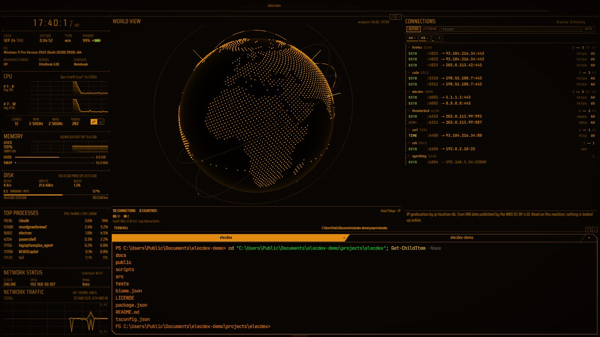
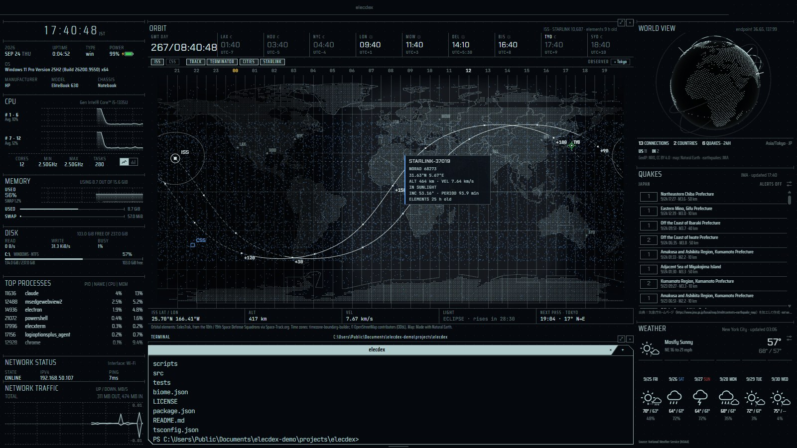
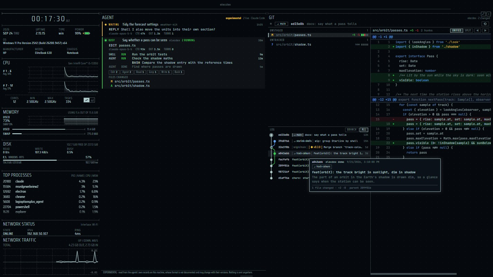
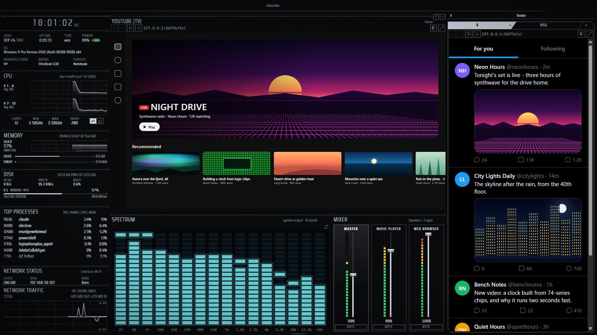
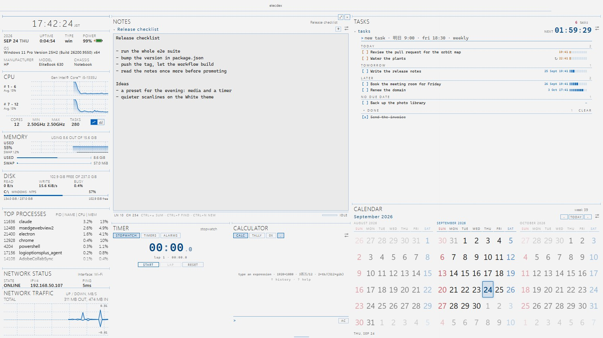
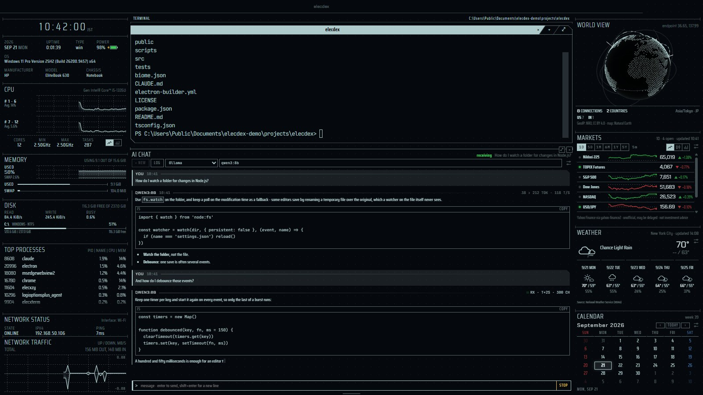
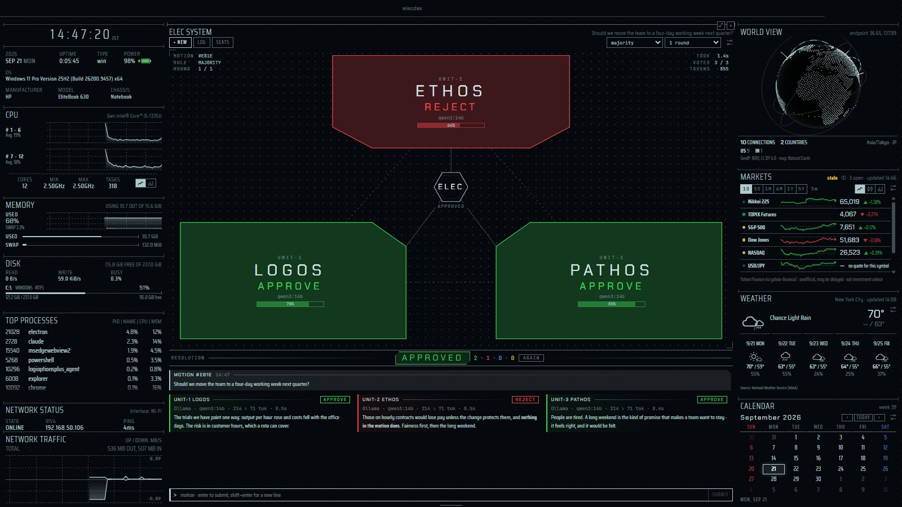
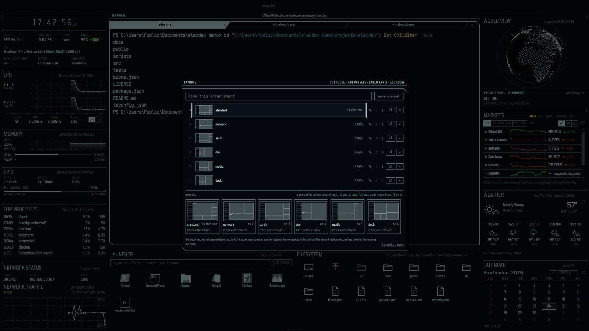

<p align="center">
  
</p>

[](https://github.com/kurouna/elecdex/actions/workflows/ci.yml)
[](https://github.com/kurouna/elecdex/releases)
[](https://www.gnu.org/licenses/gpl-3.0)
[](https://zenn.dev/kurouna)
[](https://x.com/elecxzy)

[English](README.md) | [日本語](README.ja.md) | **简体中文**

# elecdex

一款科幻风格的桌面终端模拟器兼系统监视器。它在当下安全的技术栈上从零重写了
[eDEX-UI](https://github.com/GitSquared/edex-ui)（已于 2021 年归档），支持 Windows、macOS 和 Linux。

<p align="center">
  
</p>

> **v0.0.16 — 预发布版。** 下文所列功能目前均可使用；构建未经签名。标有 *unreleased* 的内容
> 已在 `main` 上，将随下一个版本发布。
>
> **在 Windows 上开发和使用。** 每次发布都会构建 macOS 和 Linux 版本，但它们只在 GitHub Actions
> 上跑过自动化端到端测试，还没有人长时间亲手使用过，因此 **macOS 和 Linux 尚未经过充分验证**。
> 在这两个平台上可能会遇到不少粗糙之处，发现问题请[反馈](https://github.com/kurouna/elecdex/issues)。
>
> 设计说明以及每项决策及其理由：[docs/architecture.md](docs/architecture.md)。

## 功能

窗格按你正在做的事来编排：六个**布局预设**各用一个按键就能把合适的窗格摆上屏幕——
**Ctrl+Shift+F1** 到 **F6**——而且每个预设都把系统栏留在左侧，所以切换时换的是舞台，
仪表仍在原处。下面的功能按展示它们的预设分组，每张图都是该预设配上不同的主题。

### standard — 这台机器、它的 shell，以及外面的世界

elecdex 启动时的默认布局，即页首那张图（Tron）。

- **终端** — 真正的 shell（PowerShell、bash、zsh、fish），标签页和分屏数量不限。shell 集成会
  报告工作目录和退出码，Windows 上也一样；窗格被移动或重新加载后，会话的回滚缓冲区依然保留。
  启动时焦点在 shell 上；选中文本即复制，右键粘贴。Ctrl+Shift+F 在回滚缓冲区中查找文本，
  shell 输出的 URL 会在浏览器中打开。
- **系统监视器** — 带时区的时钟、带电池计量的系统条、按核心显示的 CPU（曲线图或柱状图）、
  随时间变化的内存和交换区、带读写活动的磁盘、占用最高的进程、网络状态和流量。默认布局空闲时
  约占单核的 13%。
- **文件与应用** — 跟随 shell 的文件浏览器（点击即可 `cd` 或插入路径），以及一个启动器，
  列出开始菜单（包括 Store 等打包应用）、`/Applications` 或 `.desktop` 条目以及你自己添加的项，
  最常用的排在最前。
- **天气、行情与日历** — 任意地点的天气预报（日本用 JMA，美国用 National Weather Service，
  其他地区用 MET Norway）、来自 Yahoo Finance 的行情看板，以及可选显示日本节假日的月历。

### network — 这台机器在和谁通信

<p align="center">
  
  <br><sub>network · Amber</sub>
</p>

- **世界视图与连接** — 一个显示本机连接去向的地球，以及一个按持有程序列出每个 TCP 套接字的
  窗格，两者都用内置的 GeoIP 数据库定位，不做任何在线查询。地球下方的 shell 供 ping 和
  traceroute 使用。
- **Wi-Fi** — 在套接字列表上方，逐段指出无线连接在哪里出了问题（见*窗格*）。

### earth — 头顶与脚下

<p align="center">
  
  <br><sub>earth · Tron</sub>
</p>

- **Orbit** — 任务控制中心的主屏幕：一张带夜半球的世界地图，标出时钟变化的分界线和各时区的
  钟点；ISS 和天宫此刻的位置及其星下点轨迹；它们下一次飞过你所选城市的时间；以及环绕任务控制
  GMT 年积日时钟的世界各地时钟。可按需显示 Starlink 星座。
- **地震与海啸** — 针对日本（JMA）或全球（USGS 和 NOAA）：按你选择的震度或震级发出警报
  （默认关闭）；海啸警报在生效期间始终可见；地震窗格列出近期地震，并在地球上标出震中。

### dev — 工作中的 AI 代理，以及它们修改的仓库

<p align="center">
  
  <br><sub>dev · Phosphor</sub>
</p>

- **AI Agent** *（实验性）* — 你电脑上正在工作的 Claude Code 会话：每个会话此刻在做什么、
  上下文里装了多少、它的子代理和后台任务，以及它改动的每个文件的 diff——都读取自本机上
  Claude Code 自己的记录。
- **Git** — 你选择的仓库，只读：改动的文件、每个文件带语法高亮的 diff，以及带分支和标签的
  提交图，随改动实时更新——可以在旁边的窗格里看着 AI 代理干活。每个仓库一个窗格。

### media — 看视频、刷信息流、看见声音

<p align="center">
  
  <br><sub>media · White — 网页窗格显示的是为截图制作的替身页面</sub>
</p>

- **网页窗格** — 浏览器、YouTube 和 X，需要时再添加为窗格，按主题配色绘制（也可通过设置
  保留网站自己的配色），每个网站共用一处登录。
- **频谱与混音器** — 一个显示电脑正在播放的声音的频谱分析仪，画成 1990 年代汽车音响显示屏
  的样子（荧光青、荧光琥珀、LED 或主题色），以及一个调节系统音量和各个发声应用的混音器。
- **正在播放** *(unreleased)* — 播放器正在播放的内容，与 Windows 自带的媒体浮层所知的一致：封面、
  标题、艺术家和专辑、播放到哪里，以及上一首、播放／暂停和下一首。
  **仅支持 Windows，暂不支持 macOS 和 Linux。**
- **RSS** — 你所列 RSS 和 Atom 订阅源的标题，最新的在前。

### desk — 写字、计算和掌握时间

<p align="center">
  
  <br><sub>desk · Business (Light)</sub>
</p>

- **桌面窗格** — 一个直接输入的计算器（全角数字和 3百万 这样的写法按原样识别，带纸带记录，
  还能对粘贴进来的一列数字做统计）；会自动保存的纯文本记事；截止时间画成仪表、无论窗格是否
  打开都会提醒的任务；以及一个计时器：秒表的分段像频谱一样堆叠，倒计时在旁边同时运行，
  还有围绕一天作息的闹钟。*unreleased:* 日历旁边是剪贴板历史：列出它显示在屏幕上时你复制的内容，
  点一下即可放回剪贴板。

### 与模型对话

<p align="center">
  
  <br><sub>AI 聊天 · Business (Dark)</sub>
</p>

- **AI 聊天** — 与你自己运行的语言模型对话（Ollama、LM Studio、llama.cpp——任何支持 OpenAI
  chat API 的服务），或与你持有 API 密钥的服务对话（Anthropic、OpenAI、Gemini、OpenRouter）。
  回答以流式到达，推理过程默认折叠；密钥由操作系统加密，永远不会传到页面；对话保存在你的电脑上。

<p align="center">
  
  <br><sub>ELEC system · Tron</sub>
</p>

- **ELEC system** — 仿照《新世纪福音战士》中的 MAGI，把一个是非题形式的议案交给由三个模型组成的
  评议会：LOGOS（逻辑）、ETHOS（伦理）和 PATHOS（情感）各自从自己的立场评判，投票 APPROVE、
  REJECT 或 ABSTAIN，窗格按多数决或全体一致作出决议。席位使用 AI 聊天的提供方——三个席位都用
  同一个模型也可以。

### 布局、外观及其他

<p align="center">
  
  <br><sub>布局 (Ctrl+Shift+G) · Tron</sub>
</p>

- **布局** — 每个窗格都可以拖动标题来移动，也可以关闭、分屏、放入标签页、调整大小并恢复；
  布局会被保存，也可以重置。一种排布可以命名保存以便日后回到它（Ctrl+Shift+G，或状态栏中的
  *layouts*），也可以从六个预设之一开始。
- **外观与体验** — 六种可实时切换的主题：用于 HUD 风格的 Tron、Amber、Phosphor 和 White，
  以及采用 Windows 11 配色、系统字体和全彩图标、适合日常办公的 Business (Dark) 和
  Business (Light)——上面的截图里每一种都出现过。先是一段展示本机真实信息的 Linux 风格启动日志，
  随后是 CRT 通电式的启动动画（之后添加的窗格同样会这样通电；关闭的窗格会断电，旁边的窗格随之
  延伸占据它的空间；切换到已保存布局时整个屏幕断电，再逐个窗格点亮下一个布局；对话框和通知
  也会断电），外加扫描线和辉光、合成的界面音效、主题化的标题栏，以及从底边滑出的状态栏。
  简短的入场效果——每个月的日期如波浪般出现、天气预报升起、新标题和地震条目滑入并高亮三秒——
  遵循动效设置：减少动效时（或系统开启了减少动态效果），一切都不会动。
- **设置** — 设置对话框涵盖主题、动效、声音、终端起始文件夹、已保存布局、启动器、可重新绑定的
  键盘快捷键和更新检查，全部保存在可手动编辑的 `settings.json` 中。

<p align="center">
  
  <br><sub>Settings → Keyboard · Tron</sub>
</p>

- **插件** — 用一个 TypeScript 文件做出你自己的窗格，运行在沙箱化的 worker 中，只拥有你授予的
  权限（[插件](#插件)）。
- **在后台运行** — 通知区域、菜单栏或托盘中的图标；全局的显示/隐藏快捷键；以及登录时启动。
  提供哪些选项取决于这台机器实际能做到什么，因此各平台不同：Windows 额外支持最小化和关闭到
  通知区域；macOS 把这些交给 Dock（关闭窗口本来就会让 elecdex 继续运行），其登录项也无法以
  隐藏方式启动；Linux 上托盘和快捷键取决于桌面环境——两者都不支持的会话会直接说明，而不是
  显示一个毫无作用的开关。全部默认关闭，需在 *Settings → Window* 中开启。
- **实用工具** *(unreleased)* — 把小工具放在一个窗格里：在你指定的时间内阻止休眠、生成二维码
  （文本、地址或 Wi-Fi）、编码、解码、哈希和时间转换。

## 安装

从 [Releases](https://github.com/kurouna/elecdex/releases) 下载适合你平台的安装包：

| 平台 | 文件 |
| --- | --- |
| Windows x64 / arm64 | `elecdex-win-x64-<version>.exe` / `elecdex-win-arm64-<version>.exe` |
| macOS Apple silicon / Intel | `elecdex-mac-arm64-<version>.dmg` / `elecdex-mac-x64-<version>.dmg` |
| Linux x64 | `elecdex-linux-x86_64-<version>.AppImage` 或 `elecdex-linux-amd64-<version>.deb` |
| Linux arm64 | `elecdex-linux-arm64-<version>.AppImage` 或 `elecdex-linux-arm64-<version>.deb` |

作者日常使用的是 Windows 版本。macOS 和 Linux 版本出自同一个发布工作流，并在 GitHub 的运行器上
通过了端到端测试，但没有经过实际上手测试：请把它们视为尚未充分验证。

### 出现警告时

安装包没有代码签名：证书的费用超出了个人项目的承受能力。因此 Windows 和 macOS 会在首次运行前
发出警告。这些警告的意思是它们不认识发布者，而不是在文件里发现了什么。如果想先核验下载的文件，
发布页列出了每个文件的 SHA-256 校验和。每个安装包都由 GitHub 运行器上的
[发布工作流](.github/workflows/release.yml)从打了标签的源码构建。以下步骤每次安装只需做一次。

**Windows**

1. 浏览器可能会拦下这个下载（"不常下载"）。在 Edge 中，打开该下载的 *⋯* 菜单 → *Keep* →
   *Show more* → *Keep anyway*。在 Chrome 中，选择 *Keep*。
2. 运行 `.exe`。SmartScreen 会显示 **"Windows protected your PC"**：点击 **More info**，然后点击
   **Run anyway**。
3. 安装程序只为当前用户安装，因此不需要管理员权限。

如果 Windows 提示文件已被阻止且没有 *Run anyway*，请右键点击 `.exe` → *Properties* → 勾选
**Unblock** → *OK*，然后再运行一次。

**macOS**（15 Sequoia 及更高版本；更早的版本见最后一步）

1. 打开 `.dmg`，把 **elecdex** 拖到 *Applications*。
2. 从 *Applications* 打开 elecdex。macOS 会提示 **"could not verify 'elecdex' is free of
   malware"**：点击 **Done**（不要点 *Move to Trash*）。
3. 打开 **System Settings → Privacy & Security**，滚动到 *Security*，在关于 elecdex 的那一行旁
   点击 **Open Anyway**。用密码或 Touch ID 确认，然后再点一次 **Open Anyway**。
4. 在 macOS 14 或更早版本上，右键点击应用 → **Open** → **Open** 即可达到同样效果。

如果 macOS 提示的是 **"elecdex is damaged and can't be opened"**，文件其实并没有损坏，拦住它的
是下载时附加的隔离标记。移除该标记后再打开应用：

```bash
xattr -dr com.apple.quarantine /Applications/elecdex.app
```

**Linux**（没有警告，但有两点需要知道）

- **deb**（Debian、Ubuntu）：`sudo apt install ./elecdex-linux-amd64-<version>.deb`。它还会安装
  Ubuntu 24.04 及更高版本所需的 AppArmor 配置文件，否则 Electron 的沙箱无法启动。
- **AppImage**：`chmod +x elecdex-linux-*.AppImage` 后运行。它需要 FUSE 2（`libfuse2`，Ubuntu 24.04
  上为 `libfuse2t64`）。在 Ubuntu 24.04 及更高版本上，它可能会停下并提示 *SUID sandbox helper*，
  因为 AppArmor 在那里阻止了沙箱。这种情况请改用 deb。不要用 `--no-sandbox` 启动：正是沙箱让
  渲染进程无法接触你的文件。

elecdex 以全屏启动。**F11** 退出全屏，**Ctrl+Shift+Q** 退出程序；`--windowed` 以窗口模式启动，
`--no-intro` 跳过启动动画。

## 键盘

| 快捷键 | 操作 |
| --- | --- |
| Ctrl+Shift+E | 把当前窗格（若是标签页：整个标签组）向右分屏 |
| Ctrl+Shift+O | 把当前窗格（若是标签页：整个标签组）向下分屏 |
| Ctrl+Shift+T | 在当前窗格旁新建标签页 |
| Ctrl+Shift+W | 关闭当前窗格（或点击悬停时出现的 × 按钮） |
| Ctrl+Shift+Z | 把当前窗格放大到工作区之上，再次按下恢复原位（Escape 也可以） |
| Ctrl+Shift+[ / ] | 在窗格之间移动焦点 |
| Ctrl+Shift+← / → | 当前标签组（例如 shell 的标签页）中的上一个 / 下一个标签页 |
| Ctrl+Alt+Shift+← / → | 在 shell 中：上一个 / 下一个 shell 窗格（或 shell 标签组） |
| Ctrl+Shift+A | 添加窗格：任意组件，放在当前窗格右侧、下方或作为其旁边的标签页 |
| Ctrl+Shift+Backspace | 重置为默认布局 |
| Ctrl+Shift+G | 已保存布局：给当前排布命名保存，或回到某个布局 |
| Ctrl+Shift+1 … 9 | 应用前九个已保存布局，顺序与对话框中的列表一致 |
| Ctrl+Shift+F1 … F6 | 切换到预设：standard、network、earth、dev、media、desk |
| Ctrl+Shift+L | 搜索启动器（若布局中没有，则在工作区上方弹出一个） |
| Ctrl+Shift+S | 聚焦到所选标签页中的 shell（若没有 shell 窗格则添加一个） |
| Ctrl+Shift+F | 在 shell 的回滚缓冲区中查找（Enter / Shift+Enter 下一个和上一个，Escape 关闭） |
| Ctrl+Shift+. | 设置 |
| F11 | 切换全屏 |
| Ctrl+Shift+M | 最小化窗口（Windows、Linux） |
| Ctrl+Shift+Q | 退出（即使关闭窗口只会把 elecdex 隐藏到通知区域，此键也会退出） |
| Ctrl+Alt+Shift+E | 在任何应用中显示或隐藏 elecdex（Wayland 会话中不可用；默认关闭，需在 *Settings → Window* 中开启） |
| 分隔条上的方向键 | 调整大小（按住 Shift 步长更大） |

elecdex 启动时焦点在 shell 上。在 shell 中，选中文本即复制，右键粘贴，与 PuTTY 或 Windows
Terminal 相同；Ctrl+C 仍是 shell 的中断键。搜索栏跳到的匹配项不会被复制——只有你自己选中的
内容才会。不在标签组中时，Ctrl+Shift+← / → 仍会传给 shell，PSReadLine 用它按词选择。

全局显示/隐藏快捷键在 *Settings → Window* 中它的开关旁边设置；只接受字母、数字和功能键，
如果其他应用已经占用了这组按键，它会被重新关闭并附上说明。*reset all shortcuts* 不会动它；
在录制快捷键时它会让出按键，因此它本身也可以被录制。它开启时，如果某个应用内快捷键用了相同
的按键，会在 *Settings → Keyboard* 中被标出：操作系统会先把按键交给 elecdex 的窗口快捷键。
elecdex 在前台时按下它会把 elecdex 收起；在其他地方按下则把 elecdex 调到前台。

*Settings → Window* 中还有窗口之外的图标——位于通知区域、菜单栏或托盘——单击它打开 elecdex，
右键菜单可以打开设置或退出；以及 *launch elecdex when you sign in*，如果系统把它关掉了，
设置里也会显示为已关闭。其余选项取决于机器，elecdex 只提供它实际能做到的：

| | Windows | macOS | Linux |
| --- | --- | --- | --- |
| 最小化 / 关闭到图标 | 是 | 否——关闭窗口本来就会让 elecdex 继续运行，可以从 Dock 回来 | 桌面环境有地方放图标时可用 |
| 全局显示/隐藏快捷键 | 是 | 是 | X11 下可用；Wayland 会话会独占这些按键，因此该选项会注明这一点 |
| 登录时启动 | Run 键条目，卸载时删除 | 应用的登录项（macOS 可能要求你允许） | `~/.config/autostart/elecdex.desktop` |
| *start in the background* | 是 | 否——登录项不接受参数 | 是 |

无论如何，再次启动 elecdex 都会把正在运行的那个调出来，所以窗口永远不会找不回来。

除分隔条按键外，其他所有快捷键都可以在 *Settings → Keyboard* 中重新绑定：点击一项，然后按下
新的按键。快捷键必须包含 Ctrl（macOS 上为 Cmd）、Alt 或功能键，这样其他按键都能传给 shell；
已被占用的组合会被标出。状态栏（把指针移到屏幕底边）左侧为每个已保存布局提供一个编号按钮——
编号就是应用它的按键——另有添加窗格、已保存布局、重置布局、设置、主题、声音和退出按钮。
在 Windows 和 Linux 的全屏模式下，把指针移到右上角会降下最小化、退出全屏和关闭按钮；
若设置为在通知区域继续运行，关闭会把 elecdex 放到那里，否则询问后退出。

要移动窗格，拖动它的标题（没有标题的窗格，比如时钟，就拖它顶部的横线），放到另一个窗格上：
它会被放在那个窗格旁边、离指针最近的一侧。放下时按住 Ctrl（macOS 上为 Cmd），则会把它作为
标签页加入那个窗格，位置由指针在标签条上的位置决定——在标签页所在的组上按住同样的 Ctrl
则可以调整顺序。shell 标签页可以单独拖出，拖动标签组的标题栏会移动整个组。Escape 取消。
移动后的 shell 保留其会话。

想看清某个窗格时可以把它放大：按 **Ctrl+Shift+Z**，或点击右上角 × 旁边的 ⤢ 按钮（标签组也有
同样的角，其 × 会关闭组内所有标签页；标签页自己的 × 只关闭该标签页）。它会覆盖窗口的大部分，
盖在其他窗格之上，其他窗格则在遮罩后面保持原位。放大后无益的窗格不参与：系统条和网络状态根本
没有 ⤢，计算器、计时器、混音器、正在播放、磁盘和进程列表则以面板形式出现在中间，而不是铺满整个窗口。
放大期间，窗格外侧会围上一圈边框——比 shell 的切角边框大一号，四角带有瞄准式的括角；边框画在
窗格之外，因此窗格仍可使用分给它的全部空间。
按 Escape、再按一次快捷键、点击按钮或点击遮罩即可放回。标签页会连同其所在的组一起放大，
所以组里其他标签页仍可切换。不会重新排布，也不会保存任何东西：shell 保留其会话，网页窗格保留
其页面，应用启动时每个窗格都在原位。

值得保留的排布可以命名保存——**Ctrl+Shift+G**，或状态栏中的 *layouts*——以后再回到它；
前九个对应 Ctrl+Shift+1 到 9，以及状态栏左侧的编号按钮。布局会跟随你的工作：当前所在的布局
会被标记，你对工作区做的任何改动都会保存到其中，所以回来时一切都和离开时一样。重置布局不会
影响任何已保存布局，之后的排布不属于任何布局，直到你保存它或应用某个布局。在对话框中可以
重命名布局，也可以上下移动——它在列表中的位置*就是*它的数字键。最多保存十二个。

应用一个布局会替换整个工作区，被替换窗格中的 shell 会结束，就和关闭这些窗格一样；有 shell
打开时会先询问你，询问中也提供了不再询问的方法（*Settings → General → Layouts*）。旧的排布
像显像管一样断电，新的排布逐个窗格点亮，和启动时一样——减少动效时则完全没有动画。

列表下方有六个**预设**，每个都画成其窗格的小地图：**standard**（默认布局）、
**network**（地球和 shell，旁边是 Wi-Fi 和连接）、**earth**（ORBIT、地球、地震和天气）、**dev**（AI AGENT、
shell 和 GIT）、**media**（YouTube (TV)，下方是频谱和混音器以及 *unreleased* 的正在播放，X 和 RSS 作为标签页）以及
**desk**（记事、计时器、计算器、任务和日历，以及 *unreleased* 的剪贴板）。每个预设都把系统栏留在左侧，所以切换时换的是
舞台，仪表仍在原处。选择一个预设会用它新建一个布局并切换过去——此后它就是你的布局之一，
跟随你的工作——再次选择它会回到那个布局，而不会再新建一个；↺ 把它恢复为预设原样。每个预设
都有自己的按键 Ctrl+Shift+F1 到 F6，在任何地方都能做同样的事。全新安装时，这六个预设会占据
Ctrl+Shift+1 到 6；已有的列表不会被追加。

它们保存在一个不含任何本机专属信息的文件里：**把 `layouts.json` 复制到另一台电脑，你的排布
就跟着过去了。** 对话框中的 *layouts.json* 按钮会在文件管理器中显示它（详见
[主题与设置](#主题与设置)）。

标签组可以容纳任何窗格，不只是 shell，因此偶尔用到的窗格可以和 shell 共用一个位置，而不必
单独占地方——比如把 RSS 或天气放在 shell 标签页后面。要把窗格放进组里，可以像上面那样按住
Ctrl 拖到组上；或者聚焦组中的某个窗格，打开选择器（Ctrl+Shift+A 或状态栏的添加按钮），在选择
组件前先选 **⧉ new tab**。之后点击标签即可切换；后台标签页中的 shell 会继续运行，切回来时
会话和屏幕内容都还在。组不能嵌套：一个标签页只容纳一个窗格。

*unreleased:* 在同一个选择器中选 **▣ pop up**，组件会以只带 × 的框显示在工作区上方，而不放进
布局：布局保持不变，也不会保存；按 Escape、点 × 或点框外即可关闭。除 shell、计时器（关闭后倒计时无法
响铃）和文件浏览器外，所有内置窗格都可以弹出（网页和插件不行）；在弹出窗格中所做的选择，
在应用退出前再次弹出时仍会保留。布局中没有启动器时，Ctrl+Shift+L 也会
这样打开它，启动器在启动了程序之后自动关闭。

## Panes

默认布局按窗格的用途编排——**左侧，这台机器：** 时钟、系统、CPU、内存、磁盘、占用最高的进程、
网络状态和流量；**中间，工作：** 三个 shell 标签页，下面是启动器和文件浏览器；**右侧，外面的
世界：** 世界视图、行情、天气和日历。

- **终端** — 窗格标题为 TERMINAL，并显示所选 shell 的完整路径；每个标签页以其所在文件夹命名
  （主目录也用它自己的名字），只有当两个标签页名字相同时才会加上上级文件夹，悬停时显示 shell 和
  完整路径。已退出的 shell 会在其标签页上注明，并附上退出码。新 shell 从主目录启动，或从
  *Settings → General → Terminal* 中设置的文件夹启动（"~" 表示主目录；已不存在的文件夹会回退到
  主目录）。**Ctrl+Shift+F** 在窗格上方打开搜索栏：匹配项用主题色标出并计数，Enter 和
  Shift+Enter 在其间跳转。shell 输出的 URL 是链接，会在浏览器中打开。
- **系统** — 日期和星期、运行时间、操作系统类型，以及带电池计量的电源（绿色，低于 20% 时变红）；
  完整的操作系统版本和架构（就像 `uname` 或 `winver` 显示的那样）；机器的制造商、型号和机箱类型。
  应用运行期间不会变化的信息只读取一次，不做轮询。
- **CPU** — 两张各核心平均负载的曲线图，或每个逻辑核心一根柱（在窗格中切换）。
- **内存** — 过去一分钟内存和交换区的使用比例，与 CPU 曲线同步滚动，并以柱状显示当前用量。
- **磁盘** — 每个卷一根柱，显示已用空间与总容量（90% 起为琥珀色，97% 起为红色），附剩余空间、
  文件系统以及是否为可移动或网络卷；上方是读写速率和磁盘繁忙程度（macOS 上不显示，因为那里
  没有低开销的读取方式）。
- **启动器** — 平台的应用加上你自己的条目，最常用的在前。输入即可筛选，Enter 启动。图标采用
  主题的强调色，悬停时显示原本的颜色（Business 主题下始终如此）；在 Windows 上，图标由 Windows
  shell 绘制，应用名称与开始菜单中显示的一致——包括没有快捷方式的打包应用（Teams、Outlook、
  Terminal）。在 `settings.json` 的 `launcher.items` 下添加条目（窗格的 EDIT LIST 按钮会打开它）：

  ```json
  "launcher": {
    "showSystem": true,
    "items": [
      { "name": "Project notes", "target": "C:\\Users\\me\\notes.md" },
      { "name": "Docs", "target": "https://github.com/kurouna/elecdex" },
      { "name": "Node REPL", "target": "C:\\Program Files\\nodejs\\node.exe", "args": ["-i"] }
    ]
  }
  ```

- **文件系统** — 以网格显示所跟随 shell 的目录；点击文件夹即 `cd` 进去，点击文件则在提示符处
  输入它加了引号的路径。
- **世界视图** — 在旋转的地球上按国家显示连接。"你在这里"是系统时区所在的国家（时区无法对应
  国家时则用区域设置的国家）；从不询问操作系统的定位服务。
- **连接** — 本机持有的每个 TCP 套接字，按持有它的程序分组：本地端口、对端、该端口通常用于
  什么服务，以及对端所在的国家。一个开关可以改为显示监听中的套接字——也就是这台机器敞开的门。
  在两次读取之间打开又关闭的连接仍会以删除线画出一次，因此短暂的连接也不会隐形。表格来自内核
  （Windows 上为 `GetExtendedTcpTable`，Linux 上为 `/proc/net/tcp*`，macOS 上为 `netstat`——
  它无法给出所属进程，窗格会注明这一点），国家则来自世界视图所用的同一个内置 GeoIP 数据库。
  从不做任何在线查询。**MASK** 会隐藏每个地址的后半部分，便于截图或共享屏幕。监听中的程序会
  说明它在提供什么服务，这是从它的命令行判断的——`node` 会显示为 `vite · my-app`——而不会去
  访问那个端口。
- **Wi-Fi** — 无线连接在哪里出了问题：通话卡顿，或列车上的 Wi-Fi 反复掉线时用来找原因。从本机
  到互联网的路径被逐段测量（无线电的信号与重传、每秒对网关和互联网各一次 ping、本机自己发送的
  流量），窗格指出出问题的那一段并给出依据的数值：RADIO、LOCAL LINK、UPSTREAM、UPSTREAM LOST
  （接入点有回应、更远处没有）、OWN UPLOAD 或 SIGN-IN NEEDED，并估算通话质量（MOS）。其下是
  无线电（信号仪表、标出所在信道与 DFS 范围的频段图、标准与 PHY 速率）、1 到 60 分钟的时间线
  （带十字准线）、系统记录的过去一天的断线及其原因（Windows）、接入点的切换，以及帧计数器。
  **MASK** 隐藏网络名称和地址；**COPY** 把最近几分钟的报告放到剪贴板。
  指针停在任何一项上，都会说明它是什么、据以判断的阈值以及当前读数；判定下方的图例说明其余各项的读法。
  在宽屏上放大时窗格分为两栏，站点之间的连线上画出该段最近一分钟的曲线，日志上方以横条显示过去
  24 小时的连接。有多个无线网卡时，页眉下方的小标签用来选择跟随哪一个，网关 ping 与历史各自独立。凡是需要位置信息的都不读取，
  因此没有 BSSID，也不扫描周围的网络。ping 只在窗格显示在屏幕上时进行。
- **AI Agent** *（实验性）* — 每个运行中的 Claude Code 会话一张卡片：名称和文件夹、是否忙碌、
  最后做的事（用的工具及对象）、模型、上下文中和已写出的 token，以及它的回答。下面是它启动的
  子代理和留在后台运行的命令：运行中、已完成、失败或已停止，运行中的子代理还会显示它自己的最后
  一步；已结束的保留十分钟。展开卡片可以看到它用过的工具和改动过的文件；打开文件会显示与
  Claude Code 在该会话首次改动前保存的副本之间的 diff（子代理改动的标为 SUB，没有这样的副本）。
  只在窗格打开时从 Claude Code 自己的文件夹（`~/.claude` 或 `CLAUDE_CONFIG_DIR`）读取，而且只读
  记录中自上次查看以来新写入的部分——很长的记录从末尾读起，其计数会标为 *recent*。不向任何地方
  发送任何东西。这些记录属于 Claude Code 且没有公开文档，所以它的新版本可能会改变可显示的内容——
  这正是标为*实验性*的原因。`settings.json` 中的 `agents.sources` 决定读取哪些代理的记录（目前是
  `claude-code`）。
- **Orbit** — 位置在你的电脑上计算（SGP4），所用的轨道根数由应用从 CelesTrak 下载：空间站一天
  两次，约 10,000 颗 Starlink 卫星一天一次，且只在有窗格显示它们时下载（**STARLINK**）。
  当前聚焦的空间站轨迹向后画一圈、向前画两圈，在阳光下明亮、在地球阴影中暗淡，每十分钟一个
  标记；围绕它的圆圈是能看到它的地面范围。地图下方：它在哪里、多高多快、下次何时进入或离开
  地球阴影，以及它下一次飞过观测者的时间——无论肉眼是否可见。观测者属于窗格本身，从内置城市
  列表中选择（默认是你所在时区中最大的城市）；不会询问你的位置。横穿地图的细线是今天各地时钟
  出现差异的分界，顶部的标尺给出每个十五度时区的钟点，午夜和正午会被点亮。
- **Git** — **SELECT REPOSITORY** 选择一个文件夹；此后窗格监视该仓库，每次改动后重新读取
  （最多每秒一次，没有改动时从不读取）。显示已暂存、未暂存、未跟踪和有冲突的文件，每个文件附
  增删行数；所选文件的 diff，可选统一视图或并排视图，改动的词会高亮；提交图——分支的连线、
  每个提交上的名称（检出的分支、其他分支、远程、标签），显示当前分支及其上游，或用 **ALL** 显示
  全部，每次一百个提交，用 **MORE** 加载更多——点击提交会打开它的文件和 diff，鼠标停在上面则显示
  完整信息：提交说明、作者、日期和改动内容。它只读取：暂存和提交请在终端中进行。双击会打开文件——
  使用 `settings.json` 中 `git.openCommand` 的命令（会填入 `{file}` 和 `{line}`，例如
  `code -g "{file}:{line}"`），为空时使用系统默认的应用。git 必须在 PATH 中。
- **行情** — 指数、汇率以及 Yahoo Finance 提供报价的任何品种，大约每分钟更新一次，可显示为
  迷你走势线、K 线或涨跌柱（按列表顺序，或按涨跌排序）。各行共享窗格空间：窗格宽时分两栏，
  矮时每行一条，K 线横跨名称下方的整行。点击某个代码，它的图表会占满整个窗格——带价格轴、
  底部的时间轴、区间的最高、最低和基准，以及指针下那根 K 线的读数——直到点击箭头回到列表。
  看板上方的条带选择区间——1D（5 分钟线）、5D（30 分钟）、1M（小时）、6M（日线）、1Y（周线）
  或 5Y（月线）——设置按钮用于编辑列表，每个代码后面可以跟一个标签：
  `^N225 日経平均, JPY=X ドル円, 7203.T トヨタ`。1D 相对前一收盘价计算，更长的区间相对区间开始
  前的收盘价计算。内置名称跟随应用语言（`--lang=en-US` 强制使用英文）。Yahoo 没有实时的 TOPIX
  指数，所以默认看板显示的是 CME 日元计价 TOPIX 期货（`TPY=F`）。
- **天气** — 设置按钮 → PLACE 会打开一个选择器，列出内置的大城市、各国首都以及 JMA 的预报区域，
  也可以输入 `lat, lon`。日本使用 JMA，美国使用 National Weather Service（也可选择 MET Norway），
  其他地区使用 MET Norway。每个窗格可以单独选择 °C 或 °F，以及是否显示一周预报；默认地点是
  纽约市。点击预报会在浏览器中打开数据源自己对应该地点的页面——JMA 的预报页、NWS 的定点预报
  或 yr.no。
- **AI 聊天** — 不在默认布局中：从选择器（Ctrl+Shift+A）添加，想加多少都行。先在
  *Settings -> AI* 中添加一个提供方：选一个预设（Ollama、LM Studio、llama.cpp、Anthropic、
  OpenAI、Gemini、OpenRouter，或自定义地址），调整地址，如果是托管服务，再粘贴它的 API 密钥
  （和其他设置一样，离开输入框时即保存；在此之前可以用 **show** 查看你输入的内容，已保存的密钥
  显示为圆点——它不会再被显示出来）。**test** 会向提供方请求模型列表，随后可用于补全模型字段。
  在窗格中选择提供方和模型，输入内容后按 Enter（Shift+Enter 换行；Esc 或 **stop** 结束回答并
  保留已写出的部分）。回答以 markdown 呈现，每个代码块都有复制按钮；模型的推理过程（在提供方
  提供的情况下：Claude 的摘要式思考、`reasoning_content` 或内联的 `<think>`）折叠在
  **reasoning** 下。回答生成过程中，其标题会计数秒数和字符数；完成后显示读入和写出的 token 数
  以及每秒 token 数（在提供方报告这些数据的情况下）。悬停在消息上可以 **copy** 复制、**edit**
  编辑之前的提问（会替换它及其后的内容），或 **again** 重新提问。没有正常结束的回答会注明结束
  方式——`STOPPED`、`TRUNCATED`、`DECLINED`、`LINK ERROR`，或在该地址无人应答时显示
  `NO CARRIER`——并在旁边附上提供方自己的原话。**+ new** 开始新对话，**log** 列出已有对话，
  最新的在前；指向某个对话可以将它导出为 markdown 或删除。重新打开的对话会继续使用当初回答它
  的提供方和模型（如果提供方被删除后又重新添加，则按名称匹配），无法发送时窗格会说明原因。
  空窗格会显示它指向哪里（`LINK STANDBY`、提供方和模型、地址），读取提供方的模型列表时模型字段
  显示 `QUERYING`，读不到时显示 `NO LIST` 及原因。
  **长对话会被裁剪以适应模型的上下文窗口**：本地服务器只能处理启动时设定的几千个 token，
  超出部分会从开头被悄悄丢掉，首先丢的就是系统提示词——因此设置中每个提供方都有一个
  *context window*（本机或局域网中的地址默认 8192 token，直到你输入其他值；托管服务默认不限；
  对于 Ollama，请填写它所设置的上下文长度）。最多发送其中的四分之三；超出后最早的消息留在后面
  不发——一次留下一大段，而不是每轮一条，这样服务器的提示词缓存得以保留——日志中的
  `NOT SENT · n ABOVE` 行标出模型视野的起点。对话本身及其导出始终完整。开启 *summarise what no
  longer fits*（Settings -> AI；默认关闭）后，会先请模型总结留在后面的内容——每次对话被裁剪时向
  同一提供方和模型多发一次请求，显示为 `TX · COMPACTING`——此后该总结会紧跟在系统提示词之后
  发送；那一行随之变为 `SUMMARISED · n ABOVE`，展开可看到告诉了模型什么。总结失败只会损失
  总结本身：问题照样会被提出。对话属于应用而不属于窗格：移动窗格或把它放到标签页后面都不会
  中断回答，关闭窗格则会停止请求。在你发送消息（或按 **test**、打开模型列表）之前不会向任何地方
  发送任何东西；设置中可选的系统提示词会放在每段对话的最前面。没有工具调用：模型无法读取你的
  文件、运行命令或上网浏览。
- **ELEC system** — 不在默认布局中：从选择器添加。它使用 *Settings -> AI* 中的提供方，所以请先在
  那里添加一个。**seats** 为每个单元——LOGOS、ETHOS、PATHOS——选择提供方和模型，**all** 把一个
  席位的选择应用到全部三个；三个席位用同一个模型也没问题，因为每个单元都会被告知它自己的立场
  （在 *Settings -> AI -> elec system · standpoints* 中编辑）。输入一个可以用是或否回答的议案，
  按 Enter。每个单元会用议案的语言写一段简短的陈述，以一行 `VERDICT`（APPROVE、REJECT 或
  ABSTAIN）和一行 `CONFIDENCE` 结尾；面板随着投票亮起（`TX`、`RX`，然后是表决结果）——各单元在
  议案到来前处于断电状态，之后逐个通电；评议期间，光沿着正在被询问的面板和移动的网格地面流动，
  回答的每一段到达时都会沿着它的辐条流下，所以快速的模型会源源不断地流动，而正在思考的模型会让
  辐条保持黑暗（减少动效时这些都没有）；角落里的控制台记录每一步。最后一票投出后灯光熄灭，
  片刻之后**决议**通电亮起——未能左右结果的单元退后——遵循栏中选定的规则：**majority**（两个
  席位即可决定；否则为 `DEADLOCK`）或 **unanimous**（三个都赞成；一票反对即否决；否则为
  `NO CONSENSUS`）。不计入的票——连接失败（`LINK ERROR`、`NO CARRIER`）或回答中没有表决结果
  （`NO VERDICT`）——算作无效票而非弃权，有效票少于两张则为 `QUORUM NOT MET`。置信度只显示，
  从不计入。选择 **2 rounds** 时，每个单元随后会阅读其他单元的第一轮陈述（为适应小的上下文窗口
  会被截短）并再次投票——请求数翻倍——改变的票会显示为 `REJECT › APPROVE`。位于你电脑或局域网中
  同一台服务器上的单元会依次询问，托管服务则同时询问。Esc 或 **stop** 结束评议并保留已写出的
  内容；**again** 把同一议案交给当前就座的评议会；**log** 列出过去的评议及其决议，可重新打开、
  导出为 markdown 或删除。席位、规则和轮数都是设置项，每次评议会保留它当时所用的席位。在你提交
  议案（或打开模型列表）之前不会发送任何东西。
- **RSS** — 不在默认布局中：从选择器（Ctrl+Shift+A）添加。它一开始是空的，在设置按钮中列出
  订阅源 URL（每行一个；RSS 2.0、RSS 1.0 或 Atom，每个窗格最多 10 个）之前不会获取任何内容。
  显示所有订阅源中最新的 20 条标题，每条附来源和时间（今天的）或日期（更早的），窗格较矮时列表
  可以滚动。点击会在浏览器中打开文章。只要有窗格列出某个订阅源，就会**每 15 分钟**检查一次——
  只有订阅源自己要求时（Cache-Control、Expires 或 `<ttl>`）才会降低频率，且至少每小时一次——
  使用条件请求，所以未更新的订阅源不会重复下载。获取失败的订阅源保留最后的标题，并把窗格标为
  STALE。多个窗格列出同一订阅源时共用一次请求，最后一个关闭时即停止。窗格打开期间到达的新标题会
  滑入到它的位置并高亮三秒；如果列表已向下滚动，正在阅读的内容保持不动，并出现一个 "↑ n new"
  提示，点击可回到顶部。
- **Quakes** — 不在默认布局中：从选择器添加。显示近期地震，最新的在前，数据来源在
  *Settings → Alerts* 中选择：**Japan**（日本气象厅：最大震度 shindo，3 起为琥珀色，5- 起为红色，
  也包括 JMA 报告的远地地震）或 **the world**（USGS：4.5 级及以上，5 级起为琥珀色，6 级起为
  红色）。每行包含地点、时间、震级和深度，点击会打开数据源的页面。生效中的海啸警报、注意报或
  预报会以条带形式显示在列表上方。窗格会显示当前的警报设置，其设置按钮会打开警报设置。新地震
  会以其颜色高亮滑入，列表向下滚动时也会出现与 RSS 窗格相同的 "↑ n new" 提示。只要窗格打开或
  警报开启，就会**每分钟**检查一次数据源（使用条件请求，列表未变时不产生下载）；两者都没有时
  不获取任何内容。此时世界视图会在震中位置标出当天的地震，大小按震级、颜色与列表一致，一小时内
  的地震会闪烁。**这不是地震预警：** 报告在震动发生一分钟或更久之后才到达，窗格和警报都会
  说明这一点。
- **地震与海啸警报** — *Settings → Alerts*，默认关闭。数据来源可以自动选择（系统时区为东京或
  区域设置为 ja-JP 时用日本，否则用全球），也可以手动选择。开启后，达到所选最大震度（日本，
  默认 5-，即 5弱）或震级（全球，默认 6.0）的地震会在屏幕顶部显示横幅，包含地点、震度或震级以及
  深度，并随后续报告更新；强震的横幅会一直保留到手动关闭，较弱的一分钟后消失。**海啸**警报、
  注意报或预报（日本为 JMA 的 大津波警報・津波警報・津波注意報，全球为 NOAA 的太平洋和国家海啸
  预警中心；可以关闭）会显示一张卡片，包含级别、预计到达时间和浪高的区域，以及发布方的标题。
  关闭卡片后，它在生效期间会折叠为一个小标签，解除时卡片会注明。级别提升时会再次通知。会播放
  警报音（在开启界面音效时），elecdex 不在前台时还会弹出系统通知；两者都可以关闭。每次地震只
  通知一次，且只在它足够新时通知（日本 30 分钟，全球一小时），所以稍后才启动应用不会播报旧闻。
- **计算器** — 不在默认布局中：从选择器添加。在一行中输入，答案已经显示在下方；所有已算出的结果
  都记在纸带上，可以把数字再取回来用。全角数字、`×` `÷` 以及数字后的数量级（`3百万`、`5千`）
  会按原样识别，所以不必离开日文输入法就能写表达式。内置字节、时间、百分比和 万・億・兆 的常数，
  从 `sqrt` 到 `gcd` 的函数，32 位位运算，以及表示上一个答案的 `ans`；`rate = 8 * percent`
  会把一个名称保存在寄存器行中供之后的行使用。`0x` 会在答案下方添加一张 32 列的位图。`C` 清空
  当前行，行为空时清空纸带；在空行输入 `?` 会显示计算器认识的所有内容，↑ 可以回溯输入历史。
  **tally** 模式会对粘贴进来的一列数字做统计——计数、总和、平均值、中位数、标准差、四分位数——
  附带直方图和箱线图，并且不会把日期的各部分误当作独立的数字。不会把任何东西当作代码执行：
  表达式解析器来自 elecxzy，连同其测试一起内置。
- **记事** — 不在默认布局中：从选择器添加。纯文本，没有标记语法也不做渲染，停止输入半秒后保存——
  待写入时页脚的进度条会填满，写入完成时闪一下，所以静默的自动保存从不让人疑惑。记事保存在应用
  userData 下的 `notes.json` 中，而不在布局里，因此它们比窗格活得更久，两个窗格也可以显示同一条
  记事（第二个窗格会显示 *edited elsewhere*，而不会覆盖你正在输入的内容）。第一行是记事的名称；
  标题栏列出所有记事，每条都有一个 × 可以删除（可撤销）。
  **Ctrl+=** 会计算光标所在的表达式，并把答案写在它后面，不会动普通文字。*Save as .md…* 和
  *delete*（可撤销）在设置按钮下。
- **任务** — 不在默认布局中：从选择器添加。一个列表，每个截止时间都画成一个仪表，显示任务的
  时限已经过去了多少，快到期时变为琥珀色，过期后变红，最近的截止时间在标题栏中倒计时。输入
  `歯医者 明日 9:00`、`review fri 18:30` 或 `毎週 掃除` 会从这行中读出日期和重复规则——并在添加
  任务前显示它的理解，这样误读当场就能发现；无法理解的行会原样保留。任务在显示的地方直接修改：
  点击标题重命名，点击时间用同样的写法设置截止时间（留空则取消），用键盘时 Delete 删除任务、
  F2 重命名。已完成的任务列在 DONE 下，需要时可以折叠。任务保存在 `tasks.json` 中，下一个截止
  时间的提醒由应用自身调度：即使窗格已关闭、在另一个标签页，或者从未打开过，提醒也会到达——
  在角落显示一张带 *done*、*snooze* 和 *open* 的卡片，elecdex 不在前台时还会弹出系统通知。
  只有一个定时器在等待所有任务中最近的截止时间——没有任何轮询。提醒在窗格自己的设置按钮下设置：
  默认开启，可设置稍后提醒的时长和提前多久提醒。
- **计时器** — 不在默认布局中：从选择器添加。一个窗格里有三种工具。
  秒表的每个分段都是一根柱：计时中逐渐长高，记下时闪一下并锁定，标出最快和最慢，最高处有保持的
  峰值线；**倒计时**——最多六个，各有自己的时长——沿着一排分段逐格熄灭，最后十秒闪烁，结束时
  以卡片通知。秒表和倒计时是相互独立的，就像手机上那样：启动一个不会启动另一个，重置一个也不会
  影响另一个；当屏幕上显示秒表模式时，倒计时照样运行（到时照样响），每种模式都会在标题中注明。
  手动输入的时长会经过计算器处理，所以 `90/2` 就是四十五分钟。所有时间都记录为墙上时钟的时刻，
  而不是滴答计数，因此移动窗格、切换标签页、重新加载或重启都不会影响正在运行的计时器；读数显示到
  十分之一秒，这正是共享的 10 fps 绘制循环能如实显示的精度，而分段记录精确到毫秒。倒计时通过
  点击 `+1 +3 +5 +10 +25` 累加设定，旁边的输入框可以设定精确的分钟数。
  第三种是**闹钟**：一天中的某个时刻加上标签，在你选择的日子响起，从列表中开关，而不必每次重新
  设置——起床、午饭开始。闹钟保存在 `alarms.json` 中并由应用调度，所以即使窗格已关闭或从未打开，
  它也会响起：以一张等待你处理的卡片呈现，elecdex 不在前台时还会弹出系统通知。一次性闹钟响过后
  会自动关闭；`07:30`、`7`、`19.5` 和 `１９：３０` 都会被识别为时间。
- **剪贴板** *(unreleased)* — 在 desk 预设中，也可以从选择器（"clipboard history"）添加。按从新到旧
  列出窗格显示在屏幕上时你复制的内容，并注明大小和多久以前。每一项都带有类型标签（TXT、URL、PATH、NUM，
  以及带色块的 CLR）；带格式复制的内容（HTML，或 Word 和写字板复制的 RTF）在其下方再标 RICH。把指针停在
  某一项上（或用键盘移到它），会像 GIT 窗格的提交那样弹出卡片，显示完整内容、随之复制的格式和复制时间。点击某一项（或按 Enter）即可连同复制时的格式放回剪贴板，再粘贴到任何地方；↑ ↓
  在各项之间移动，Delete 或 × 删除一项。再次复制相同的文本时，它会移到最上面而不会出现两次；在终端里
  拖动出的选区（每移动一步都会复制一次）只算一项。剪贴板每秒读取 4 次，而且只在有剪贴板窗格显示在
  屏幕上时读取：位于其他标签页之后、窗口最小化或收起，或按下 **PAUSE** 时，什么都不读，这期间复制的
  内容也不会保留。带有密码管理器那种“私密”标记（Windows 的
  `ExcludeClipboardContentFromMonitorProcessing` 和剪贴板历史标志、macOS 的 concealed type、KDE 的
  密码提示）的复制内容不会被读取，只计数。最多 50 项保存在内存中，退出 elecdex 即消失——不写入磁盘，
  插件也无法访问。**MASK** 隐藏内容，**CLEAR**（按两次）清空列表，并一并清空剪贴板。仅限文本：剪贴板上的图片和文件不会保留。
  窗格通过剪贴板文本的变化得知有新的复制，所以中间没有复制别的内容时，同一段文本复制两次只算一次。
- **日历** — 显示当月并标出今天；‹ › 或鼠标滚轮切换月份，日期会朝切换方向扫入。空间足够时——
  宽窗格，或用 Ctrl+Shift+Z 放大窗格——上个月和下个月会以暗淡的样式出现在两侧，箭头会同时移动
  三个月。设置按钮可以勾选节假日日历（目前仅日本，在本地计算），下一个节假日的名称显示在月历
  下方。
- **频谱** — 不在默认布局中：从选择器添加。以 7、10、16 或 31 个频段显示系统的声音输出，每个频段
  是一列分段并带峰值保持；设置按钮可选择样式（VFD 青色（默认）、VFD 琥珀色、LED 或主题色）、
  频段数、柱状、镜像图案或仅显示峰值，以及峰值保持。它只在窗格显示在屏幕上时监听——在后台
  标签页中不监听——且只在有声音时以每秒 20 帧绘制（在 i5-1335U 上，播放声音时约占三分之一个核心，
  静音时约十分之一）。采集在一个独立的隐藏窗口中进行，只有电平数据会传到窗格；不录制任何东西。
  已在 Windows 上测试；macOS 应该可以通过同样的屏幕采集途径工作（需要屏幕录制权限），但未经
  测试。在 Linux 上，由于 Electron 没有回环采集，改用 `parec`（pulseaudio-utils，适用于
  PulseAudio 或 PipeWire）录制默认输出的监视源。如果系统设置中监视源的音量被调低，会自动补偿，
  使柱状显示的就是实际播放的声音；监视源被静音时会报告，并提供一个取消静音的按钮。
- **Browser、YouTube 和 X** — 不在默认布局中：从选择器添加。*Browser* 带有地址栏，可以打开任何
  http(s) 页面；*YouTube (TV)* 和 *X* 打开各自的网站并停留在该站内，指向其他网站的链接会交给你的
  默认浏览器。*YouTube (TV)* 是 YouTube 的客厅界面，用方向键操作；之所以提供这个 YouTube 窗格，
  是因为它可以登录——在手机上访问 yt.be/activate 并输入它显示的代码——而 Google 拒绝从嵌入式
  浏览器登录（"this browser or app may not be secure"）。每个窗格都有后退、前进、重新加载（网站类
  窗格还有主页）和"在浏览器中打开"按钮，并在重启后记住所在页面。页面由一个独立的、沙箱化的浏览器
  视图绘制在窗格之上：它无法访问 elecdex，不能使用摄像头、麦克风、位置或通知，也不能下载文件。
  所有网页窗格每个网站共用一处登录（YouTube 只需登录一次），与应用的其余部分隔离；
  *Settings → General → sign out of all sites* 会将其删除。页面默认以其自身的配色显示。地址栏右侧的
  ◐ 按钮会让单个窗格的页面改用主题色绘制，所见即所得；*Settings → General → tint pages in the
  theme's colour* 是尚未使用自己按钮的窗格的默认值，Business 主题下从不着色。当对话框、通知或
  正在拖动的窗格位于其上方时，会用一张静止画面代替页面。页面获得键盘焦点时应用快捷键仍然有效，
  其他按键都交给页面。指针位于页面上方时，状态栏和全屏窗口控制按钮不会出现（请使用快捷键，或把
  指针移到另一个窗格）。
- **混音器** — 不在默认布局中：从选择器添加。输出设备的音量和静音，在 Windows 和 Linux 上还有
  每个正在发声的应用，带推子、静音按钮，Windows 上还有峰值表。macOS 只有主音量。只在窗格显示在
  屏幕上时读取：Windows 上通过一个常驻的 PowerShell，macOS 上用 AppleScript，Linux 上用 pactl
  （PulseAudio 或 PipeWire；需要 PulseAudio 16 或更高版本的 pactl），缺少 pactl 时用 WirePlumber
  的 wpctl 控制主音量。
- **正在播放** *(unreleased)* — 在 media 预设中，也可从选择器添加（"now playing"）。显示 Windows
  视为当前的媒体会话——Spotify、正在播放 YouTube 的浏览器、媒体播放器，以及任何把播放内容告诉系统的
  播放器——包括封面、标题、艺术家、专辑和应用名、曲目播放到哪里（在播放器自己的两次报告之间每秒往前数），
  以及上一首、播放／暂停和下一首按钮，只在播放器接受时才可用。播放器接受改变播放位置时，进度条带有
  可拖动的滑块（也可用 ← →、Home / End）；不接受时只是一条没有滑块的进度表。把指针停在封面上会打开
  一张卡片，放大显示封面，以及完整的标题、艺术家和专辑。通过一个常驻的 PowerShell 每秒读取两次，
  且只在窗格显示在屏幕上时读取：在其他标签页后面、窗口最小化或收起时什么都不读。不写入磁盘或日志，
  插件也无法访问。**仅支持 Windows，暂不支持 macOS 和 Linux**（窗格会显示 UNSUPPORTED）。
- **实用工具** *(unreleased)* — 从选择器（"utility"）添加。用切换按钮一次显示一个小工具，也可以弹出显示。
  - **AWAKE** 阻止休眠：SYSTEM（屏幕可以关闭）或 DISPLAY（屏幕也保持开启），一直保持或 30 分钟到 4 小时
    （+30M 延长）。通过 Electron 的节能阻止器向系统请求，不启动任何程序；合上盖子或选择睡眠仍会休眠。
    在关闭或时间到之前，即使关闭窗格或重新启动也会继续：此期间状态栏（底边的标记会亮起）和通知区域的
    提示会说明，启动日志中也会显示。
  - **QR** 为文本、地址或 Wi-Fi 网络（手机摄像头一扫即可连接的格式）生成二维码，纠错级别 L 到 H，
    使用主题颜色——始终是亮底暗模块，主题对比度不足时改为白底黑码。COPY 以图片放到剪贴板。
    Wi-Fi 密码与 AI 密钥一样，只保存经系统加密封存的内容，包含密码的二维码在按下 REVEAL 前会被遮住。
  - **CODEC** 进行 Base64、Base64URL、URL 编码和十六进制的编码与解码，显示 JWT 内容（不验证签名），
    计算 SHA-1、SHA-256、SHA-512 哈希，Unix 时间与日期互相转换，全角英数与半角互转（以及 NFKC），
    生成 UUID。输入的内容不会写入磁盘。
  全部在本机运行，不使用网络，插件也无法访问。

## 插件

插件用来添加一个窗格。它是一个 TypeScript 或 JavaScript 文件，或者一个含有 `index.ts` 的文件夹，
放在应用 userData 下的 `plugins` 文件夹中；保存修改即会加载，旁边的 `elecdex-plugin.d.ts` 为编辑器
提供 API 的类型。*Settings → Plugins → **install from a folder…*** 可以替你复制进来：选择插件的
文件夹，elecdex 会从中取出插件本身——入口文件及其导入的内容，别的一概不要，所以 README、
`package.json`、`.git`、`node_modules` 以及代码旁的任何测试都会留在原处（插件确实导入了的
`tests/` 下的文件会一起复制：关键在于插件是否用到它，而不是文件夹叫什么）——以该文件夹自己的
名字安装，如果已有同名插件会先询问。复制之前会检查不运行就能知道的事——代码能否编译、每个导入
是否都是随之复制的文件——因此不是插件的文件夹，或需要 npm 的插件，会被拒绝并说明原因，而不是
之后才出错；*包含*多个插件的文件夹也能与本身就是插件的文件夹区分开来。*Open plugins folder*
依然保留，供手动放入插件。新建的插件文件夹自带一个**番茄钟**（本仓库中的
`examples/plugins/pomodoro`）：专注时段、短休息，每隔几轮一次长休息，带 VFD 仪表、提示音和
阶段结束时的通知，重启后继续。

插件在 *Settings → Plugins* 中开启之前一直处于关闭状态。该页面列出每个插件可以做什么——读取
指标来源、访问指定的主机（每个请求都由应用发出并对照该列表检查）、为某个网站使用自己的登录会话、
在没有打开窗格时继续运行、发送通知——并在首次运行前询问，插件之后请求更多权限时也会再次询问。
每个插件运行在自己的 Web Worker 中，无法访问页面、你的文件或网络，只能通过应用按主题渲染的
区块来绘制（文本、数字、仪表、图表、表格、列表、按钮）。停止响应的插件会被终止，不会拖住应用。
API 和规则见 [docs/plugins.md](docs/plugins.md)。

## 主题与设置

设置对话框中的所有内容都会立即保存到应用 userData 文件夹中的 `settings.json`，应用运行时也可以
手动编辑它。无法解析的文件会保持原样（在修复之前使用默认值），并在应用的修改替换它之前复制为
`settings.json.bak`：

```json
{
  "theme": "amber",
  "sound": { "enabled": true, "volume": 0.5 },
  "motion": "system",
  "terminal": { "startDirectory": "~/work" },
  "keybindings": { "app.quit": null },
  "window": { "minimizeToTray": false, "closeToTray": true, "globalShortcut": true, "startInBackground": false },
  "updates": { "check": true },
  "layout": { "confirmSwitch": true },
  "web": { "tint": false },
  "quakes": { "source": "auto", "notify": true, "minIntensity": "5-", "minMagnitude": 6, "tsunami": true, "system": true, "sound": true },
  "reminders": { "notify": true, "system": true, "sound": true, "snoozeMinutes": 10, "leadMinutes": 0 }
}
```

要添加主题，把一个 JSON 文件放进它旁边的 `themes` 文件夹（*Settings → General → themes folder*）。
主题会立即出现；`id` 与内置主题相同的文件会替换该主题。无法读取的文件会连同原因列在主题选择器
下方，而不是悄无声息地缺席。

```json
{
  "id": "ice",
  "name": "Ice",
  "accent": { "h": 200, "s": 60, "l": 70 },
  "surfaces": { "s0": "#000000", "s1": "#010203", "s2": "#040506", "line": "#101820" },
  "terminal": { "ansiPull": 0.5, "ansi": { "red": "#ff5f56" } },
  "effects": { "scanlines": false, "glow": 0.2 }
}
```

颜色格式为 `#rrggbb`；`status`（danger / warn / ok / info 的色相）、`fonts` 和 `text`（`primary`
和 `muted` 文字颜色；不设置时文字使用强调色）、`mode`（`"light"` 表示浅色背景：状态颜色更深，
终端会把浅淡的颜色提高到 4.5:1 的对比度）以及 `effects.iconTint`（`false` 使启动器图标显示其原本
的颜色）都是可选的。
布局保存在它们旁边的 `layout.json` 中：唯一的实时排布，手动编辑后会在加载时校验，无法读取时会被
移到 `layout.json.bak`，而不是丢弃。

已保存布局存放在 `layouts.json` 中，按名称保存每个布局，外加当前所在布局的 id。它不包含任何属于
本机的信息——终端的会话 id 在写入时会被去除——因此**这个文件可以原样复制到另一台电脑**，新开的
shell 也永远不会改写它。无法读取的单个条目会被单独丢弃，其余保留；整个文件都无法读取时，会被
移到 `layouts.json.bak`。

```json
{
  "version": 1,
  "active": "k3f9d1ab",
  "items": [
    { "id": "k3f9d1ab", "name": "work", "tree": { "version": 1, "root": { "kind": "pane", "id": "p1", "widget": "terminal" } } }
  ]
}
```

## 为什么要重写

eDEX-UI 被归档时，用其作者的话说，代码库"极需一次彻底的重构"。elecdex 保留了它的理念，
抛弃了它的实现：

| eDEX-UI | elecdex |
| --- | --- |
| PTY 通过 localhost WebSocket 隧道传输（端口 3000+） | `MessageChannelMain`，每个会话一个通道；没有监听套接字 |
| `nodeIntegration: true`、`contextIsolation: false`、`@electron/remote` | `sandbox: true`、`contextIsolation: true`，单一的带类型 preload 桥；渲染进程无法访问网络或文件系统 |
| 每个核心 fork 一个 `cluster`；每个组件用自己的定时器轮询 `systeminformation` | 一个 `utilityProcess` 加一个由订阅驱动、无人关注时即停止的调度器；在 Windows 上用一个常驻采样器代替每次读取启动一个 PowerShell（实测监控开销从单核的 144% 降至 14%） |
| 通过轮询 `/proc`、`lsof` 和 `ps` 跟踪 CWD——不支持 Windows | shell 集成（`OSC 7` / `OSC 133`），因此 Windows 也能用 |
| 五个硬编码的屏幕区域，五个终端标签页 | 持久化的布局树：窗格、分屏和标签页数量不限 |
| 没有打包工具；以后处理方式压缩 | electron-vite（Vite + Rollup） |

## 开发

技术栈：Electron 44 · TypeScript 7 (native) · electron-vite 5 / Vite 7 · Svelte 5 (runes) ·
`@xterm/xterm` 6 · node-pty 1.1 · systeminformation · three · zod 4 · Biome 2 · Vitest 5 ·
Playwright · electron-builder 26

```bash
npm ci
npm run dev -- -- --windowed --no-intro   # the second -- hands flags to Electron; npm start is the same
```

```bash
npm run verify       # lint + typecheck + unit/component tests
npm run build        # bundle main / preload / renderer into out/
npm run test:e2e     # Playwright against the built app (run build first)
npm run package      # installers into release/
```

在 **Windows 和 macOS** 上不需要原生工具链：node-pty 自带预编译的 N-API 二进制文件，Electron
可以直接加载。在 **Linux** 上，node-pty 会在安装时编译一次（需要 `python3`、`make` 和 C++ 编译器）；
npm 11 会先要求批准：`npm install-scripts approve node-pty && npm rebuild node-pty`。

Electron 二进制文件由本项目的 `postinstall` 脚本下载（Electron 44 自身没有安装脚本，而
electron-vite 不会触发其首次使用时的下载），该脚本还会让 node-pty 在 macOS 上的 `spawn-helper`
具有可执行权限。如果用了 `--ignore-scripts`，请运行一次 `npx install-electron`。

端到端测试从不连接真实服务，也从不触碰运行它们的机器：天气、行情和更新检查都指向关闭的端口或
本地桩服务（JMA 的地震和海啸列表连同天气预报，以及 USGS 和 NOAA 的数据源），RSS 订阅源、AI
提供方、插件主机和网页窗格的网站由本地服务器提供，声音、通知区域图标、登录启动项、套接字表和
API 密钥加密都使用替身。整套测试需要几分钟；发布前会完整运行，平时的改动则运行它可能影响到的
测试。

```
src/shared/     contracts shared by all processes (API types, IPC channel names, schemas, pure logic)
src/main/       app lifecycle, window, IPC handlers, pty, weather, markets, feeds, quakes, launcher,
                audio, plugins, web panes, reminders, running in the background, updates
src/preload/    the one and only contextBridge surface
src/renderer/   Svelte 5 UI: layout tree, widgets, the plugin host, dialogs, design tokens
src/services/   utilityProcess: the metrics collector
examples/       the sample plugin (pomodoro)
tests/          unit (vitest) · component (vitest + jsdom) · e2e (playwright _electron)
scripts/        asset generators (icon, banner, globe data, city list, README screenshots)
docs/           architecture.md (the design and the decision log, in Japanese), plugins.md,
                weather-providers.md
```

改动必须遵守的规则——安全边界、网络在哪里运行、测试可以触碰什么——见 [CLAUDE.md](CLAUDE.md)。

### 发布流程

1. 在 `package.json` 中设置 `version`，提交并推送。
2. 给该提交打上 `v<version>` 标签并推送标签：`git tag v0.1.0 && git push origin v0.1.0`。
3. Release 工作流会核对标签与 `package.json` 是否一致，运行 lint、类型检查和单元测试，创建一个带
   自动生成说明的 GitHub 预发布，并附上 Windows（x64、arm64）、macOS（arm64、x64）和 Linux
   （AppImage 和 deb，x64 和 arm64）的安装包。
4. 检查预发布，准备好后取消勾选 "Set as a pre-release"。更新检查会忽略预发布，所以只有到那时，
   正在运行的副本才会提示新版本。

## 数据来源

| 数据 | 来源 | 说明 |
| --- | --- | --- |
| 天气（日本） | [日本气象厅](https://www.jma.go.jp/) 预报 JSON：`https://www.jma.go.jp/bosai/forecast/data/forecast/<office code>.json` | 直接以 JSON 读取，而不是从网页抓取。这是 JMA 自己的[预报页面](https://www.jma.go.jp/bosai/forecast/)加载的数据，并非公开文档化的 API，因此解析时较为宽松，获取失败时屏幕上保留最后一次的预报。只在天气窗格显示日本的地点时获取，时间围绕 JMA 的发布时刻（日本时间 0、5、11 和 17 点），使用条件请求。依据 JMA 的[使用条款](https://www.jma.go.jp/jma/kishou/info/coment.html)使用，条款要求注明「出典：気象庁ホームページ（https://www.jma.go.jp/bosai/forecast/）を加工して作成」；窗格中会显示这一署名，并注明该 JSON 所属的预报页面。 |
| 天气（美国） | [National Weather Service](https://www.weather.gov/)（api.weather.gov） | 开放数据。定点查询结果保留一天；预报约每小时请求一次，且只在有窗格显示该地点时请求。 |
| 天气（其他地区） | [MET Norway](https://api.met.no/) Locationforecast 2.0 | [CC BY 4.0](https://api.met.no/doc/License)，在窗格中署名。请求遵循其[服务条款](https://api.met.no/doc/TermsOfService)：可识别的 User-Agent，坐标保留四位小数，在上次响应的 `Expires` 之前不再请求（且至少间隔 30 分钟），使用 If-Modified-Since。 |
| 天气选择器的城市列表 | [GeoNames](https://www.geonames.org/)（人口 50 万及以上的城市，以及各国首都） | [CC BY 4.0](https://creativecommons.org/licenses/by/4.0/)；内置。在选择器中输入的内容不会发送到任何地方。 |
| 行情报价 | [Yahoo Finance](https://finance.yahoo.com/)，通过 yahoo-finance2 | 非官方 API，未获 Yahoo 认可；报价可能延迟，不构成投资建议（窗格中有注明）。只在行情窗格打开时获取：每分钟一次批量请求（所列市场全部休市时每五分钟一次），每张图表每五分钟（1D）到每小时（6M 及更长）一次。 |
| 地震 | [日本气象厅](https://www.jma.go.jp/) 地震列表 JSON：`https://www.jma.go.jp/bosai/quake/data/list.json` | JMA 自己的[地震页面](https://www.jma.go.jp/bosai/map.html#contents=earthquake_map)加载的数据（约一个月的报告），以 JSON 读取。只在地震窗格打开或地震警报开启时获取：按其 `max-age=60` 的要求每分钟一次，并带 If-None-Match，因此列表未变时返回 304。依据 JMA 的[使用条款](https://www.jma.go.jp/jma/kishou/info/coment.html)使用；窗格中注明「出典：気象庁ホームページ（URL）を加工して作成」，警报中注明 JMA。并非紧急地震速报。 |
| 海啸（日本） | JMA 海啸列表 JSON：`https://www.jma.go.jp/bosai/tsunami/data/list.json` 及其列出的各份报告 | 与地震列表一起检查（通常是空列表，首次请求之后为 304）；新报告的详情只获取一次。计入警报、大海啸警报和注意报；预报和解除不计入。署名方式与地震相同。 |
| 地震（全球） | [USGS](https://earthquake.usgs.gov/) 实时数据源 `summary/4.5_day.geojson` | 公有领域。只在地震窗格或警报使用全球数据源时获取：每分钟一次（按其 `max-age=60`），使用条件请求。 |
| 海啸（全球） | [NOAA 海啸预警中心](https://www.tsunami.gov/)：太平洋（`PHEBAtom.xml`）和国家（`PAAQAtom.xml`）的 Atom 源 | 公有领域。每个源包含该中心的最新公报；计入警报、观察、注意报和威胁信息，信息声明不计入。与 USGS 数据源一起检查，使用条件请求。警报中会提示遵循当地政府的指示。 |
| RSS 订阅源 | 你在 RSS 窗格中列出的订阅源 URL | 由应用获取，从不由页面获取，且只在有窗格列出它们时获取：每 15 分钟一次（或按订阅源的要求，至少每小时一次），使用条件请求（If-None-Match / If-Modified-Since），同时最多两个，每个最大 2 MB，不带 cookie，User-Agent 为 `elecdex/<version>`。标题以纯文本显示；每个订阅源最后的标题保存在应用数据文件夹的 `feeds-cache.json` 中。不会向任何其他网站发送任何东西。 |
| AI 聊天 | 你在 *Settings -> AI* 中列出的提供方：你电脑或局域网中的服务器，或托管 API（Anthropic 通过其[官方 SDK](https://github.com/anthropics/anthropic-sdk-typescript)；其余通过 OpenAI 兼容的 `chat/completions`） | 由应用请求，从不由页面请求，且只在你发送消息、按 **test** 或打开窗格的模型列表时请求——放在布局中的聊天窗格不会调用任何服务。发送的内容是到目前为止的对话、你的系统提示词和模型名称，只发往你选择的地址，不发往别处；各提供方自己的条款和数据保留政策适用。不带 cookie，不跟随重定向。API 密钥由操作系统（DPAPI、Keychain、桌面环境的密钥环）加密后存入 `ai-keys.json`，与 `settings.json` 分开，且不会再显示出来；系统无法加密时，密钥只保存在内存中，直到 elecdex 退出。对于你的电脑和局域网之外的明文 http 地址，会拒绝使用密钥。没有自己的密钥时，Anthropic SDK 会在它惯常的位置查找（`ANTHROPIC_API_KEY`、`ant auth login` 配置）。在 Anthropic 自己的端点上，请求 `claude-opus-5` 和 `claude-fable-5-1` 时会启用服务端回退（`fallbacks: "default"`），这样被其安全分类器拒绝的请求会在同一次调用中改由另一个 Claude 模型重新运行；回答会注明写出它的模型。对话以文件形式保存在应用数据文件夹的 `chats/` 中。 |
| ELEC system | 同样的提供方，按每个席位的指定 | 与 AI 聊天相同，且只在你提交议案（或打开模型列表）时请求：向每个单元发送它的立场、投票说明和议案——第二轮还会发送其他单元的第一轮陈述。每轮三个请求，共一轮或两轮。评议以文件形式保存在应用数据文件夹的 `elec/` 中。 |
| 网页窗格 | 你在 Browser、YouTube 或 X 窗格中打开的网站 | 由应用的沙箱化浏览器视图像普通浏览器一样加载，且只在这类窗格存在时加载；elecdex 本身不向它们发送任何东西。Cookie 和网站数据保存在应用数据文件夹中（`Partitions/web`），直到执行 *sign out of all sites*。YouTube 和 X 依据其各自的条款使用。 |
| 轨道根数 | [CelesTrak](https://celestrak.org/) GP 数据（来自第 18 和第 19 太空防御中队，经由 [Space-Track.org](https://www.space-track.org/)）：`GROUP=stations` 为 OMM JSON，`GROUP=starlink` 为 TLE | 位置在你的电脑上计算；只下载轨道根数。遵循 CelesTrak 的[使用政策](https://celestrak.org/usage-policy.php)：只在 ORBIT 窗格显示该组时获取，空间站最多每天两次，Starlink 最多每天一次（CelesTrak 每两小时更新一次），保存在磁盘上并跨重启保留，使用可识别的 User-Agent，收到非 200 的任何响应后一天内不再请求。在窗格中署名。 |
| Wi-Fi 窗格 | 你自己的网关，以及 `1.1.1.1`（网络状态窗格本来就在 ping 的主机） | 每秒各一次 ping，且只在 Wi-Fi 窗格显示在屏幕上时进行；对互联网的 ping 与网络状态窗格读取的是同一个，因此不会重复询问同一主机。其余一切——信号、信道、连接日志——都从操作系统读取，从不询问外部服务。在 Windows 上网络名称取自连接配置文件，任何需要位置权限的内容（BSSID、扫描）都不读取；在 macOS 上没有定位服务时网络名称保持隐藏，而 elecdex 从不请求该权限。 |
| 更新检查 | [GitHub Releases API](https://docs.github.com/rest/releases/releases#get-the-latest-release) | 启用时（默认）在启动 15 秒后请求一次最新发布的版本，此后每天一次。不下载也不安装任何东西：有新版本时会显示一条通知，点击打开其页面。 |

## 第三方资源

| 资源 | 来源 | 许可证 |
| --- | --- | --- |
| 显示字体 | [Chakra Petch](https://fonts.google.com/specimen/Chakra+Petch) | SIL OFL 1.1 |
| 界面字体 | [Saira Condensed](https://fonts.google.com/specimen/Saira+Condensed) | SIL OFL 1.1 |
| 等宽字体 | [JetBrains Mono](https://www.jetbrains.com/lp/mono/) | SIL OFL 1.1 |
| IP 地理定位 | [`@ip-location-db/geo-whois-asn-country-mmdb`](https://github.com/sapics/ip-location-db)，数据来自 [NRO](https://www.nro.net/) | [CC BY 4.0](https://creativecommons.org/licenses/by/4.0/)（npm 包标注为 CC0-1.0；其附带的 NRO_LICENSE 要求注明 nro.net） |
| 地球的陆地和国家形状 | [Natural Earth](https://www.naturalearthdata.com/)，经由 [world-atlas](https://github.com/topojson/world-atlas) | 公有领域 / ISC（仅构建时使用） |
| 国家代码和时区 | [i18n-iso-countries](https://github.com/michaelwittig/node-i18n-iso-countries)、[countries-and-timezones](https://github.com/manuelmhtr/countries-and-timezones) | MIT（仅构建时使用） |
| README 横幅字体 | [Source Sans 3](https://fonts.google.com/specimen/Source+Sans+3) | SIL OFL 1.1（构建时转为 SVG 中的轮廓） |
| 行情数据客户端 | [yahoo-finance2](https://github.com/gadicc/yahoo-finance2) | MIT（打包进主进程） |
| 时区边界（ORBIT） | [timezone-boundary-builder](https://github.com/evansiroky/timezone-boundary-builder) 2026d，基于 OpenStreetMap 数据 | [ODbL 1.0](https://opendatacommons.org/licenses/odbl/1-0/)，© OpenStreetMap contributors。由其派生、存放在 `src/renderer/widgets/orbit/tz-lines.json` 中的线条（由 `npm run gen:orbit-map` 生成）同样采用 ODbL；在窗格中署名。 |
| ORBIT 地图的陆地 | [Natural Earth](https://www.naturalearthdata.com/) 50m 陆地数据，经由 world-atlas | 公有领域（"Made with Natural Earth"，在窗格中署名） |
| 轨道外推（SGP4） | [satellite.js](https://github.com/shashwatak/satellite-js) | MIT |
| git 窗格 diff 的语法高亮 | [highlight.js](https://highlightjs.org/) | BSD-3-Clause |
| 计算器的表达式求值器 | [elecxzy](https://github.com/kurouna/elecxzy) `src/utils/calc`，原样复制到 `src/shared/calc/vendor` | MIT |

地理定位数据库是内置的，因此不需要账号、API 密钥或首次运行时下载，IP 查询也永远不会离开本机。

构建应用所用的每个软件包以及上述数据，连同其许可证全文，都列在每个发布版本中可执行文件旁的
`THIRD_PARTY_NOTICES.txt` 里（由 `npm run build` 生成）。

---

## License / ライセンス / 许可证

This software is released under the [GNU General Public License v3.0](./LICENSE), the same license
as eDEX-UI.  
本ソフトウェアは、eDEX-UI と同じ [GNU General Public License v3.0](./LICENSE) のもとで公開されています。  
本软件与 eDEX-UI 一样，依据 [GNU General Public License v3.0](./LICENSE) 发布。

## Acknowledgements / 謝辞 / 致谢

This application is deeply inspired by the design and philosophy of the following pioneering
project. We express our utmost respect and gratitude to its creator and contributors:

本アプリケーションは、以下の先駆的なプロジェクトの設計と哲学に深くインスパイアされています。
この優れたソフトウェアを生み出した開発者およびコミュニティの皆様に、最大限の敬意と謝意を表します。

本应用深受以下开创性项目的设计与理念启发。谨向其作者及所有贡献者致以最崇高的敬意与感谢：

- **[eDEX-UI](https://github.com/GitSquared/edex-ui)**
  - Copyright (c) 2017-2021 Gabriel "Squared" Saillard
  - Created by Gabriel "Squared" Saillard ([gaby.dev](https://gaby.dev))
  - Licensed under the GNU General Public License v3.0

---

<p align="center">Copyright © 2026 elecxzy project</p>
