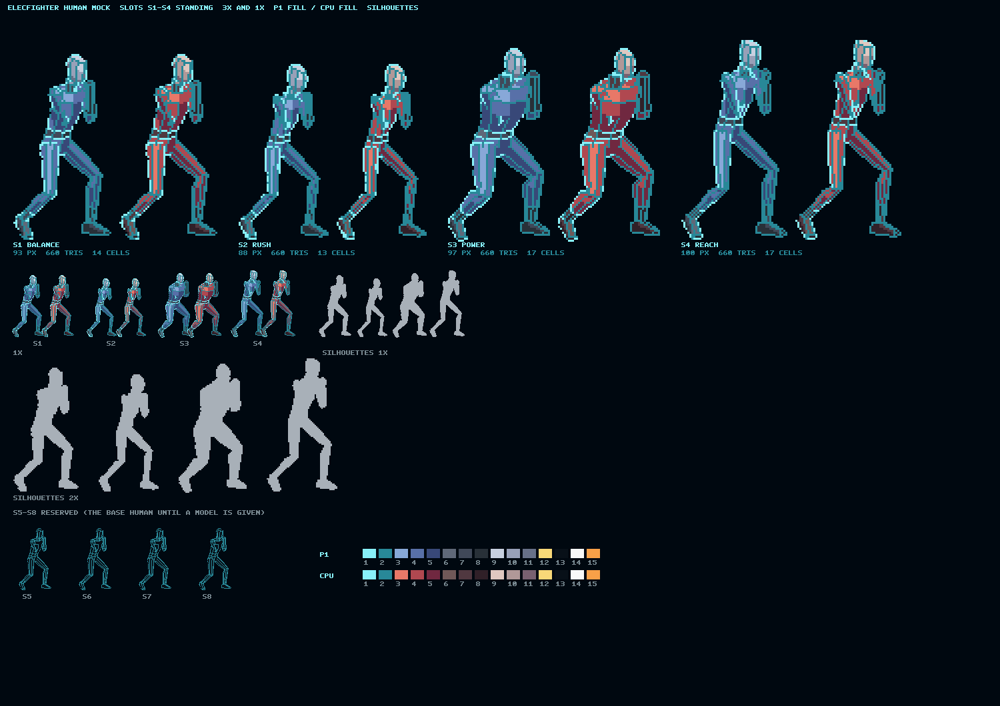
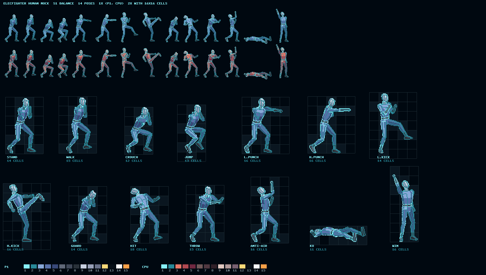
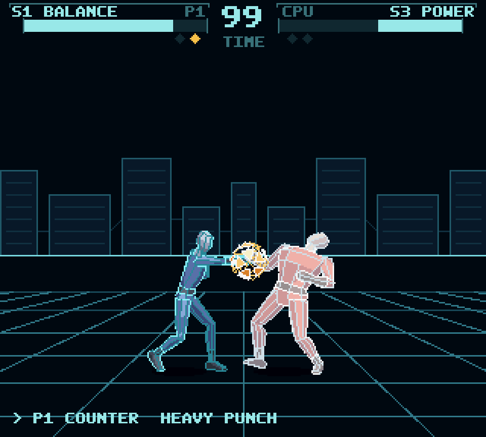
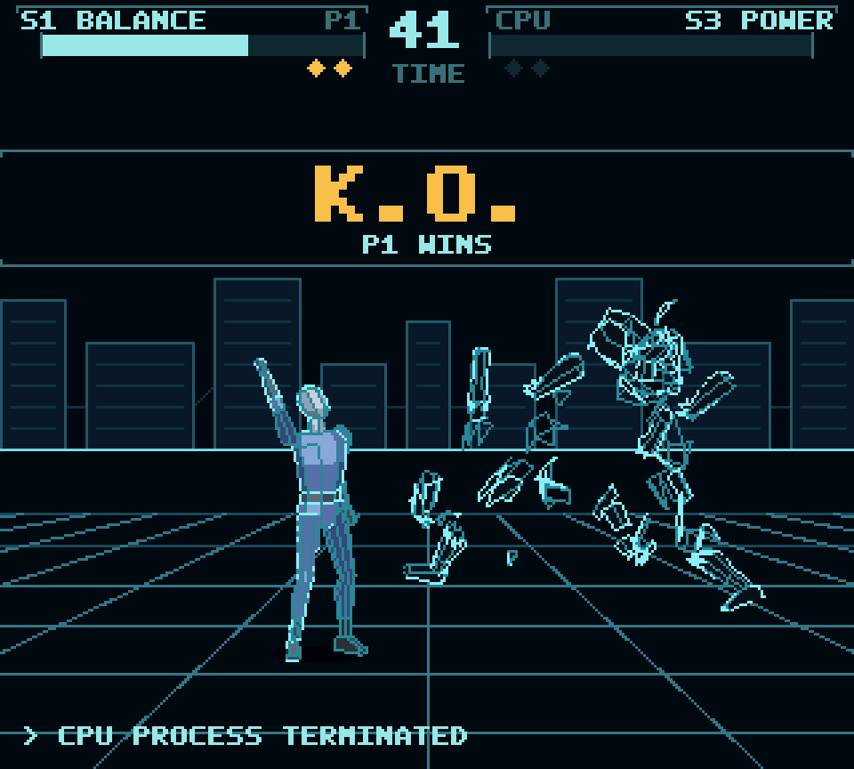
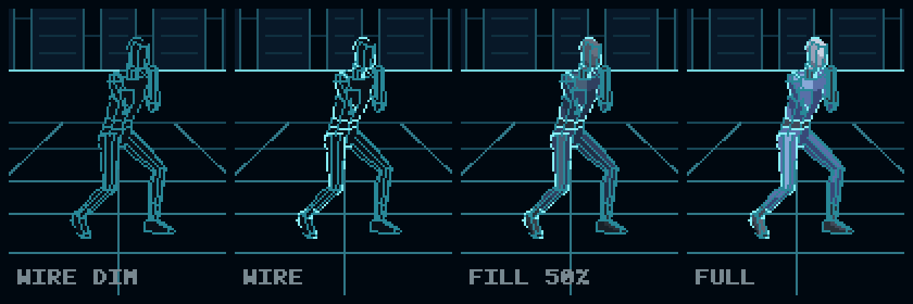
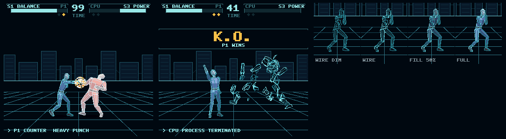

# ELECFIGHTER — ELEC-16 PLAY の 1 対 1 対戦格闘（設計 第 2 版: メッシュ）

PLAY-320 のゲームキット（[elec16-play.md の 10 章](elec16-play.md#10-ゲームキットg7)、[elec16-kit.md](elec16-kit.md)）で作る 4 本目のゲームの**設計の案**です。**まだ何も作っていません**。決まったことは利用者と決めてから「決まっていること」に移し、理由は [decisions.md](decisions.md) に残します。

- 第 1 版（2026-10-06、コミット 39ce080）: 利用者の最初の設計書を PLAY-320 に当てて確かめ、格闘家を 2D の骨と部品で描いたモックを付けた。機械の上限、CPU の試作の測定、カートリッジと映像メモリの割り当ては、この版でもそのまま使う（10 章）
- **第 2 版（2026-10-08、この文書）**: 利用者の「詳細仕様」と「ゲーム設計図」（2026-10-08）を芯にし、利用者の方針「中途半端なキャラデザインは魅力を下げる。メッシュ（ポリゴン風）のワイヤーフレーム＋塗りが elecdex の世界観に合う」を受けて、見た目、UI/UX、遊び、キャラクター、背景を E16 CPU と PLAY-320 の上で設計し直した

## 0. 結論（先に）

- **メッシュは「前もって描いたもの」にする（プリレンダー）**。格闘家は低ポリゴンの 3D モデル（glTF）と姿勢（関節の角度）で持ち、**three.js をデザインの道具として使って前もって描き**（ゲームの中では描かない）、ワイヤー（光る線）とベタの塗り（面ごとに 3 段）の 16×16 のセルにする。機械は第 1 版と同じくセルをストリーミングで写して並べるだけ。**実行時の 3D はできない**: 1 人を塗るだけで 1 フレームの CPU を越える（2.1）
- **立体に見せるのは、映像だけ**: 床の遠近（1 行ごとのラスタ）、奥の層の視差、高さで変わる影、3/4 の角度から描いた格闘家、KO で三角形の破片に割れる体。論理は X–Y の 2D、`z` は常に 0（利用者の仕様どおり）
- **格闘家は「人」**（利用者の決定 2026-10-08）: キャラ付けはしない（ロボット、忍者、悪魔などにしない）。産業用の格闘シミュレータの中の、顔のない人のワイヤーフレーム＋塗り。**自分と CPU の違いは塗りの色だけ**。下手なキャラは第一印象を悪くするので、作り込むのは人らしい比と構えと動き
- **格闘家の枠は 8 つ**: どの枠もモデル（glTF）と体格を指し、同じ骨の名前の人型なら差し替えるだけで描ける。初版は同じ人の体格違い 4 つ（標準、細身、がっしり、長身）、残り 4 つは予約（3 章）
- **パレットだけで「メッシュらしい」演出ができる**: 線だけの姿から塗りが満ちて現れる（ラウンドの始め）、当たりで線が白く光る、ガードで六角の「ファイアウォール」、KO で塗りが消えて線だけになり破片に割れる。どれも 32 B の `palette` を数回書くだけ
- **遊び**: 利用者の仕様（通常技 16 本、投げ、ガード、コマンド技なし）を芯に、深さを足すのは 4 つだけ: **弱 → 強のチェーン、カウンターヒット、対空の無敵、ダッシュ**（ダッシュは利用者に聞く）。すべて 4 ボタンと十字で済み、コマンドの入力はない
- **勝ち負けは読み、反射、攻めと守りの型で決まる**（利用者の方針 2026-10-08）。CPU の相手は ELECAIRCOMBAT のエースと同じく**表で個性を持つ**: 反射の時間、行動の割合と癖、好きな間合い、攻めと守りの速さ。CPU は相手を反射の時間だけ前の姿で見るので、**速い弱は見てから止められず、遅い強は見られる**（「速い＝弱い、遅い＝強い」が数から出る）。最後の相手 ROOT は人の癖を記録して読む（7.10）
- **1 つだけ仕様を変えたい**: 上段の攻撃が「しゃがみガードで受けられない」と、どの攻防も上下の当てずっぽうになり、しゃがみガードの役目がなくなる。**上段は立ちでもしゃがみでも受けられ、下段はしゃがみだけ、中段（ジャンプ攻撃を含む）は立ちだけ**を勧める（7.6、Q2）
- **予算は第 1 版のまま収まる**: CPU は平均 約 16,000、最悪 約 24,000 サイクル（66,667 の 36%）、1 行のスプライトは最悪 26 個（上限 32）、カートリッジは約 755 KB（1 MB のうち、4 枠）。人のモックで数えた（16 章: 1 ポーズ平均 15.7 セル、離れた点 0、背景 305 タイル）

## 1. 製品と遊びの芯

| 項目 | 内容 |
|---|---|
| 題名 | **ELECFIGHTER** |
| ジャンル | 1 対 1、ラウンド制の格闘（論理は 2D） |
| 人数 | 1P 対 CPU。2P は入力の抽象だけを持つ（PLAY-320 にパッドは 1 つ。7.1） |
| 世界 | elecdex の中の「仮想の戦いの場」。格闘家はプロセスの化身（アバター）で、メッシュで描かれる |
| 権利 | 実在の作品の名前、キャラクター、技の名前、曲、ロゴ、画面の特徴は使わない。ジャンルの共通の仕組みだけ（13 章） |

**遊びの芯は 4 つ**（利用者の設計図の「間合い・発生・ガード・投げの読み合い」を形にしたもの）:

1. **間合い**: 届く距離（箱の幅）と歩く速さが格闘家ごとに違い、相手の届かない所から自分の技を置く
2. **三すくみ**: 打撃はガードに止められ、ガードは投げに崩され、投げは打撃に負ける（投げの出がかりに打撃が当たる）
3. **跳び込みと対空**: ジャンプ攻撃は立ちでしか受けられない（中段）が、各格闘家の対空（しゃがみ強パンチ）が上半身の無敵で迎え撃つ

4. **読み、反射、型**（利用者の方針 2026-10-08）: 体の違いは小さめにし、相手を分けるのは頭。CPU の相手ごとの反射と癖（7.10）を見抜き、人は自分の癖を読まれないように変える

**成功の条件（初版）**: 弱と強の役割が分かる、ガードと投げが成り立つ、毎秒 60 枚でラウンドが終わりまで進む、`z` は常に 0、そして**等倍で見て 4 人が一目で見分けられ、格好いい**。

## 2. 見た目の方式: 前もって描くメッシュ

### 2.1 実行時に 3D を描けない理由

| 仕事 | 見積もり | 1 フレーム（4 MHz、66,667 サイクル）に対して |
|---|---|---|
| 1 人の塗り（88 ドットで約 3,000 点）を映像メモリのタイルに書く | 1 点 約 30 サイクル（4 ビットの読み書きと番地の計算）→ 約 90,000 | **135%**（1 人だけで越える） |
| 1 人の線だけ（約 600 点、隠れた線の判定なし） | 約 20,000 + 頂点の変換 約 5,000 | 37%、2 人で 75%。毎フレーム消してから描く分を入れると越える |
| 使ったタイルを毎フレーム空にする | 1 人 約 40 タイル × 32 B の `vfill` | 小さいが、上の 2 つが成り立たない |

- 描画回路はタイルとスプライトの機械で、線や面を描く回路はない（モード 0 のビットマップは 4 色、CPU が描く）
- そこで、**3D はスクリプトの中だけ**にする。機械が毎フレームするのは第 1 版と同じ「ポーズが替わったらセルを写す、スプライトを並べる」だけ

### 2.2 流れ（利用者の決定 2026-10-08）

three.js は**デザインの道具**: 今それを使ってビットマップを作っておき、ELECFIGHTER はそのビットマップを取り込むだけ。ゲームの中で three.js や 3D を動かすことはない（2.1）。

```text
scripts/elecfighter/models/human.gltf   人のモデル（skinned mesh、骨 19 本）
scripts/elecfighter/poses.json          姿勢（骨ごとの回転。全部の枠で共通）
scripts/elecfighter/slots.json          8 つの枠（モデルと体格）
scripts/elecfighter/svg/                ステージと HUD の枠（SVG）
        ↓ three.js（見せない Electron の窓の WebGL、ぼかしなし、等倍）
        ↓ 面と線がパレットの番号をそのまま書く（色を寄せる手間がない）
等倍の点 → 離れた点を消す → 空のセルを捨てた 16×16 のシート（PNG、以後はこれが元）
ポーズの表（セルの位置）と、喰らい・攻撃の箱の下書き（tables）
        ↓ キットのビルド（gen:elec16、DEVELOP）
カートリッジ。ポーズが替わったフレームだけ部屋へ DMA（第 1 版 2.4）
```

- **デザインのページ** `scripts/elecfighter/viewer.html`（`node scripts/elecfighter/serve.mjs` で開く）: 同じ場面（モデル、姿勢、枠、P1 と CPU の塗り、カメラ、光）をブラウザで回して見ながら直せる。ビットマップを作る描画も**同じ場面のコード**（`scene.mjs`）を使うので、ページで見たものがそのまま絵になる
- 描画は既定で SwiftShader（どの機械でも同じ点になる）。GPU で描くと線の端の点が少し変わる
- 3D のデータ（glTF）と SVG はリポジトリに置く。glTF は Blender などの道具でも開いて直せる
- ELECLANCE、ELECAIRCOMBAT、ELECDRILL と同じく、**スクリプトが最初に描き、以後は PNG が元**。手で直した PNG はスクリプトに上書きされないよう、描き直しは枠とポーズを指定して行う（P3 で決める）
- モデルは姿勢を直せば何度でも描き直せる。中割りのポーズも安く作れるが、増やす上限はカートリッジ（10.3）

### 2.3 描き方の決まり

| 項目 | 決まり（案） |
|---|---|
| カメラ | 正射影。**横から 30° 手前に回し、10° 見下ろす**（モックで決めた）。拡大縮小なし |
| 光 | 手前の上から（カメラの側）。`FLIP_H` で左右を写しても光がおかしく見えないよう、左右に強く振らない |
| 塗り | 面ごとにベタ。材質ごとに **光・中・陰の 3 段**（面の向きと光で決める）。ディザなし、ぼかしなし、点を混ぜない |
| ワイヤー | 1 ドットの線。**線の密度 A**（利用者の決定 2026-10-08）: 外形と材質の境は明るい線、折れの強い稜線（30° より大きい所。three.js の `EdgesGeometry`）は暗い線。隠れた線は描かない |
| 奥の手足 | 塗りも線も暗い段（線は「暗い線」の色）。手前と奥の手足が重なっても分かれる |
| 点の決まり | **離れた点は 0**（8 方向に同じ色の点がない点。テストで数える。decisions.md の「細かいディザで点に見える絵をやめる」） |
| 顔 | 描かない（顔のない人の頭） |
| 大きさ | 立ちの背丈 88〜100 ドット。1 ポーズ 32 セル以内（第 1 版 1.4） |

**1 人のパレット（スプライトの slot 8 か 9、15 色）**:

| 色 | 役 |
|---|---|
| 1 | ワイヤー（明るい。テーマの青緑、P1 と CPU で同じ） |
| 2 | ワイヤー（暗い。奥の手足、内側の稜線） |
| 3–5 | 材質 A（体、光・中・陰）。**P1 と CPU で違うのは 3〜11 の塗りだけ** |
| 6–8 | 材質 B（光、中、陰） |
| 9–11 | 材質 C（差し色、光る部品） |
| 12 | 光る部品の予備 |
| 13 | 空洞（ほぼ黒。口、関節の奥、線だけの姿の塗り） |
| 14–15 | 予備（技の軌跡） |

色の番号を役で固定するので、**パレットの書き換えだけで全員に同じ演出が効く**（2.4）。

### 2.4 パレットでする演出

| 場面 | 書き換え | 長さ |
|---|---|---|
| **現れる**（ラウンドの始め、選択で選んだ時） | 3–13 を空洞の色 → 線 2 だけ → 線 1 も → 塗りを 4 段で満たす（`palMix`） | 約 40 F |
| **当たり** | 線 1・2 を白、塗りを 30% 白へ | 2–3 F |
| **ガード** | 線を青白へ。体の前に六角の「ファイアウォール」の線（効果のスプライト） | 2 F |
| **投げられ** | 線を赤紫へ | 投げの間 |
| **体力 25% 未満** | 線 1 を 16 F ごとに暗くする（点滅） | 続く |
| **KO** | 塗りを空洞の色へ（線だけの姿）→ 体を消して三角形の破片（効果のスプライト）に替え、飛ばして落とす | 約 60 F |
| **一時停止** | ステージと格闘家と効果を黒へ 60%（`palMix`、HUD はそのまま。ELECDRILL と同じ） | 続く |
| **同じ格闘家どうし** | P2 は線の色を別の色相に替えたパレット（絵は増えない） | — |

- 1 回の書き換えは 32 B の DMA（約 40 サイクル）。1 フレームに数回で済む
- 第 1 版の「輪郭を太らせる」はパレットでは形が変わらずできない。ここでも色で代える

### 2.5 当たり判定は絵から下書きする

- 3D のモデルは部品（胴、頭、腕、脚）の形を知っているので、**スクリプトがポーズごとに喰らいの箱（3 つまで）と、攻撃の持続の絵では当たる部品の先の箱を下書きする**。絵と箱がずれない
- 下書きは tables の数。人はそこから直す（直しは別の表に重ね、描き直しても消えない）
- 確かめる絵（ポーズに箱を重ねたもの）をスクリプトが書く。テストは「攻撃の箱が、その部品の点から 2 ドット以内にある」を確かめる

## 3. 格闘家（人、8 つの枠）

- **キャラ付けはしない**（利用者の決定 2026-10-08）: 顔のない人。産業用の格闘シミュレータで訓練される人の形で、ロボット、忍者、悪魔などの作り込みはしない。人らしさは**比（7.5 頭身）、構え（膝を曲げ、重心を低く、ガードを顎に）、ためと振り抜きのある姿勢**で出す
- **自分と CPU の違いは塗りの色だけ**: ワイヤーは同じ青緑。P1 は青、CPU は赤の塗り（モックの色。2.3 のパレットの 3〜11）。同じ体格どうしでも色で分かる
- **8 つの枠**（`scripts/elecfighter/slots.json`）: 枠ごとに `id`、`used`、`role`、`model`（glTF）、`build`（骨の伸び縮み: 全体、太さ、肩、腰、胴、腕、脚、頭）。枠の中身を替えるのは、この 1 行とモデルのファイルだけ。**同じ骨の名前**（hips、spine、chest、neck、head、clavicle・upperarm・forearm・hand・thigh・shin・foot の左右、19 本。`scripts/elecfighter/README.md`）の人型の glTF なら、そのまま描ける。技の表、体の数（3.1）、CPU の操縦（7.10）も枠ごとの行
- 初版で使う枠と、その体格:

| 枠 | 役（仕様の ID） | 体格 | 立ちの背丈 |
|---|---|---|---|
| S1 | 標準（balance） | 基準の人（1.75 m、7.5 頭身） | 93 |
| S2 | ラッシュ（rush） | 細身で小さい | 88 |
| S3 | パワー（power） | 肩と胴の厚い、がっしりした人 | 97 |
| S4 | 変則（outbox） | 背が高く手足が長い | 100 |
| S5〜S8 | 予約 | 基準の人（モデルを入れるまで使わない） | — |

- 名前: 画面には枠の番号と役（`S1 BALANCE`）を出す（シミュレータの登録番号のように）。人の名前は付けない（Q6）。README と手引きでは「名前のない人型の枠（産業用の格闘シミュレータの訓練体）」と一言添える（そっけなく見えないように）

### 3.1 数の違い（データだけ。コードに格闘家の分岐はない）

体の違いは**小さめ**（速さと届く距離で 1〜2 割）。どの格闘家を選んでも同じ読み合いができ、相手の個性は CPU の操縦（7.10）が持つ。

| | S1 標準 | S2 ラッシュ | S3 パワー | S4 変則 |
|---|---|---|---|---|
| 体力 | 100 | 95 | 105 | 97 |
| 重さ（のけぞりの効き） | 100 | 90 | 115 | 95 |
| 前に歩く / 後ろ（1/16 ドット毎 F） | 20 / 16 | 24 / 18 | 17 / 14 | 19 / 16 |
| ジャンプ（上の初速、重力、頂点） | 104, 5 → 約 68 ドット | 108, 5 → 約 73 | 92, 5 → 約 53 | 112, 5 → 約 78 |
| 弱の出がかり | 基準 | −1 F | +1 F | 基準 |
| 強のダメージ | 基準 | −2 | +3 | 基準 |
| 届く距離 | 基準 | 短い（−6 ドット） | 基準 | **強キック +10、しゃがみ強キック +6** |
| 投げの間合い | 28 | 26 | **34** | 30 |
| 特徴（印） | — | — | 強攻撃の出がかりに「のけぞらない」1 回（アーマー。初版には入れず、P4 の後で考える） | 中段の立ち技を 1 本（両手の振り下ろし） |

## 4. ステージ

初版は 1 つ（利用者の仕様 11.2）。2 つ目は P4 で残りのカートリッジを見て決める（Q10）。

### 4.1 GRID（初版）

- **奥（BG0 の上、0.25 倍）**: 低ポリゴンの地平の稜線と、データの塔（縦長の角柱。縦と横の線だけなので、タイルを使わない）。線は青緑の暗い段
- **中（BG0 の中、0.5 倍）**: 戦いの場の奥の縁の光る線。八角の台の奥の辺（横の線）
- **床（BG0 の下、1 行ごとに 0.6〜1.6 倍）**: 遠近の格子。横の線は奥ほど詰まり、縦の線は世界の 80 ドットごと（第 1 版でタイルが収まると数えた間隔）。**メッシュの世界でいちばん立体に見える所**なので、1 行ごとのラスタを勧める（Q4、第 1 版 6.3 (a)）
- **台の縁**: 世界の両端（壁）で、八角の台の斜めの辺が見える。端に来たことが絵で分かる
- 色: 地は elecdex の地（`#05080D` 近く）、線は青緑の 3 段。点のディザなし

### 4.2 座標

| 定数 | 値（案） | 意味 |
|---|---|---|
| 世界の幅 | 512 ドット（BG0 の 1 回り） | |
| 壁 `RING_L`、`RING_R` | 32、480 | 格闘家の体の箱がはみ出さない（端は X だけで止める。場外なし） |
| 足の線 `GROUND_Y` | 画面 244 | 影は 244〜250 |
| 地平線 | 画面 168 | |
| 2 人の間の最大 | 256 ドット | 画面の端から 32 ドット。それより下がれない |
| 始めの間 `START_SEP` | 100 | 中央 256 から左右に 50 |
| カメラ | 2 人の真ん中を追い、横だけ。`camX = clamp(mid − 160, 0, 192)` | 拡大縮小なし（利用者の設計図 1.4） |

- 跳んだ頭の高さ: 足の線 244、立ちの頭 144〜154、頂点で 70〜91（HUD の下端 36 にかからない）

## 5. 画面と UI/UX

### 5.1 考え方

- **elecdex の画面のように見える**: HUD は elecdex のペインの見出し（上の罫線、両端の短い目盛り、左に題、右に暗い副題）。文字は等幅の大文字の短い英語
- **3 つで手応え**: 当たるたびに、止まる（ヒットストップ）、光る（パレット）、鳴る（効果音）。言葉でも知らせる（5.3 の記録の行）
- **待たせない**: ラウンドの始めは 2 秒以内。どの場面の演出も START か A で飛ばせる
- **覚えなくてよい**: コマンドの入力はない。技は「立ち / しゃがみ / ジャンプ × 4 ボタン」と「近くで前 + 強パンチ」だけ。操作の画面はその表だけで全部

### 5.2 戦いの画面（320×288）

```text
Y  0– 3  地
Y  4–11  ─┤ S1 BALANCE  P1 ├─    99     ─┤ CPU    S3 POWER ├─   枠と役（ペインの見出し）
Y 13–20  [████████████████]    TIME    [████████████████]       体力のバー（120 ドット）
Y 23–27        ◆◆                              ◆◆                取ったラウンドの灯
Y 28–36  （中央）ROUND 1 / 2 HIT など、あるときだけ
Y 40–250 戦い（足の線 244、影 244–250）
Y 268–279 > P1 COUNTER  HEAVY PUNCH                  記録の行（5.3）
```

- 体力のバー: P1 は X 16〜135（右から減る）、P2 は X 184〜303（左から減る）。体力 100 を 120 ドットへ。減ったばかりの分は琥珀で残り、20 F 後に縮む。25% 未満で赤と点滅（パレット）
- TIME: 真ん中に 16×16 の線の数字 2 桁（X 144〜175）。60 F で 1 減る。残り 10 で色が変わり音
- HUD は BG1（スプライトより前、動かない）。KO、ROUND、FIGHT、PAUSED は BG1 の**帯**（地を塗った横の帯、上下に罫線と目盛り。第 1 版のモックで、壁の字と重なって読めなかったのを帯で解いた）

### 5.3 記録の行（elecdex らしさと、教える役）

- 画面の下の 1 行に、端末のログのように**今起きたこと**を出す: `> P1 COUNTER`、`> CPU ANTI-AIR`、`> THROW TECH`、`> GUARD CRUSH`… 出て 60 F でパレットで暗くなる
- 言葉が、仕組みの名前を教える（カウンター、対空、投げ抜け）。説明書を読まなくても覚えられる
- 1 行の文字を書くだけ（約 300 サイクル、変わったときだけ）。**既定で出し、設定で消せる**（決まり 2026-10-08）。試合中は 1 行の短い語だけ（`COUNTER HEAVY PUNCH` くらい）

### 5.4 場面の流れ

```text
起動のログ（数行、START で飛ばす）
  → タイトル（ELECFIGHTER / PRESS START、4 人が線だけの姿で並び、順に塗りが満ちる）
  → メニュー: VERSUS CPU / CONTROLS / BEST
  → 操作の画面（初回だけ自動。以後はメニューから。セーブ RAM の印）
  → 格闘家の選択
  → 対戦の前（2 人が「ダウンロード」されるバー、RENDER 100% で塗りが満ちる、60 F）
  → ROUND n（帯、45 F）→ FIGHT → 戦い
  → KO / TIME UP（帯、勝った側の勝ちのポーズ）→ 次のラウンドか試合の結果
  → 試合の結果（WIN / LOSE、ヒット数、最大コンボ、残り時間）
  → 勝てば次の相手（ほかの 3 人、最後に ROOT。4 人勝ち抜き）、負ければ CONTINUE? 10 カウント
  → 4 人に勝つと SYSTEM CLEAR（クリアの時間、格闘家ごとの記録）→ タイトル
```

- **4 人勝ち抜き**（ほかの 3 人を強さの順に、最後に人の格闘家の写しで人の癖を読む ROOT。7.10.5）を勧める。対戦の前の画面に相手の型を 3 行で出す。目標と記録ができる（Q8）。利用者の仕様の「CPU 固定対戦」が「1 試合だけ」の意味なら、それに合わせる
- タイトルで何もしないと、HOW TO PLAY と BEST を交互に出す（ELECLANCE、ELECDRILL と同じ）

### 5.5 格闘家の選択

- 4 人の胸像（64×64、背景のタイル、BG のパレット 4 本。第 1 版 Q15）。メッシュの胸像は体と同じモデルをカメラを寄せて描く（拡大ではない）
- カーソルが乗った格闘家の全身（スプライト）が**線だけの姿から現れる**（2.4）。役、ひとこと、4 本の 1 色のバー（POWER、SPEED、REACH、DEFENSE、5 段）
- 選ぶと勝ちのポーズ、CPU の相手は順に決まる（勝ち抜き）

### 5.6 一時停止

- START で一時停止。画面を暗くし、帯に PAUSED、`RESUME` / `CONTROLS` / `QUIT FIGHT`（十字と A）。一時停止の間は何も進まない（乱数も、TIME も）

## 6. 操作

### 6.1 ボタン

| パッド | PC のキー | 働き |
|---|---|---|
| 十字 左右 | ← → | 前と後ろ（**相手から見た向き**）。後ろを押している間はガード |
| 十字 下 | ↓ | しゃがむ（後ろ下でしゃがみガード） |
| 十字 上 | ↑ | ジャンプ（斜めで前後へ） |
| Y | A | 弱パンチ（LP） |
| X | S | 強パンチ（HP） |
| B | X | 弱キック（LK） |
| A | Z | 強キック（HK） |
| START | Enter | 一時停止 |
| SELECT | 右 Shift | 操作の画面でボタンの組を替える |
| L、R | Q、W | 使わない（押しても何も変わらない。テストで確かめる） |

- パッドの菱形では左下の Y、B が弱、右上の X、A が強で自然。**PC のキーではパンチとキックで弱強の左右が逆になる**（第 1 版 5.1）。そこで**ボタンの組 TYPE A（パッド）/ TYPE B（キックを入れ替える）**を持ち、操作の画面の `PAD | PC KEY | ACTION` の表がその組に合わせて書き換わる（Q7）
- 機械のキーの割り当て（elec16-play.md 6 章）は変えない

### 6.2 入力の処理

- 生のパッド → 相手から見た前と後ろに変える（向きは 7.3 の決まりで直る）
- 毎フレーム「押されているボタン」と「押したボタン」を 16 フレームの輪に入れる（`padRead` は PADHIT も読むので、2 回の読み取りの間に押して離したキーも「押した」になる）
- **先行入力 8 フレーム**: 技を出せない間に押したボタンは、8 フレーム以内に出せるようになれば出す
- 同じフレームに出せる技が 2 つ以上なら、**投げ > 強 > 弱**（利用者の設計図 3.2）
- **ダッシュ**（決まり 2026-10-08、Q5）: 地上で動ける間に、前を 10 フレーム以内に 2 回で前のダッシュ（14 F、約 36 ドット進む）、後ろを 2 回でバックダッシュ（18 F、約 32 ドット下がる。最初の 6 F は投げられない、打撃は当たる）。ダッシュの間はガードも技も出せず、打撃も投げも当たる（前のダッシュ）。技からダッシュへのキャンセルはなく、弱の連打はダッシュにならない（十字だけを見る）。輪をさかのぼって見る（押したフレームだけ）。**作るのは P2 で、ガード、投げ、対空より後**
- ガードは「今、後ろを押しているか」をその場で見る（輪は使わない）

## 7. ゲームの決まり

### 7.1 データの形（2P と z の予約）

```text
Fighter { pos.x, pos.y, pos.z(=0), vel.x, vel.y, vel.z(=0), facing, state, stateT,
          life, moveId, moveF, hitDone, combo, invul, input(輪) }
Match   { round, wins[2], time, phase, seed, replays }
```

- 位置と速度は **1/16 ドットの固定小数**（世界 512 ドット × 16 = 8,192 で 16 ビットに入る）
- `pos.z`、`vel.z` は持つが、どの計算も読まない。テストが「どの試合のどのフレームでも 0」を確かめる
- 2 人の入力は同じ入口（`FighterInput`）を通る。P1 はパッド、P2 は CPU。2P のパッドがあれば同じ入口に入るが、PLAY-320 にパッドは 1 つ

### 7.2 ラウンドと試合

| 項目 | 決まり |
|---|---|
| 勝ち | 2 本先取 |
| 時間 | 99 カウント（60 F で 1） |
| KO | 体力 0 |
| 時間切れ | 体力の多い方。同じなら引き分け |
| 引き分けとダブル KO | ラウンドを数えずやり直す。**2 回続いたら、3 回目の引き分けは両者負け**（CPU 戦では負け） |
| ラウンドの間 | 帯の演出 → 始めの位置へ、体力は満タン、線だけの姿から現れる |

### 7.3 状態機械

```text
Stand, Crouch, PreJump, JumpRise, JumpFall, Land, Dash, BackDash,
Attack, Hitstun, Blockstun, Down, Wake, Throw, Thrown, Dead, Intro, Win
```

| 状態 | できること | 出口 |
|---|---|---|
| Stand、Crouch | 歩く、ガード、技、ジャンプ、ダッシュ | Attack、PreJump、Hitstun、Blockstun、Thrown |
| PreJump（3 F） | なし（ガードもできない） | JumpRise |
| JumpRise、JumpFall | ジャンプ攻撃 1 回 | Land、空中の Hitstun |
| Land（3 F） | なし | Stand |
| Dash（14 F）、BackDash（18 F） | なし | Stand |
| Attack | チェーンだけ | 技の終わりで Stand / Crouch、空中なら JumpFall |
| Hitstun | なし | Stand / Crouch、ダウンする技なら Down |
| Blockstun | ガードの向きを替える（立ち ↔ しゃがみ）だけ | Stand / Crouch |
| Down（36 F） | なし | Wake |
| Wake（12 F） | なし。打撃も投げも当たらない | Stand。立った後 2 F は投げられない |
| Throw、Thrown | なし | 分かれて Stand / Down |

- 遷移は**データとエンジンの決まりだけ**。格闘家の名前や番号でコードを分けない（利用者の仕様 6.1）
- **向き**は地上で技を出していない間だけ相手へ直す（跳び越しで背中を見せない、技の途中で向きが変わらない）
- 1 人の更新の順: 硬直を減らす → 技のフレームを進める → 操作できれば入力から遷移 → 加速度と重力 → 動きと壁（利用者の設計図 4.3）

### 7.4 物理

- 地上: 歩く速さは格闘家の数（3.1）。のけぞりの速さは `押し返し × 100 ÷ 重さ`、毎フレーム摩擦で減る
- 空中: 重力は一定、ジャンプの横の速さは踏み切りで決まり、空中では変えない
- 押し合い: 体の箱が重なったら、重なりの半分ずつ外へ。壁際では片方だけ
- **壁際の押し返し**: 当てた相手が壁で下がれない分は、当てた側が下がる（壁で永久に当て続けられない）
- 跳び越し: 空中で体の箱が重なっても押し合わず、着地で押し合う（相手の上に乗らない）

### 7.5 箱

| 種類 | 役 | 数 |
|---|---|---|
| 体（Body） | 押し合いだけ | 1 人 1 |
| 喰らい（Hurt） | 当たる所。ポーズごと（2.5 の下書き） | 1 人 3 まで |
| 攻撃（Hit） | 技の持続の間だけ | 1 技 2 まで |

- 全部、軸に平行な矩形。原点は足元の中央、`facing` で x を写す: `worldX = pos.x + facing × local.x`（`facing = −1` なら `local.x + w` を写した側）。1 つの関数にまとめる
- 1 フレームに 2 人で 10 個前後（利用者の仕様 16 章）
- **腕や脚を伸ばした分は攻撃の箱だけに足し、喰らいの箱には足さない**（利用者の設計図 6.2）。ただし強攻撃の戻りの間は、伸ばした手足に小さな喰らいの箱を置く（届かない所から強を振るだけの遊びを止める。差し返しができる）

### 7.6 高さとガード（決まり 2026-10-08）

| 攻撃 ＼ 防御 | 立ちガード | しゃがみガード | ガードなし |
|---|---|---|---|
| 上段（H） | 受ける | **受ける** | 当たる |
| 下段（L） | 当たる | 受ける | 当たる |
| 中段（M）とジャンプ攻撃 | 受ける | 当たる | 当たる |
| 投げ | 抜けない | 抜けない | 条件で決まる |

- 利用者の仕様は「上段はしゃがみガードで受けられない」。これだと、**立ち技はすべてしゃがみガードを崩し、しゃがみ技はすべて立ちガードを崩す**ので、どの攻防も上下の当てずっぽうになる。しゃがみガードは「下段を受ける」だけの意味しかなくなり、守る側に正解がない（Q2）
- 勧め: 上段はどちらでも受けられ、**崩しは下段（しゃがみ技）、中段（ジャンプ攻撃と S4 の 1 本）、投げの 3 つ**。守る側は「基本はしゃがみガード、跳び込みと中段を見て立つ、近づかれたら投げに気をつける」と読める
- しゃがんだ相手には、上の方の攻撃が箱の上を空振りする（ルールではなく箱の形で）。背の低い格闘家ほど得をしすぎないよう、しゃがみの喰らいの箱の高さは全員同じにする

### 7.7 技の表（S1 標準、出発の値）

| 技 | 出がかり | 持続 | 戻り | ダメージ | のけぞり | ガード硬直 | 止まり | 高さ | ヒットで | ガードで | 印 |
|---|---|---|---|---|---|---|---|---|---|---|---|
| 立ち LP | 4 | 2 | 8 | 6 | 12 | 9 | 6 | H | +3 | 0 | チェーン |
| 立ち HP | 9 | 3 | 18 | 15 | 18 | 14 | 9 | H | −2 | −6 | |
| 立ち LK | 5 | 2 | 10 | 7 | 12 | 9 | 6 | H | +1 | −2 | チェーン |
| 立ち HK | 11 | 3 | 20 | 17 | 19 | 14 | 9 | H | −3 | −8 | 届く |
| しゃがみ LP | 4 | 2 | 8 | 5 | 11 | 9 | 6 | H | +2 | 0 | チェーン |
| しゃがみ HP | 7 | 4 | 20 | 14 | 18 | 14 | 9 | H | −5 | −9 | **対空**（1〜8 F 上半身無敵） |
| しゃがみ LK | 5 | 2 | 10 | 6 | 12 | 9 | 6 | L | +1 | −2 | チェーン |
| しゃがみ HK | 10 | 3 | 24 | 14 | ダウン | 14 | 9 | L | — | −12 | |
| ジャンプ LP | 4 | 6 | — | 7 | 12 | 9 | 6 | M | | | |
| ジャンプ HP | 8 | 4 | — | 14 | 16 | 12 | 9 | M | | | |
| ジャンプ LK | 5 | 8 | — | 7 | 12 | 9 | 6 | M | | | |
| ジャンプ HK | 9 | 4 | — | 15 | 17 | 13 | 9 | M | | | |
| 投げ（近くで前か後ろ + HP） | 5 | 2 | 22 | 18 | ダウン | — | 12 | 投げ | | | 間合い 28、抜け 7 F |

- 「ヒットで」「ガードで」は表に書かず計算する（持続の最初で当たったとき: `のけぞり − (持続 − 1 + 戻り)`）。テストが「弱はガードされても 0 前後、強は −6 以下で弱で反撃できる」を確かめる
- 体力 100 で、強 1 発 15%、弱から強のチェーン 1 回で約 20%。1 ラウンドは強いヒットで 6〜8 回
- 列（技の表の 1 行）: 出がかり、持続、戻り、ダメージ、削り（初版 0）、のけぞり、ガード硬直、止まり、押し返し（ヒット、ガード）、高さ、種類、印（チェーン、ダウン、無敵、アーマー）、無敵の範囲、ポーズ（出がかり、持続、戻り）、音、効果。1 行 16 語（第 1 版 7.3）

### 7.8 当たりの解決

- 同じフレームの**前の状態**で両方の判定をしてから、両方に同時に当てる（P1 が先に有利にならない。左右を入れ替えても同じ結果をテストする）
- 順: 投げ → 打撃（利用者の仕様 7.4）。**打撃と投げが同じフレームなら打撃の勝ち**（投げの出がかりに当たった）。投げどうしは両方抜ける
- 打撃どうしは**相打ち**（両方に当たる）
- 1 回の技の出で、同じ相手に当たるのは 1 回（印）
- **カウンターヒット**（Q5）: 相手の技の出がかりに当てると、のけぞり +4 F、ダメージ +20%、記録の行に `COUNTER`。強のカウンターから弱がつながる（読み勝ちのご褒美）
- **チェーン**（決まり 2026-10-08）: **弱 → 強だけ**。弱がヒットかガードした時に限り、その弱の持続か戻りの最初の 4 F に、同じ系統（パンチならパンチ、キックならキック）の、同じ姿勢（立ちなら立ち、しゃがみならしゃがみ）の強を出せる。弱 → 弱、強から、空振りからは出せない。どの枠も同じ
- **コンボの補正**（利用者の設計図 6.5）: n 発目のダメージ × max(40%, 100 − 10 × (n − 1) %)。表で持つ（掛け算は 1 回）
- **空中で当たったら必ずダウン**（空中の追い打ちはない。永久コンボがない作り）。テストで「CPU 対 動かない相手で、最大コンボが 4 以下」を確かめる
- ヒットストップ: 両者が止まる。止まっている間は入力の輪だけ進む。弱 6、強 9、投げ 12、KO 24（さらに KO の後 20 F をゆっくり、任意）

### 7.9 投げ

- 近くで「前か後ろ + 強パンチ」（後ろなら後ろへ投げる）。条件: 両者とも地上、間合い以内、相手が Hitstun、Blockstun、Wake、PreJump にいない
- 投げられた最初の 7 F に同じ入力で**投げ抜け**（`THROW TECH`、両者が離れる）
- 空振り（間合いの外）は 22 F の戻り（読まれると反撃される）
- 利用者の仕様の例「LP+LK の同時押し」は、1 秒に 60 回の読み取りで 1〜3 F ずれ、単独の弱を待たせる。キーボードでは A と X が斜めで押しにくい。1 ボタンの形を勧める（Q3）

### 7.10 CPU の相手（個性で戦う）

ELECAIRCOMBAT のエースと同じ考え: **相手の個性は体ではなく頭（操縦）にある**。コードは 1 つで、何をどうするかは相手ごとの表（数と印）で決まり、相手の番号の分岐はない。格闘家の体の違い（3.1）は小さめにし、勝ち負けは**読み、反射、攻めと守りの型**で決まるゲームにする。

**7.10.1 見えるもの（反射）**

- CPU は相手を**今ではなく、反射の時間 R フレーム前の姿で見る**。相手の状態（状態、技、技のフレーム、位置）を 32 フレームの輪に毎フレーム入れ、`輪[今 − R]` を読む
- だから**速い技（出がかり 4〜5 F の弱）は見てからは止められず、遅い技（9〜11 F の強）は反射の速い相手には見てから止められる**。利用者の「速い＝弱い、遅い＝強い」が、表の数と反射の時間から自然に出る: 弱は当たっても小さいが読まれにくく、強は大きいが見られる
- 反射は場面ごとに別の数: ガード（攻撃の出がかりを見てから）、対空（跳んだのを見てから）、反撃（ガードの後の戻りを見てから）、投げ抜け（掴まれてから、窓 7 F の内か外か）、ガードの上下の切り替え（下段を見てから）
- いちばん速い相手でも 8 F（人の反射はおよそ 12〜15 F）。完全な反応はしない

**7.10.2 読み（見る前に動く）**

- 反射で間に合わない所（弱、投げ、起き上がりの重なり）は**読み**で守る: 「この場面では相手はたいてい○○する」と見て、見る前にガードの高さや投げ抜けを決める
- 読みの元は、ELECAIRCOMBAT のエースにはない仕組み: **人の癖の記録**。5 つの場面（ガードされた後、起き上がり、中間の間合い、跳び込みの後、体力の少ない時）ごとに、人が何をしたか（打つ、投げる、跳ぶ、下がる、待つ）を数える（場面 5 × 行動 5 の 8 ビットの数。新しいものほど重く、古いものは 16 回ごとに半分）
- 読みの強さは相手ごとの数（使う確率）。読みで当たると記録の行に `> READ`（相手が人の癖を読んだことが分かる。人は癖を変えればよい）
- 記録は試合ごとに消す（ROOT だけは勝ち抜きの間ずっと持つ、7.10.5）

**7.10.3 考え方（行動の割合）**

- **考え直す間隔** T フレーム（＋0〜7 の揺らぎ）ごとに、間合いの帯（近い、中くらい、遠い）と場面から、行動を重みで引く
- 行動: **攻める**（弱、強、下段、中段、跳び込み、投げ、ダッシュで近づく）、**守る**（立ちガード、しゃがみガード、待つ）、**逃げる**（後ろへ歩く、バックダッシュ、後ろへ跳ぶ）
- 場面で重みを替える: 自分が有利（ガードさせた後）、不利（ガードした後）、相手が空中、相手の起き上がり、自分の体力 25% 未満、壁を背にした
- 1 つの行動は短い「型」（行動の列）にできる: 例えば「弱を何回か、それから投げ」「前に歩いて止まって下がる」。型は表（バンク）にあり、相手ごとに使う型と確率が違う

**癖は「傾向」で、決まりではない**（利用者の決定 2026-10-08）。ずっと同じ癖だと単調になり、「この相手は弱 2 回の後に必ず投げる」と見抜かれた時点で読み合いが終わる。人が感じるのは「**いつ来るかは分からないが、投げようとすることが多い**」くらいにする:

- **出る確率**: 癖は機会ごとに確率で出る（例えば 55〜70%）。100% の癖は持たない（表の上限、テストで確かめる）
- **出る時がずれる**: 癖のきっかけの数は幅で持ち、出るたびに引き直す（「ガードされた弱 1〜3 回の後」「出入りの周期 32〜48 F」）。同じ間で 2 度続けては出さない
- **気まぐれ**: どの場面でも、相手ごとの確率（10〜25%）で、癖でも重みでもない行動を合法な行動の全部から引く（攻める相手が急に下がる、待つ相手が急に跳ぶ）
- 乱数の種は時刻から（7.11）。同じ入力でも試合ごとに違う

**7.10.4 間合い**

- 相手ごとに**好きな間合い**（ドット）と、その幅、近づき方（歩く / ダッシュ）、離れ方（歩く / バックダッシュ / 跳ぶ）、壁を背にしたときのふるまい
- 好きな間合いは、その相手の得意な技が届くかどうかの境に置く（DAEMON は長い強キックの先、PACKET は弱の届く所、MAINFRAME は投げの間合い）

**7.10.5 相手 5 人**

CPU の相手は、シミュレータの**対戦プログラム**。名前はプログラムの名前で、体は枠の人（格闘家は人、個性は頭、3 章）。PACKET は S2、MAINFRAME は S3、DAEMON は S4、KERNEL は S1 の体で戦い、ROOT は人が選んだ枠の体（塗りだけ CPU の色）。画面の CPU の側には `CPU` と枠と役、対戦の前の画面にプログラムの名前と型の 3 行を出す。

体の格闘家は 4 人。CPU の相手は、その 4 人のそれぞれの「操縦」と、最後の 1 人 ROOT。勝ち抜きは、選んだ格闘家以外の 3 人を決まった順に、最後に ROOT（5.4）。

| | 相手 | 型（ひとこと） | 速さ（攻め / 守り） | 好きな間合い | 癖（破り方） |
|---|---|---|---|---|---|
| 1 | **PACKET** | せっかち。近づいて弱を重ねる | 速い / 遅い（弱が多い。守りの切り替えが遅い） | 弱の届く所（約 40） | ガードされた弱の後に投げに来ることが多い（1〜3 回の後、いつかは分からない）→ 跳ぶかバックダッシュで空振りさせて反撃。守りの上下の切り替えが遅いので、下段と跳び込みの混ぜに弱い |
| 2 | **MAINFRAME** | 待つ。来たら一撃 | 遅い / 速い（強とアーマー。ガードが固い） | 投げの間合いの少し外（約 60） | 自分からはあまり歩かない（人が下がり続けると出てくることが多い。たまに自分から詰める）。立ちガードが多く下段に遅れがち。対空は強いので跳ばない方がよい |
| 3 | **DAEMON** | 罠。間合いの端で出入りして、空振りを刈る | 中 / 中（長い技の差し返し） | 自分の強キックの先（約 90） | 前後に出入りする歩きにおおよその周期（32〜48 F で揺れる）がある → 下がる瞬間にダッシュで入る。中段と下段を交互に出しがち |
| 4 | **KERNEL** | 教科書。正しい反撃、正しいガード | 中 / 中 | 立ち強キックの先（約 70） | ガードされた強の後はしゃがみガードで固まることが多い → 投げと跳び込みが通りやすい。反撃は正確だが読みは使わない |
| 5 | **ROOT** | 鏡。人の格闘家の写し（パレットだけ別）で、人の癖を読む | 速い / 速い | 人がいちばん長くいた間合い | 決まった癖を持たない。読みは人の記録に頼るので、**勝ち抜きの間の癖を最後に変える**と崩れる（記録に惰性がある） |

- **同じ相手でも後ほど強い**: 何人目かで数を替える（ELECAIRCOMBAT の `34 - 6 × 何人目` と同じ形）。反射 = 個性の値 − 2 × 何人目、読みの確率 = 個性の値 + 10% × 何人目
- 相手の順は、強さの順で決まる（PACKET → MAINFRAME → DAEMON → KERNEL → ROOT から、選んだ格闘家を抜く）

**7.10.6 相手の表（1 人 1 行）**

| 欄 | 中身 |
|---|---|
| 反射 | ガード、対空、反撃、投げ抜け、上下の切り替え（フレーム） |
| 正しさ | 間に合ったときに正しい高さでガードする確率、対空を出す確率、反撃する確率 |
| 読み | 記録を使う確率、記録を持つか（ROOT） |
| 考え直す間隔 | T と揺らぎ |
| 間合い | 好きな間合い、幅、近づき方、離れ方 |
| 重み | 帯 3 × 場面 6 × 行動 10（バンクの表。8 ビット） |
| 攻めの速さ | 弱と強の比（0〜255）、チェーンを使う確率 |
| 守りの速さ | ガードされた後の動き（固まる / 弱で割り込む / 投げる / 下がる）、起き上がりの動き |
| 型と癖 | 使う型の番号、出る確率（上限 70%）、きっかけの数の幅 |
| 気まぐれ | 癖でも重みでもない行動を引く確率（10〜25%） |
| 印 | FEINT（出入り）、BAIT（空振りを誘う）、TURTLE（待つ）、RUSH（詰める）、MIRROR（ROOT） |

- CPU は人と同じ入口（パッドの代わりに「押したボタン」を作る）を通る。**今のフレームの人の入力は見ない**、技の性能も人と同じ。ずるはない
- 対戦の前の画面（5.4）に、その相手の型を 3 行の英語で出す（ELECAIRCOMBAT のブリーフィングと同じ）
- **癖は伏せる**（利用者の決定 2026-10-08）: ゲームの中にも、手引き（`docs/elec16-elecfighter.md`）にも書かない。見つけるのが遊び。この設計書と表にだけある
- 予算: 状態の輪 約 60、考え直し（`far_call`、T ごと）約 1,500、記録 約 100 サイクル。平均 2,000 前後（10.4 の見積もりのまま）

### 7.11 乱数の種（利用者の決定 2026-10-08）

- **種は時刻から**: 試合を始める START の時に、機械の時計（CLOCK、FF38〜FF3E: 秒、分、時、日、月、年。ページが渡すホストの時刻）と、その時の CPU のサイクルの数（`csrr`。人が押した瞬間で決まる）を混ぜて `randSeed` に渡す。**同じ入力でも、試合ごとに CPU の動きが違う**（癖の出る時、気まぐれ）
- 時計は秒までなので、同じ秒に始めた試合が同じにならないよう、サイクルの数を必ず混ぜる
- 種が決まった後は、種と入力だけで決まる（ラウンドの間で引き直さない）。コアは時計を自分で読まない（ページが渡す。elec16.md の決まりのまま）
- **テストでは種を揃える**: コアの上のテストは時計を決まった値にし（`setClock`）、入力を決まったフレームで流す。e2e は Playwright でページの時刻を止める（`page.clock`）か、コアのテストで足りるものはそちらで確かめる。そのうえで**同じ時計、同じ入力なら同じ試合**（RAM が一致）、**時計が違えば CPU の動きが違う**の両方を確かめる

## 8. 1 フレームの順（決まり）

```text
frame_wait → sprShow → ポーズの絵を写す（前のフレームで決めたもの）→ padRead → 入力の輪
→ ヒットストップ中ならここで止め（描くことと音だけ）
→ CPU（P2 の「押したボタン」を作る）
→ 状態機械（P1、P2。どちらも前のフレームの相手を読む）
→ 動き（X、Y。z = 0）→ 壁 → 押し合い
→ 箱を世界の座標に → 判定（両方向、前の状態で）→ 解決（両方に同時に）
→ 体力、ダウン、ラウンドの判定
→ カメラ → ラスタの表 → スプライトを組む（格闘家、影、効果、破片）→ HUD と記録の行（変わったときだけ）→ 音
```

エンジンのコメントにこの順をそのまま書き、テストが「ヒットストップの間は位置もタイマーも変わらない」「P1 と P2 を入れ替えても結果が写しになる」を確かめる。

## 9. 音

| 種類 | チャンネル | 中身 |
|---|---|---|
| 曲 | 0〜11 | タイトル、選択、戦い 1、結果（勝ち、負け）、SYSTEM CLEAR。ジャンルの一般的な作り方（速さ、調）だけを参考に一から書く。キットの MML |
| ヒット、ガード | 12 | 弱は高く短い打音、強は低く長い打音と雑音、ガードは高い金属の矩形波 |
| 空振り、ダッシュ | 13 | 小さな風の雑音 |
| 投げ、着地、ダウン、破片 | 14 | 投げは専用、KO の破片は下がっていく小さな音の連なり |
| HUD | 15 | ROUND と FIGHT の合図（声はない）、TIME の残り 10、KO の和音、現れる音（上がっていく） |

- 一時停止で曲は `musicMute`。曲は全チャンネルが同じ長さ（ELECLANCE のテストと同じ）

## 10. 資源の予算

### 10.1 機械の上限（第 1 版 1.1 で確かめたもの）

画面 320×288、毎秒 60 枚。スプライト 128 個、**1 行 32 個まで（数だけ、画面の外も数える）**。タイル 8×8、16 色、1,024 枚（背景とスプライトで共有）。背景 2 枚（512×512、行ごとにずらせる）。パレット 16 本 × 15 色（背景 0〜7、スプライト 8〜15）。DMA は 1 バイト 0.5 サイクル。描かれるのは VBLANK のときの映像メモリの写し。拡大縮小、回転、半透明はない。

### 10.2 1 行のスプライト

| 行にあるもの | 個数 |
|---|---|
| 2 人（いちばん幅の広いポーズ、7 セルずつ） | 14 |
| 影（1 人 2 個） | 4 |
| ヒットの火花（32×32）とファイアウォール | 3 |
| KO の破片（同じ行にかかる分、24 個を縦に散らす） | 5 |
| **最悪** | **26**（上限 32） |

### 10.3 映像メモリ、カートリッジ、RAM

| | 割り当て |
|---|---|
| タイル | P1 と P2 の部屋 各 128、字体 64、大きな数字 40、HUD 32、効果 120（火花 3 コマ、ファイアウォール 2、破片 8 向き × 2 大きさ、影 2）、ステージ 320、残り 192 |
| カートリッジ | 格闘家の絵 4 枠 × 71 ポーズ ≈ 570 KB（人のモックの平均 15.7 セル）。枠を 8 つとも使うと約 1,140 KB で 1 MB を越えるので、5 つ目からは同じ姿勢のセルの共有か、ポーズを減らす（Q15）、表 32 KB、ステージ 1 つ 30 KB、胸像とタイトル 20 KB、曲と効果音 30 KB、バンクのコード 48 KB、RAM のコード 20 KB、キットの表 4 KB。**約 755 KB（95 バンク）**、余り 33 バンク |
| RAM | 第 1 版 4 章のまま（大域変数 約 2.5 KB、RAM のコード 10〜12 KB、バンクのコード 6 バンク）。破片 24 個 × 6 語を足す |

- 余りが小さくなったら、**同じセルを共有する**（メッシュでは胴や脚のセルがポーズの間で同じことがある）。圧縮は使わない（CPU でほどくと 1 ポーズ 2 万サイクルを越える）

### 10.4 CPU（4 MHz、1 フレーム 66,667 サイクル）

第 1 版の試作（2 人 24 セルのストリーミング、箱 10 個、AI、音、`raster(1)`）は**平均 8,131、最大 10,582**。本番の見積もり（第 1 版 3.2）に足すもの:

| 足すもの | サイクル |
|---|---|
| KO の破片 24 個（動きと `spr`） | 1,800（KO の後だけ） |
| パレットの演出（1 フレーム最大 3 回） | 150 |
| 記録の行（変わったときだけ） | 300 |
| ダッシュの読み取り、カウンター、チェーン | 200 |
| **合計** | **平均 約 16,000、最悪 約 24,000（36%）** |

- テストで固定: 決まった操作の試合と CPU どうしの試合で、**平均 25,000 未満、最大 40,000 未満**。最初に測ったら「前の値を越えない」に締める（ELECAIRCOMBAT と同じ）
- 重くなったら、利用者の仕様のとおり**背景 → 効果 → カメラ**の順に削る（破片の数を `busy` で減らす、ELECAIRCOMBAT の仕組み）

## 11. ファイルとデータ

```text
resources/elec16/games/elecfighter/
  game.json
  engine/   input、fsm、physics、boxes、resolve、camera、round、draw（RAM に写すコード）
  scenes/   boot、title、controls、select、versus、result、pause（バンクのコード）
  cpu/      ai（バンク）
  fighters/<id>/  moves.txt、profile.txt、ai.txt（数の表）、art/（シートの PNG、ポーズと箱の表）
  stages/grid/    art/、stage.txt
  art/ music/     共通の絵（字体、HUD、効果、破片）と曲
  assets.e16.ts、compiled.s   生成（キットの決まり、手で触らない）
scripts/elecfighter-art.mjs、scripts/elecfighter/   モデル、姿勢、描画（P3）
```

- e16c は名前空間が 1 つ: フォルダは分けてよいが同じ名前の関数は 2 つ書けない。**格闘家とステージはデータだけ**で、コードは engine、scenes、cpu だけ（第 1 版 7.2）
- キットの `tables` は数だけのテキスト。列の意味は文書（7.7）とテストが持ち、テストが範囲（出がかり 1〜30 など）を確かめる
- 格闘家を足すのは `fighters/<id>/` と登録の表 1 行（利用者の仕様 17 章）

## 12. テスト（受け入れの条件）

- [ ] `z` と `vel.z` がどの試合のどのフレームでも 0
- [ ] L と R を押しても RAM が変わらない（入力の輪の生の値を除く）
- [ ] 弱の出がかりが強より明らかに速い（表と、動かした結果）
- [ ] 上段は両方のガードで、下段はしゃがみで、中段とジャンプ攻撃は立ちで受ける（7.6 で決まった表どおり）
- [ ] 投げはガードを抜け、間合いの外では出ず、打撃に負け、7 F 以内に抜けられる
- [ ] 相打ちと同時の判定が左右で写し
- [ ] 空中で当たるとダウン、最大コンボ 4 以下
- [ ] KO と時間切れと引き分けでラウンドが進み、CPU 戦が最後まで止まらない（4 人勝ち抜き）
- [ ] CPU は反射の時間より前の人の姿を読まない（輪の読み出しを調べる）。反射 R の相手は出がかり R 以下の技を見てからガードできず、R より遅い技はできる
- [ ] 相手ごとの癖が傾向として出る: 決まった操作で何十回も試し、癖の行動の割合が表の確率の幅にあり、**100% にならない**（PACKET の投げ、DAEMON の出入り、MAINFRAME の待ち、KERNEL の固まり）。きっかけの数がばらつく。気まぐれの行動が出る
- [ ] ROOT の読みが記録から決まる（同じ癖を続けると読まれ、変えると外れる）
- [ ] 同じ時計と同じ入力で同じ RAM、時計が違えば CPU の動きが違う
- [ ] 予算（平均と最大のサイクル、1 行のスプライト ≤ 32、タイル ≤ 1,024、1 ポーズ ≤ 32 セル）
- [ ] 絵: 離れた点が 0、パレットの色の役が全員同じ番号、攻撃の箱が部品の点から 2 ドット以内
- [ ] CPU どうしの総当たり（4 × 4）で勝率が偏りすぎない（35〜65%）
- [ ] 操作の画面のボタンとキーが両方の組で正しい
- [ ] 実在の作品の名前と素材がない

## 13. 権利

- 取り入れるのは**ジャンルの仕組みだけ**: 矩形の当たり判定、フレームデータ、打撃・投げ・ガード、弱と強、対空、押し合い、ヒットストップ、ラウンドと時間、体力のバー、チェーン、カウンター、ダッシュ。どれも広く使われる仕組み
- 前もって描いた 3D の絵をスプライトにするのも、広く使われる作り方。特定の作品の見た目は写さない
- 実在の作品名、会社名、キャラクター、技の名前、掛け声、絵、曲、画面の特徴、ロゴは使わない（README と docs にも書かない）
- 題名 ELECFIGHTER（2026-10-06 に同じ名前のゲームがないことを調べた）。格闘家の名前は決める前に同じ名前の格闘ゲームのキャラクターがいないか調べる

## 14. 作業の段階

どの段階もコアの上の試合のテスト（`tests/unit/elec16-elecfighter.test.ts`）で進め、終わるたびに予算を測る。棚に載せるのは P3 から。

| 段階 | 届くもの | テスト |
|---|---|---|
| **P0 動き** | 色の四角の 2 人。歩く、しゃがむ、ジャンプ、ダッシュ、向き、壁、押し合い、カメラ、影、GRID の仮の床（1 行ラスタ、Q4）、HUD の枠、入力の輪、ボタンの組 | z = 0、L/R、2 人の間の最大、壁、跳び越し、同じ時計と入力で同じ RAM、予算 |
| **P1 打つ** | 技の表（立ちの 4 本から 16 本）、箱、ガード（7.6）、のけぞり、ヒットストップ、ダメージ、チェーン、カウンター、KO、ROUND、TIME。**四角だけで 1 試合が遊べる** | 高さとガードの表、1 回の技は 1 回、相打ちの写し、先行入力、有利不利の計算 |
| **P2 崩す、相手** | 投げと投げ抜け、ダウンと起き上がり、対空の無敵、壁際の押し返し、CPU（見える輪、反射、重み、間合い、型、相手の表 5 行、人の癖の記録と ROOT）、一時停止、記録の行 | 投げの三すくみ、最大コンボ、反射より前を読まない、相手ごとの癖、ROOT の読み、CPU どうしが止まらない、一時停止で何も進まない |
| **P3 見せる** | **入口の条件**: まずポーズを数枚描き直し、構えの角度（胸が正面を向かない）、奥の手足の縞、手足の大きさを直し、**等倍で弱パンチと強パンチ（弱キックと強キック）の影絵が区別できる**ことを確かめてから、全部のポーズを描く（箱は絵から下書きするので、影絵があいまいなままだと判定も信用されない）。そのうえで: 描画のスクリプト（three.js → セル、箱の下書き）、4 枠、ストリーミング、パレットの演出、KO の破片、選択、タイトル、操作の画面、対戦の前、勝ち抜き、曲と効果音、セーブ RAM | 弱と強の影絵の違い（重ならない点の割合）、絵の決まり（離れた点、色の役、箱と絵）、タイルとバンクとセルの上限、曲の同期 |
| **P4 仕上げ** | 数の調整（総当たり）、予算を締める、手引き `docs/elec16-elecfighter.md`、README 3 つ、スクリーンショット、紹介ツアーの 1 場面（CLAUDE.md の決まり）。次の候補: 練習モード、2 つ目のステージ、テーマの色、OVERCLOCK | 総当たりの勝率、予算 |

- 練習モードは利用者の仕様どおり初版の外（次の版）
- ELECAIRCOMBAT から: 決まった操作でサイクルを測るテスト、絵のスクリプト → PNG が元、`busy` で効果を減らす、操作の画面、難しさの表、`globalsOf` で RAM を読むテスト。ELECLANCE、ELECDRILL から: HOW TO PLAY と BEST の交互、一時停止の暗さ、セーブ RAM の印と版

## 15. 決めてほしいこと

| | 問い | 勧め |
|---|---|---|
| Q1 | 見た目の方式とワイヤーの密度 | **決まり（2026-10-08）**: three.js で前もって描く人のメッシュ。線の密度 A |
| Q2 | 高さとガードの表 | **決まり（2026-10-08）**: 上段は両方のガード、下段はしゃがみだけ、中段（ジャンプ攻撃を含む）は立ちだけ（7.6） |
| Q3 | 投げの入力 | **決まり（2026-10-08）**: 近くで前か後ろ + 強パンチ |
| Q4 | 床の遠近 | **決まり（2026-10-08）**: キットに 1 行ごとのラスタを足す。同梱のゲームの動きが変わらないことをテストで確かめる |
| Q5 | カウンターヒットとダッシュ | **決まり（2026-10-08）**: 両方入れる。定義は狭く（6.2、7.8） |
| Q6 | 格闘家と相手の名前 | **決まり（2026-10-08）**: 格闘家は名前のない人（枠の番号と役、`S1 BALANCE`）。CPU の相手はプログラムの名前（PACKET、MAINFRAME、DAEMON、KERNEL、ROOT）を案として残す |
| Q7 | ボタンの組 TYPE A / TYPE B | **決まり（2026-10-08）**: 持つ。操作の画面で SELECT、セーブ RAM に残す |
| Q8 | CPU 戦の形 | **決まり（2026-10-08）**: 4 人勝ち抜き（ほかの 3 人と ROOT、SYSTEM CLEAR と記録） |
| Q13 | CPU の相手の癖 | **決まり（2026-10-08）**: 伏せる（ゲームにも手引きにも書かない）。癖は確率と時のずれと気まぐれのある傾向（7.10.3） |
| Q14 | 人の癖を読む ROOT | **決まり（2026-10-08）**: 入れる。READ を記録の行に出す |
| Q15 | 8 つの枠を全部使うとき | 1 MB に 4 枠分の絵（各 71 ポーズ）までしか入らない。5 枠目からは、体格の近い枠でセルを共有するか、ポーズを減らす。初版は 4 枠 |
| Q9 | 時間切れの同じ体力とダブル KO | **決まり（2026-10-08）**: やり直し、3 回目は両者負け（7.2） |
| Q10 | ステージ | 初版は GRID 1 つ。2 つ目（CORE、サーバーの通路）は P4 で残りのカートリッジを見て |
| Q11 | 記録の行（画面の下のログ） | **決まり（2026-10-08）**: 既定で出し、設定で消せる。短い語だけ |
| Q12 | OVERCLOCK | **決まり（2026-10-08）**: 初版は入れない。R を使うと「L/R は使わない」と衝突するので、入れるなら別の段階で仕様を開き直す |

第 1 版の Q1〜Q17 は、第 2 版の仕様と上の表ですべて決まった（2 人対戦なし、ラウンドと時間、場外なし、ズームなし、初版のステージ 1 つ、練習モードは次の版、ボタンの組、投げ、床、名前、背丈は 3 章の体格、選択の胸像は背景のタイル）。**まだ決めていないのは Q10（2 つ目のステージ、P4 で）と Q15（5 つ目からの枠、初版は 4 枠）だけ**。ダッシュの定義は 6.2、チェーンの定義は 7.8 にある

## 16. 人のモック（設計の段階、2026-10-08）

利用者の方針（キャラ付けのない人、自分と CPU は塗りの色だけ、線の密度 A、8 つの枠、three.js でデザインしてビットマップにする）で描き直した。描いたのは `node scripts/elecfighter/mock.mjs`（約 3 秒）。人のモデルは `scripts/elecfighter/build-models.mjs` が作って glTF に書き、描画はその glTF を読む（差し替えたモデルがそのまま描かれる）。**まだ決定ではなく、方式と見た目を合わせるための試作**。








**数**

| 枠 | 立ちの枠 | 1 ポーズのセル（平均 / 最大） |
|---|---|---|
| S1 標準 | 49×93 | 14.7 / 18 |
| S2 ラッシュ | 45×88 | 13.0 / 15 |
| S3 パワー | 51×97 | 17.7 / 20 |
| S4 変則 | 53×100 | 17.4 / 20 |

- 人のモデルは 660 三角形、骨 19 本、1.75 m（7.5 頭身）。カメラは横 30°、見下ろし 10°
- **離れた点は全部の絵で 0**、パレットの外の色も 0。どのポーズも 32 セルの部屋に十分入る（最大 20）
- 4 枠の平均は 1 ポーズ 15.7 セル。71 ポーズで 4 枠 **約 570 KB**（10.3 の見積もりの内側）
- 戦いの画面: スプライト 41 個、1 行に最大 11 個。ステージ（512 ドット幅全部）は **305 タイル**（反転を共有すれば 272。割り当て 320 の内側）
- KO: 負けた側を自分のメッシュの三角形 29 片に割り、線だけの姿で飛ばす。スプライト 84 個、1 行に最大 18 個（上限 32）
- 現れる演出は同じ絵のままパレットだけ

**等倍で見て**

- ボクサーのような構え（膝を曲げ、重心を前に、ガードを顎に）の人として読める。影絵がきれいで、4 つの体格が分かれる（S3 は幅広、S2 は小さく細い、S4 は背が高い）。強パンチ、強キック、対空、やられ、投げ、KO ははっきり読める

**直すこと（P3 で）**

- 右向きで構えると胸がカメラの方を向き、構えが正面向きに見える。奥の前の手が隠れ、弱パンチとガードが強の技より読みにくい
- 奥の脚と腕は暗い線と陰の色だけで縞に見える。8 角の脚の暗い稜線が手前の脚にも縞を作る
- 手と足が 3〜4 ドットと小さく、膝と肘が尖り、前腕とふくらはぎが少し細い
- ジャンプと勝ちは硬い。歩きが 1 枚で、立ちとほとんど同じ
- 影が床の上でほとんど見えない
- KO の破片がほとんど右へ飛ぶ
- 姿勢は手と足の先の位置から 2 本の骨の角度を解いて作った。姿勢を作り直し続けるなら、その道具もリポジトリに入れる

## 付録: 前のモック

**メッシュのキャラクター（2026-10-08、第 2 版の最初の案）**: 4 人をロボット、配達人、筐体、悪魔の形のメッシュで描いた（[4 人](elecfighter-mock/mesh-fighters.png)、[KERNEL](elecfighter-mock/mesh-kernel.png)、[PACKET](elecfighter-mock/mesh-packet.png)、[MAINFRAME](elecfighter-mock/mesh-mainframe.png)、[DAEMON](elecfighter-mock/mesh-daemon.png)、[戦い](elecfighter-mock/mesh-fight.png)、[KO](elecfighter-mock/mesh-ko.png)、[現れる](elecfighter-mock/mesh-intro.png)、[等倍](elecfighter-mock/mesh-screens-1x.png)）。利用者の決定でキャラ付けをやめ、人にした。カメラの角度、線の密度の比べ（A と B はほとんど同じ）、床の縦の線を地平線の 24 行下からにすることは、ここで決めた

**第 1 版（2D の骨と部品、2026-10-06）**

第 1 版の絵（[4 人](elecfighter-mock/fighters.png)、[KERNEL](elecfighter-mock/kernel.png)、[PACKET](elecfighter-mock/packet.png)、[MAINFRAME](elecfighter-mock/mainframe.png)、[DAEMON](elecfighter-mock/daemon.png)、[タイトル](elecfighter-mock/title.png)、[操作 A](elecfighter-mock/controls-a.png)、[操作 B](elecfighter-mock/controls-b.png)、[選択](elecfighter-mock/select.png)、[戦い](elecfighter-mock/fight.png)、[ガード](elecfighter-mock/guard.png)、[投げ](elecfighter-mock/throw.png)、[一時停止](elecfighter-mock/pause.png)、[KO](elecfighter-mock/ko.png)、[CORE](elecfighter-mock/core.png)、[等倍の並び](elecfighter-mock/screens-1x.png)、[elecdex の中で](elecfighter-mock/in-elecdex.png)、[本体](elecfighter-mock/in-elecdex-device.png)）。画面の組み立て（HUD の帯、壁の字と帯、床の縦の線の間隔、選択の胸像のパレット）は第 2 版にも使う。数は第 1 版の文書（39ce080）の 11.4。
