# ELECFIGHTER — ELEC-16 PLAY の 1 対 1 対戦格闘（設計と検証）

PLAY-320 のゲームキット（[elec16-play.md の 10 章](elec16-play.md#10-ゲームキットg7)、[elec16-kit.md](elec16-kit.md)）で作る 4 本目の本格的なゲームの**設計の案**です。利用者の設計書（2026-10-06）を、PLAY-320 とキットの実際の上限に当てて確かめ、合わない所を直し、作業を段階に分けました。**まだ何も作っていません**。決まったことは利用者と決めてから「決まっていること」に移し、理由は [decisions.md](decisions.md) に残します。

利用者の依頼: 「elecdex / eDEX-UI の世界観と UX/UI を取り入れ、ELECAIRCOMBAT の経験とノウハウを使い、現代のベストプラクティスに沿って、ELEC-16 の格闘ゲームを作る」。

## 0. 結論（先に）

- **作れる。CPU は余る**。2 人の 64×96 の格闘家を 16×16 のスプライトの組で描き、ポーズの絵をカートリッジから毎回 DMA で写し、当たり判定と押し合いをしても、試作の 1 フレームは**平均 8,131、最大 10,582 サイクル**（66,667 の 16%。3 章）
- **格闘家はスプライトで描く**（背景に描く手は取らない）。**16×16 のセルの組（メタスプライト）**、空のセルは持たない、ポーズの絵は**ストリーミング**（ELECAIRCOMBAT の敵機と同じ考え）。立ち姿の背丈は **88 ドット前後**を勧める（1 章）
- **1 行 32 個の上限には届かない**。2 人が重なってもいちばん混んだ行で 22 個ほど（試作の 2 人並びは 10 個）
- いちばんの制約は **CPU ではなくカートリッジ（1 MB）とタイル（1,024 枚）**。4 人 × 約 71 枚の絵で約 650 KB（2 章）
- **2 人対戦はできない**（パッドのレジスタは 1 つ。2 台の機械をつなぐ口もない）。CPU 戦と練習だけ（10 章 Q1）
- 設計書のうち PLAY-320 に合わないのは: **床の遠近**（キットのラスタは 8 行ごとなので縦の線が段になる → 1 行ごとのラスタをキットに足すか、縦の線を描かない）、**PC のキーでの弱強の並び**（パンチとキックで左右が逆になる → ボタンの組を選べるようにする）、**「当たると輪郭が太る」**（パレットでは太くできない → 色を変える）、**フォルダの分け方**（e16c は名前空間が 1 つなので、格闘家ごとの違いはコードでなくデータ）。どれも小さな調整で済む（7 章）

## 1. 格闘家の大きさと描き方

### 1.1 PLAY-320 の上限（確かめたもの）

| 項目 | 上限 | どこで |
|---|---|---|
| 画面 | 320×288、毎秒 60 枚 | elec16-play.md 2 章 |
| スプライト | 128 個、8 / 16 / 32 ドットの正方形、**1 行 32 個まで**（番号の若い順） | 同 4 章、`SPRITES_A_LINE`（video.ts） |
| 1 行の数え方 | **数だけ**。点の数（幅）の上限はない。画面の左右の外にあるスプライトも、その行にかかれば数に入る（`tile-painter.ts` の `readSprites` は x を見ない） | 実装を読んで確かめた |
| 大きなスプライト | 続きの番号のタイル（16×16 は 2×2、32×32 は 4×4）。拡大縮小、回転、半透明はない | 4 章 |
| タイル | 8×8、16 色、全部で **1,024 枚**（32 KB）。背景とスプライトで共有 | 4 章 |
| 背景 | 2 枚、それぞれ 512×512 で回る。ずらしは行ごとに効く（LINE 割り込み） | 4 章 |
| パレット | 16 本 × 15 色（色 0 は透明）。**背景 0〜7、スプライト 8〜15** | 4 章 |
| DMA | 16 バイトを 8 サイクル（1 バイト 0.5 サイクル）。CPU は待つ | 4 章 |
| 描かれる絵 | VBLANK のときの映像メモリの写し（`LastFrame`）。フレームの途中で写したタイルが半分だけ見えることはない | 4 章 |

### 1.2 描き方の候補

| 案 | 中身 | 判定 |
|---|---|---|
| A. 32×32 のスプライトの組 | 64×96 なら 6 個。1 行に 2 個 | 空の部分も 32×32 の単位で持つので、カートリッジと DMA が 16×16 より約 4 割多い |
| **B. 16×16 のスプライトの組（勧める）** | 64×96 なら最大 24 個、空のセルは持たない。1 行に 4〜7 個 | 1 行の数に十分な余裕。セルが細かく、空きを捨てられる |
| C. 8×8 の組 | 1 人 60 個以上、1 行に 10 個以上 | 2 人と火花で 1 行 32 個に近づく。`spr` の手間も 4 倍 |
| D. 背景（BG1）にタイルで描く「大きなスプライト」 | 1 枚の背景を BG1 のずらしで動かす | 1 枚の背景に動かせるのは 1 人だけ。2 人目は BG0 になり、ステージが描けない。2 人が重なると同じマスを取り合う。HUD の BG1 もなくなる。**取らない** |
| E. B と D の混ぜ | 1 人をスプライト、1 人を背景 | 左右で見え方と前後関係が違う。**取らない** |

**勧めるのは B**。理由: 1 行 32 個の上限が数だけで決まり、スプライトの数（128）にも余裕があるので、セルを細かくしてカートリッジと DMA を減らす方が得。16×16 は 1 セル 4 タイル（128 B）で、反転は位置の写し（`dx' = -dx - 16`）と `FLIP_H` だけ。

### 1.3 1 行のスプライトの数（見積もりと試作）

| 行にあるもの | 個数 |
|---|---|
| 格闘家 1（いちばん幅の広いポーズ、112 ドット = 7 セル） | 7 |
| 格闘家 2（同じ） | 7 |
| 影（1 人 16×16 を 2 個、足の行） | 4 |
| ヒットの火花（32×32 を 2 個） | 2 |
| 砂ぼこり、ガードの火花など | 2 |
| **合計（最悪の重なり）** | **22**（上限 32） |

- 試作（3 章）の 2 人並び（4 セル幅ずつと影）は、いちばん混んだ行で **10 個**
- HUD は BG1（スプライトでない）。一時停止の暗い帯をスプライトで敷く（ELECDRILL のやり方、320 ドットで 32×32 が 10 個）と 1 行 +10 になるが、それでも 32 に収まる。**一時停止はパレットで暗くする**のを勧める（ELECDRILL の一時停止と同じ。7.2）
- 隠すスプライトは大きさ 3（`S_NONE`）にする（キットの `sprShow` がそうしている）。画面の横の外に置くだけだと行の数に入る

### 1.4 大きさ

| 背丈（立ち） | 画面の高さに対して | 1 ポーズの平均（空きを捨てた 16×16） | 4 人 × 71 枚 |
|---|---|---|---|
| 80 ドット | 28% | 約 15 セル（1,920 B） | 約 545 KB |
| **88 ドット（勧める）** | **31%** | **約 18 セル（2,304 B）** | **約 655 KB** |
| 96 ドット | 33% | 約 21 セル（2,688 B） | 約 765 KB |

- 88 ドットを勧める: 1 MB に約 200 KB の余りを残して読める大きさ。ジャンプの頂点（約 100 ドット上）でも頭が HUD（上の 40 ドット）にかからない（足の線 256、立ちの頭 168、跳んで 68）
- 1 ポーズの枠は最大 128×112（16×16 で 8×7 = 56 セル）、ただし空きを捨てて **32 セル以内**（ビルドで確かめる）。この 32 セルが映像メモリの部屋の大きさ（2.2）
- 平均のセル数は見積もり。P3 で最初の 1 人を描いたら実際の数に直す（2 章の予算もそこで締め直す）

## 2. 絵の枚数と置き場所

### 2.1 1 人の絵の数（見積もり）

| 動き | 枚数 |
|---|---|
| 立ち（息 4）、歩き（前後で共用 6）、しゃがみ（入り 1、待ち 1）、振り向き 1 | 13 |
| ジャンプ（踏み切り、上り、頂点、下り、着地） | 4 |
| ガード（立ち、しゃがみ） | 2 |
| 通常技 12（立ち・しゃがみ・ジャンプ × パンチ弱強・キック弱強）、平均 2.7 枚（出がかり、持続、戻り。弱は出がかりと戻りを共用） | 32 |
| 対空技 1 | 4 |
| 投げ 3、投げられ 2 | 5 |
| やられ（立ち上段、立ち中段、しゃがみ）、空中やられ 2、ダウン 1、起き上がり 2 | 8 |
| 勝ち 2、負け 1 | 3 |
| **合計** | **71** |

- 「輪郭とベタ塗り」の絵は動きを少ない枚数で読ませやすい。枚数を増やすより、ヒットストップと揺れと火花で手応えを出す（ELECAIRCOMBAT の「描くより手応え」と同じ優先）
- 2P の色（同じ格闘家どうし）はパレットだけで作る。絵は増えない

### 2.2 映像メモリ（タイル 1,024 枚）の割り当て

| 中身 | タイル | 注記 |
|---|---|---|
| P1 の部屋（32 セル × 4） | 128 | いま見せているポーズだけ。ストリーミング |
| P2 の部屋 | 128 | 同じ格闘家どうしでも別の部屋 |
| 字体（8×8、ASCII 32〜95） | 64 | ELECLANCE の字体（このリポジトリのもの） |
| 大きな数字（TIME、16×16 × 10） | 40 | |
| HUD（バーの 9 段 × 2 色、枠、ラウンドの印） | 32 | |
| 効果（ヒットの火花 32×32 × 4、ガードの火花 16×16 × 4、投げの閃光 32×32 × 3、砂ぼこり 16×16 × 3、影 16×16 × 2） | 156 | |
| ステージ（BG0） | 320 まで | ELECLANCE のステージは 178 枚 |
| 予備 | 156 | |
| **合計** | **1,024** | |

- タイトル、選択画面の顔（64×64 × 4 = 256 タイル）とエンディングは、ステージと同じ先頭の `tile` で場所を共有し、使う前に `load` する（ELECLANCE、ELECAIRCOMBAT のやり方）
- 格闘家のシートは `stream: 0`（映像メモリを取らず、絵だけを持つ。elec16-play.md 10 章）。部屋は別に取る（空のシート 1 枚か、キットに小さく足す。P0 で決める）

### 2.3 カートリッジ（1 MB = 128 バンク）

| 中身 | 見積もり |
|---|---|
| 格闘家の絵 4 人（88 ドット） | 655 KB（82 バンク） |
| 格闘家のポーズの表（セルの位置）と技の表と箱の表 | 4 × 約 8 KB = 32 KB |
| ステージ 2 つ（タイルと地図） | 50 KB |
| 選択画面の顔、タイトル | 16 KB |
| 曲（タイトル、選択、戦い 2、勝ち、負け、エンディング）と効果音 | 30 KB |
| バンクに置くコード（AI、場面、選択、記録、練習） | 48 KB |
| RAM に写すコード | 20 KB |
| キットの表、パレット | 4 KB |
| **合計** | **約 855 KB（107 バンク）**、余り 21 バンク |

- 余りが小さくなったら、**同じセルを共有する**（ポーズの表がセルの番号を持ち、セルごとに写す）。輪郭とベタ塗りでは胴や脚のセルがポーズの間で同じことが多く、2〜3 割減る見込み。手間は 1 ポーズ 18 回の `load` で +1,500 サイクルほど。P4 の予備の手として持つ
- 圧縮は使わない（CPU でほどくと 1 ポーズ 2,300 B で 2 万サイクルを越える）

### 2.4 ストリーミング（DMA）

- ポーズが変わったフレームだけ、そのポーズのセルを部屋へ 1 回の `load` で写す（88 ドットで平均 2,304 B = **約 1,150 サイクル**、最大 32 セル 4,096 B = 2,050 サイクル）。2 人が同じフレームに替わっても約 4,100 サイクル
- シートは 8 KB を越えるのでバンクの頭から続けて置かれる（キットの決まり）。1 バンクに 16×16 のセルがちょうど 64 個入るので、セル番号 c は `bank = SHEET_BANK + (c >> 6)`、`at = 0xC000 + (c & 63) * 128`。16 ビットのバイト数の掛け算で溢れない（1 人 1,400 セル ≈ 175 KB）
- 写すのは `sprShow` の直後（前のフレームで決めたポーズ）。映像メモリは VBLANK のときの写しが描かれるので、二重の部屋は要らない（絵と位置が同じフレームのものになる）

### 2.5 パレット（スプライト用 8〜15）

| slot | 中身 |
|---|---|
| 8 | P1 の格闘家 |
| 9 | P2 の格闘家（同じ格闘家なら 2P の色） |
| 10 | ヒットの火花（白い芯、琥珀）とガードの火花（青白）と投げ（赤紫）を 5 色ずつ |
| 11 | 影、砂ぼこり |
| 12 | 練習の箱の表示（角の印）、CPU の印 |
| 13〜15 | 予備（選択画面のカーソル、タイトル） |

- **1 人のパレット（15 色）**: 1 輪郭（紺に近い黒）、2〜3 縁の光（明るい線とそれより暗い線、テーマの色）、4〜5 主の塗り（光の側と陰の側）、6〜7 差し色の塗り、8〜9 肌、10 目と光、11〜15 予備（技の軌跡、気の光）
- **当たったとき**: 格闘家の slot に「当たり」のパレットを 2〜3 フレーム書く（`palette` は 32 B の DMA、約 40 サイクル）。輪郭は白、塗りは明るく。**ガード**は青白へ 1〜2 フレーム、**投げ**は赤紫。色で見分け、音でも見分ける（6 章）
- 設計書の「輪郭を太らせる」はパレットではできない（点の形は変わらない）。色を変える（輪郭を光の色にする）で代える

## 3. CPU の予算

### 3.1 試作で測ったもの（2026-10-06）

一時的な試作（キットでビルドし、コアで 240 フレーム動かした。リポジトリには入れていない）: 2 人の 64×96（16×16 × 24 セル、空きを捨てない最悪）、ポーズを 4 フレームごとに替えてカートリッジから写す、影 2 個、当たり判定の箱 10 個（喰らい 3、攻撃 1、押し 1 × 2 人）、攻撃 1 個対喰らい 3 個を両方向と押し合い、AI の素案、TIME の表示、8 チャンネルの 16 分音符の曲、`raster(1)` の LINE 割り込み。e16c は -O2（キットのビルド）。

| 部分 | サイクル（240 フレームの最大） |
|---|---|
| ポーズの絵の転送（2 人が同じフレームに 3,072 B ずつ）と `sprShow` | 3,741 |
| スプライトを組む（2 × 24 + 影 2 = 50 個、`spr` 1 回 約 63） | 3,203 |
| 動き、押し合い、箱 10 個を世界の座標に、重なりの確かめ 7 回 | 1,028 |
| AI の素案（8 フレームごとに決める） | 127 |
| HUD（TIME の数字を変わったときだけ） | 194 |
| `soundTick`（8 チャンネルの忙しい曲） | 平均 約 820、最大 2,471 |
| `raster(1)`（36 回の LINE 割り込み） | +1,732（1 回 約 48） |
| **全部** | **平均 8,131、最大 10,582** |

- 1 行のスプライトの数の最大は 10。RAM のコードはキットのライブラリと音を含めて 5.6 KB

### 3.2 本番の見積もり

| 仕事 | サイクル |
|---|---|
| パッド、入力の記録（16 フレームの輪） | 300 |
| 状態機械（技の表を窓から引く、2 人） | 1,500 |
| 動き（重力、着地、壁） | 400 |
| 押し合い | 200 |
| 箱（ポーズが変わったときだけ表から写す）と重なり 10 回 | 1,200 |
| 当たりの解決（ダメージ、のけぞり、ヒットストップ、押し返し、効果） | 600 |
| カメラ、1 行ごとのラスタの表（88 行、足し算で） | 800 |
| 1 行ごとの LINE 割り込み（88 回 × 約 48） | 4,200 |
| スプライト（2 人 × 平均 18 + 効果 8） | 2,800 |
| ポーズの転送（最悪 2 人同時） | 4,100 |
| HUD（バーが変わったフレームだけ 15 マス） | 800 |
| 音 | 2,500 |
| CPU の AI（バンク、`far_call` 数回） | 2,000 |
| **合計** | **平均 約 14,000、最悪 約 22,000**（33%） |

- 目標（テストで固定）: 決まった操作の試合と、CPU どうしの試合の両方で **平均 25,000 未満、最大 40,000 未満**。最初の値を測ったら、ELECAIRCOMBAT と同じく「前の値を越えない」に締める
- 余った CPU は手応え（ヒットストップ、揺れ、火花、練習の表示）に使い、描く量は増やさない（設計書の「当たり判定と 60 F を描画より優先」）
- アセンブリは要らない見込み。`spr` の繰り返しが重くなったら、ELECAIRCOMBAT のように 1 つの `asm` で OAM を直接書く（1 個 約 20 サイクル）

## 4. RAM

| 場所 | 大きさ | 中身 |
|---|---|---|
| 0280–1FFF（大域変数と配列） | 7,552 B | キットの OAM の写し 1,024 B、音の状態、格闘家 2 人の状態（各 約 50 語）、入力の記録（16 × 2 語 × 2）、いまのポーズのセル表（32 語 × 2）、いまの箱（5 × 4 語 × 2）、効果 16 個（× 8 語）、ラスタの表（88 語）、CPU の記憶。合わせて 約 2.5 KB |
| 2000–6FFF（RAM のコード） | 20 KB | 毎フレームのエンジン（入力、状態機械、動き、押し合い、箱、解決、カメラ、描画、HUD）とキット。見積もり 10〜12 KB |
| バンクのコード（8 KB ずつ） | 6 バンク | 1 AI と音、2 場面（タイトル、選択、勝ち負け、一時停止）、3 記録と設定、4 練習、5 ラウンドの流れ、6 予備 |
| データ（`tables`） | | 技の表、ポーズの表、箱の表、難しさの表、AI の表。**RAM には写さない**。ポーズや技が変わったときだけ RAM のコードが窓を切り替えて引く（ELECDRILL の `level` と同じ） |

- 窓のコードは窓を替えない（キットの決まり）。表を引く関数は RAM に置く

## 5. 操作

### 5.1 ボタン

| ボタン | PC のキー | 働き |
|---|---|---|
| 十字 左右 | ← → | 歩く（前、後ろ）。**後ろを押している間はガード** |
| 十字 下 | ↓ | しゃがむ（後ろ下でしゃがみガード） |
| 十字 上 | ↑ | ジャンプ（斜めで前後へ） |
| Y | A | 弱パンチ |
| X | S | 強パンチ |
| B | X | 弱キック |
| A | Z | 強キック |
| START | Enter | 一時停止 |
| SELECT | 右 Shift | タイトルと設定でボタンの組を替える |
| L、R | Q、W | 使わない（押しても何も変わらない。テストで確かめる） |

- パッドの菱形（X 上、Y 左、A 右、B 下）では、**左下の Y と B が弱、右上の X と A が強**。指の置き方として自然
- **PC のキーでは逆になる**: 上の段 A S が Y X（弱 → 強、左が弱）、下の段 Z X が A B（強 → 弱、左が強）。パンチとキックで弱強の左右が入れ替わり、キーボードでは覚えにくい。機械のキーの割り当て（elec16-play.md 6 章、決まっていること）は変えない。そこで**ボタンの組を 2 つ持つ**:
  - **TYPE A（パッド）**: 上の表のとおり
  - **TYPE B（PC のキー）**: キックだけ入れ替える（A = 弱キック、B = 強キック）。キーボードでは A S / Z X の左の列が弱、右の列が強になる
  - 機械はパッドとキーの区別を知らない（PAD は 3 つの OR）ので、選ぶのは人。タイトルの後の操作の画面で SELECT で替え、`PAD | PC KEY | ACTION` の表がその組に合わせて書き換わる（ELECAIRCOMBAT のスティックの向きと同じ）。セーブ RAM に残す（10 章 Q2）

### 5.2 投げと対空

- **投げ**: 近くで「前か後ろ + 強パンチ」（後ろなら後ろへ投げる）。2 つのボタンの同時押しは、毎秒 60 回の読み取りでは 1〜3 フレームずれるので、単独の弱技を待たせることになり、キーボードでは A と X のキーが斜めで押しにくい。1 ボタンで済む形を勧める（10 章 Q3）。投げ抜け: 投げられた最初の 7 フレームに同じ入力
- **対空**: 「下 + 強パンチ」を格闘家ごとの対空技にする（出がかりに上半身の無敵）。昇り竜のようなコマンドは入れない（設計書の「後で少しだけのコマンド技」は入力の記録があれば足せる）

### 5.3 入力の記録と先行入力

- `padRead` は 1 フレームに 1 回、PADHIT も読むので、2 回の読み取りの間に押して離したキーも「押した」になる（キットの決まり）。これをそのまま使う
- 毎フレーム、押されていたボタンと押したボタンの 2 語を 16 フレームの輪に入れる（約 30 サイクル）
- **先行入力 8 フレーム**: 技が出せない間（戻り、のけぞり、着地）に押したボタンは、8 フレーム以内に出せるようになれば出す。キャンセルできる技の持続中も同じ
- ガードは「後ろを押しているか」をその場で見る（記録は使わない）
- コマンド技を後で足すときは、ボタンを押したフレームだけ輪をさかのぼって十字の並びを見る（毎フレームは見ない）

## 6. 見た目と音

### 6.1 elecdex の世界

elecdex（eDEX-UI の作り直し）の見た目（`src/renderer/styles/tokens.css`、`frames.css`）:

- 地はほぼ黒（`#05080D`）、薄い灰の格子（`#262828`）、色はテーマの 1 色（Tron は 青緑 `hsl(183 22% 74%)`）。文字もその色で、ラベルは不透明度 0.5 で暗くする
- 箱は塗らない。モジュールは**上に罫線（色の 30%）と両端の短い縦の目盛り、左に題、右に暗い副題**。シェルだけが角を落とした枠
- 文字は等幅（JetBrains Mono）と細い大文字のラベル（字間が広い）。CRT の走査線と光（`--glow`）

これをゲームに写す:

- **ステージ「GRID」**（勧める 1 つ目）: 黒い地に格子の床（遠近、青緑の線）、奥はシステムのペインが並んだ壁（CPU のグラフ、地球、端末の行）。ペインの中身はゆっくり動かしてよいが、色の段を増やすだけで点のディザは使わない
- **ステージ「CORE」**（2 つ目、任意）: サーバーの棚の通路。床の縁に光の線
- **HUD**（BG1、上の 40 ドット、前に出す）: `LIFE` の罫線の上に名前（左に P1、右に P2 の名前を暗い色で）、1 色のバー（減った分は暗い色で少し遅れて縮む）、真ん中に `TIME` の大きな 2 桁、`ROUND` の印。体力が 25% を切るとバーが赤（`--danger` の色）と点滅（パレットの 1 色を替えるだけ）。罫線と目盛りは elecdex のペインの見出しと同じ形なので、横にペインが並んでも同じ仲間に見える
- **起動の場面**: elecdex の起動の流れ（ブートのログ）のように、タイトルの前に数行のログ（`LOADING FIGHTER DATA ... OK`）。START で飛ばせる
- **テーマ**: 機械はアプリのテーマを知らない（外への口は LINK だけ）。ゲームの設定で HUD とステージの色を TRON / AMBER / PHOSPHOR から選べるようにする（パレットを替えるだけ。10 章 Q6）

### 6.2 格闘家の絵: 輪郭、ベタ塗り、光る縁

- 320×288、RGB555 で、スプライトとして**できる**。1 ドットの輪郭、主と差し色の 2 色を光と陰の 2 段、外側の縁に 1 ドットの光の線（不透明の明るい色。半透明はないので「光」は色で見せる）
- **点のディザは使わない**（decisions.md の「細かいディザで点に見える絵をやめる」）。陰は面の向きで 2 段に分け、1 点だけ離れた点を残さない（テストで確かめる。ELECAIRCOMBAT の爆発と同じ）
- 絵は **`scripts/elecfighter-art.mjs` が決まった計算で描き**、以後は PNG が元（ELECAIRCOMBAT、ELECDRILL と同じ）。格闘家は骨の姿勢（関節の角度の数）と体の部品（多角形と太さのある線）から描くので、4 人 × 71 枚を手で描かずに済み、姿勢を直せば描き直せる。スクリプトは空のセルを捨ててシート（PNG）とポーズの表（`tables`）を書く
- 箱（喰らい、攻撃、押し）はデータとして手で決める（絵から自動にはしない）。スクリプトはポーズに箱を重ねた確認用の絵を書く（PNG は使わない、見るためだけ）

### 6.3 ステージとカメラ

- **カメラは横に動くだけ**（拡大縮小はない）。2 人の真ん中を追い、2 人の間は最大 256 ドット（画面の端から 32 ドット）。それ以上は後ろに下がれない。ステージは 512 ドット幅（BG0 の 1 回り）、両端は壁
- **縦は動かさない**（ジャンプは画面に収まる、1.4）。BG0Y は一定
- **遠近の床**: 奥の壁は 0.5 倍、床は行ごとに奥から手前へ 0.1 倍から 1.6 倍で横にずらす（地平線 y 200、足の線 256 で 1 倍）。キットの `raster(1)` は **8 行ごと**なので、床の縦の線は帯の境で段になる（カメラが 96 ドット寄ると 1 段 約 14 ドット）。1 行ごとなら 1 段 約 1.7 ドットでなめらか。手は 2 つ（10 章 Q4）:
  - **(a) キットに「1 行ごとのラスタ」を足す**（勧める）: 決まった行の範囲だけ、LINE を毎行にして BG0X を表から書く。1 回 約 48 サイクル、床 88 行で 約 4,200。ランタイム（`runtime.s`）を変えるので、同梱のゲーム全部のカートリッジのバンク 0 が変わる。前と同じ動き（RAM とフレームごとのサイクルが一致）を並べて確かめる（decisions.md の絵の描き直しで使ったやり方）
  - **(b) 床に縦の線を描かない**: 横の線（奥ほど詰まる）と床の光だけにして、8 行の帯のままにする。キットは変えない
- 視差: 奥の壁（BG0 の上の行）は 0.5 倍。BG1 は HUD 専用で動かさない

### 6.4 手応え

- **ヒットストップ**: 当てた側と当たった側が技ごとのフレーム数止まる（弱 6、強 10、投げの最後 12 を目安。表で決める）。その間、画面を 1〜2 ドット揺らす（BG0Y と スプライトの位置。ステージだけ）
- **火花**: ヒットは白と琥珀、ガードは青白の小さな火花、投げは赤紫の閃光。当たった箱の重なりの真ん中に出す
- **音**（チャンネル 12〜15 が効果音）: 12 ヒットとガード（ヒットは雑音のはじけと低い打音、ガードは高く短い金属の矩形波、強は低く長く）、13 空振り、14 投げと着地とダウン、15 HUD（ラウンドの始まり、TIME の残り 10 秒、KO の和音）。声はない（ROUND と FIGHT は文字と音で）。曲はジャンルの一般的な作り方（速さ、調）だけを参考に一から書く

## 7. 設計書の調整

### 7.1 そのままでよいもの

- 2D（X–Y）の戦い、`z` はデータにだけ持って常に 0（1 人 1 語。投影も判定も読まない。テストで「どの試合でも 0」）
- 矩形（AABB）の喰らい判定と攻撃判定とフレームデータ、打撃と投げとガードの三すくみ、弱と強、格闘家ごとの対空、押し合い、重さ、ノックバック、壁、ヒットストップと火花、決まった計算（同じ入力なら同じ試合）、決まったフレームの順
- 箱は 2 人で 10 個以内（喰らい 3、攻撃 1、押し 1 × 2 人）。投げは箱でなく距離と高さで判定
- 4 人（バランス、ラッシュ、パワー、トリッキー）、CPU、リング 1〜2

### 7.2 直すもの

| 設計書 | PLAY-320 とキットで | 直し |
|---|---|---|
| 2 人対戦（暗に） | パッドは 1 つ、機械をつなぐ口はない | CPU 戦と練習だけ。対戦相手は CPU（10 章 Q1） |
| Y/X パンチ、B/A キック | PC のキーで弱強の左右が逆 | ボタンの組 TYPE A / TYPE B（5.1） |
| 当たると輪郭が太る | パレットでは形が変わらない | 輪郭の色を替える（2.5） |
| 床の遠近 | ラスタは 8 行ごと | キットに 1 行ごとを足すか、縦の線を描かない（6.3） |
| カメラ（暗に寄り引き） | 拡大縮小がない | 横に動くだけ、2 人の間の最大で止める（6.3） |
| `engine/`、`fighters/<id>/`、`stages/<id>/`、`scenes/` のフォルダ | ファイルはフォルダに分けられるが、e16c の名前空間は 1 つ。同じ名前の関数は 2 つ書けない | フォルダはそのまま使い、**格闘家とステージはデータだけ**（絵、ポーズの表、技の表、箱の表、AI の性格の表）。格闘家ごとの違いは表の数と印で決め、**コードに格闘家の番号の分岐はない**（ELECAIRCOMBAT の `aceFlags` と同じ）。コードは `engine/` と `scenes/` だけ |
| 一時停止で画面を暗く | 半透明はない | パレットを混ぜて暗くする（`palMix`。ELECDRILL と同じ）。HUD と PAUSED の字はそのまま |
| 練習で有利不利を表示 | | 練習のモードで、ガードされた・当たった後の両者の動ける時刻の差を数え、`+3` のように出す。箱は角の印（8×8 のスプライト）で見せる（40 個まで。練習だけ） |
| 同時に当たったとき | | **相打ち**: 2 人の判定を同じフレームの前の状態で両方行い、両方に当てる（P1 が先に有利にならない）。打撃と投げが同じフレームなら打撃の勝ち、投げどうしは両方抜ける。テストで左右を入れ替えても同じ結果 |
| 「常に向き合う」 | | 向きは地上で技を出していない間だけ相手の方へ直す（跳び越しで背中を見せない、技の途中で向きが変わらない） |
| 1 つの技が何度も当たる | | 1 回の技の出ごとに当てるのは 1 回（印を持つ） |
| フレームデータの「ヒット時の有利」 | 表に書くと値が食い違いうる | 表にはのけぞりとガード硬直を持ち、有利不利は計算する。テストが「弱はガードされて不利が小さい、強は大きい」などを確かめる |

### 7.3 技の表（1 技 1 行、16 語）

| 欄 | 中身 |
|---|---|
| 出がかり、持続、戻り | フレーム |
| ダメージ、削り | 体力 1,000 のうち |
| のけぞり、ガード硬直 | フレーム |
| ヒットストップ | フレーム |
| 高さ | 上段 / 中段 / 下段（しゃがみガードで受けられないのは中段、立ちガードで受けられないのは下段） |
| 種類 | 打撃 / 投げ |
| 押し返し（ヒット、ガード） | 1/16 ドット |
| ノックバック | ダウンさせるか、空中で浮かせるか |
| キャンセル | 弱 → 弱、弱 → 強、強 → 対空 の印 |
| 無敵 | 上半身（対空）、投げ無敵（起き上がり） |
| ポーズ | 出がかり、持続、戻りの絵の番号 |
| 音、火花 | 番号 |

- 重さ（ノックバックと投げの距離と押し合いの強さ）、歩く速さ、ジャンプの高さと重力、体力は格闘家の 1 行
- 格闘家の性格: **バランス**（標準）、**ラッシュ**（速い歩き、弱の連携、軽い、体力少なめ）、**パワー**（遅い、強の一撃、重い、投げが長い、ジャンプ低い）、**トリッキー**（ジャンプが高く速い、下段と中段の使い分け、対空が横に強い）

### 7.4 1 フレームの順（決まり）

```
frame_wait → sprShow → ポーズの絵を写す → padRead → 入力の記録
→ ヒットストップ中ならここで止め（描くだけ）
→ 状態機械（P1、P2 の順。読むのは前のフレームの相手の状態）
→ 動き（X, Y, z = 0）→ 壁 → 押し合い
→ 箱を世界の座標に → 判定（両方向を前の状態で）→ 解決（両方に同時に）
→ カメラ → ラスタの表 → スプライトを組む → HUD（変わったときだけ）→ 音
```

CPU の AI は入力の記録の前に、パッドの代わりに「押したボタン」を作る（人と同じ入口を通る）。

## 8. 権利

- 取り入れるのは**ジャンルの仕組みだけ**: 矩形の当たり判定、フレームデータ、打撃・投げ・ガード、弱と強、対空、押し合い、ヒットストップ、ラウンドと時間、体力のバー。どれも広く使われる仕組みで、特定の作品のものではない
- 実在の作品名、会社名、キャラクター、技の名前、掛け声、絵、曲、画面の配置の特徴、ロゴは使わない。このリポジトリの公開物（README、docs）にも書かない（ELECAIRCOMBAT、ELECDRILL と同じ）。この文書もジャンルの言葉だけで書いた
- 題名 **ELECFIGHTER**（このアプリの ELEC ＋一般語 FIGHTER）。同じ名前のゲームは見つからなかった（2026-10-06 の検索。似た名前に別ジャンルの ElecHead）
- 格闘家とステージの名前は一般の英単語から（下の Q5）。見た目は道着や鉢巻のような、ジャンルの有名なキャラクターを思わせる組み合わせを避ける

## 9. 作業の段階

どの段階も `resources/elec16/games/elecfighter/`（ソースとデータ）、`scripts/elecfighter-art.mjs`（絵）、`tests/unit/elec16-elecfighter.test.ts`（コアの上の試合）で進め、終わるたびにフレームの予算を測る。棚に載せるのは P3 から（`npm run gen:elec16`、`games.json`）。

| 段階 | 届くもの | テスト |
|---|---|---|
| **P0 動きとカメラと影** | 四角（8×8 のタイルの色の箱）の 2 人。歩く、しゃがむ、ジャンプ（重力と着地の硬直）、向き、壁、カメラ、影、ステージ GRID の仮の床（6.3 の (a) か (b)）、HUD の枠、入力の記録、ボタンの組の切り替え。フォルダの形（engine、fighters、stages、scenes）と表の読み方 | z は常に 0、L と R は何も変えない（RAM を比べる）、2 人の間の最大、壁、ジャンプの頂点と着地、同じ入力なら同じ RAM、1 行のスプライトの数 ≤ 24、予算（測って固定） |
| **P1 箱と攻撃とガードとダメージとヒットストップ** | 技の表（4 ボタン × 立ち・しゃがみ・ジャンプ）、喰らいと攻撃の箱、ガード（上中下）、のけぞりとガード硬直、ダメージと削り、ヒットストップ、火花、押し返し、KO と ROUND と TIME。**四角だけで 1 ラウンドが最後まで遊べる** | 当たる、ガードされる、下段は立ちガードで受けられない、中段はしゃがみで受けられない、1 回の技は 1 回だけ当たる、相打ち（左右を入れ替えても同じ）、ヒットストップの間は何も動かない、弱と強の有利不利、先行入力 8 フレーム、TIME 切れの判定 |
| **P2 投げ、壁、CPU、押し合い** | 投げと投げ抜け、壁際の押し返し（攻めた側が下がる）、押し合いの仕上げ、重さ、ダウンと起き上がり（投げ無敵）、CPU の AI（バンク、難しさの表、相手の状態を反応のフレームだけ遅れて見る、決まった乱数）、一時停止 | 投げが打撃に負ける、投げどうしは抜ける、壁際、跳び越しで重ならない、CPU どうしの 3 ラウンドが止まらない、難しさごとの反応、一時停止（何も進まない、画面が暗い） |
| **P3 4 人、選択、絵、音** | 絵のスクリプト（骨の姿勢 → 輪郭とベタ塗りと光る縁、空のセルを捨てる、ポーズの表）、4 人の絵と技の表、ストリーミング、選択画面、タイトル、操作の画面（PAD / PC KEY / ACTION）、HOW TO PLAY、曲と効果音、勝ち負けの場面、セーブ RAM（設定と CPU 戦の記録） | games.json と一致、タイルと RAM とバンクの上限、1 ポーズ 32 セル以内、絵に 1 点だけ離れた点がない、パレットの色が一致、曲の同期、操作の画面のボタンとキー（両方の組）、全員の対空の無敵、予算（ポーズの転送を含む最悪） |
| **P4 調整、予算、練習、バランス** | 技の数の調整、難しさ 3 段、練習のモード（箱の表示、有利不利、ダミーの設定）、2 つ目のステージ（任意）、テーマの色（任意）、手引き `docs/elec16-elecfighter.md`、README 3 つ、スクリーンショット、紹介ツアーの 1 場面（CLAUDE.md の決まり） | CPU どうしの総当たり（4 × 4）で勝ち数が偏りすぎない（例えば 35〜65%）、練習の有利不利の表示が表の計算と一致、予算を締め直す |

- ELECAIRCOMBAT から持ってくるもの: テストで決まった操作を流してフレームごとのサイクルを測る形、絵のスクリプトで描いてから PNG を元にする流れ、`busy`（`csrr` のサイクル）で混んだフレームの効果を減らす仕組み、操作の画面、難しさの表、変数の名前でテストが RAM を読む形（`globalsOf`）
- ELECLANCE、ELECDRILL から: 難しさをデータで、HOW TO PLAY とベスト 5 の交互の表示、一時停止でパレットを暗く、セーブ RAM の印と版

## 10. まだ決めていないこと（利用者に聞くこと）

| | 問い | 勧め |
|---|---|---|
| Q1 | 2 人対戦がないこと（CPU 戦と練習だけ）でよいか | よい。PLAY-320 にパッドは 1 つで、LINK は main のサービスにしかつながらない。2 人目のパッドを足すのは機械の仕様の変更（MODELS、PAD、snapshot）で、ゲームより大きい |
| Q2 | PC のキーで弱強の左右が逆になる件 | ボタンの組 TYPE A（パッド）/ TYPE B（PC のキー。キックを入れ替える）を操作の画面で SELECT で選び、セーブ RAM に残す |
| Q3 | 投げの入力 | 近くで「前か後ろ + 強パンチ」。同時押し（弱パンチ + 弱キック）はキーボードで押しにくく、弱技を待たせる |
| Q4 | 床の遠近 | キットに「1 行ごとのラスタ」を足す（同梱のゲームの動きが変わらないことを並べて確かめる）。避けたいなら、縦の線のない床にして 8 行の帯のまま |
| Q5 | 格闘家とステージの名前 | 一般の英単語で、elecdex の世界（システムの言葉）から。例: KERNEL（バランス）、PACKET（ラッシュ）、MAINFRAME（パワー）、DAEMON（トリッキー）、ステージ GRID と CORE。決める前に同じ名前の格闘ゲームのキャラクターがいないか調べる |
| Q6 | テーマの色（TRON / AMBER / PHOSPHOR）をゲームの設定に持つか | 持つ（P4、パレットだけ）。機械はアプリのテーマを知らないので自動では合わせない |
| Q7 | 背丈 | 88 ドット。80 なら余裕が増え、96 ならカートリッジが 1 MB に近づく |
| Q8 | リング 1 つか 2 つか | P3 は GRID 1 つ、P4 で CORE を足すかを残りのカートリッジで決める |
| Q9 | 場外（リングアウト） | 入れない（壁）。後で足すなら、ステージの表の印 1 つと端の判定だけ |
| Q10 | ラウンド数と時間 | 2 本先取、99 秒（1 秒は 60 フレーム）。設定で 1 / 2 / 3 本先取 |

## 11. 画面と格闘家のモック（設計の段階、2026-10-06）

利用者の依頼: 「キャラクターのデザインも含めて ELECFIGHTER のモックを作って。画面のイメージも設計の段階で決めたい」。**機械の解像度（320×288）の本当の点で**、PLAY-320 の上限（1 人 1 パレット 15 色、タイル、1 行 32 個、背景 0〜7 とスプライト 8〜15 のパレット）を守って描いた。まだ決定ではなく、ここから利用者と決める案。

- 描いたのは一時的なスクリプト（リポジトリには入れていない。3 章の試作と同じ扱い）。ELECLANCE の `draw.mjs` の Canvas と ELECLANCE の字体を使い、格闘家は 6.2 の案どおり**骨の姿勢（関節の角度）と体の部品（太さのある線と多角形）から**描いた。4 人 × 14 ポーズを手で描かずに済み、姿勢の数を直せば描き直せる。P3 の `scripts/elecfighter-art.mjs` はこのやり方をそのまま引き継げる
- 画面は PLAY-320 の重なり（背景色、後ろのスプライト、BG0、BG1、スプライト、前の BG）と 1 行 32 個の決まりで組み立て、スプライトの数、いちばん混んだ行、タイル、パレットをスクリプトが数えた（11.4）
- 絵の決まり（6.2、decisions.md の「細かいディザで点に見える絵をやめる」）: 1 ドットの輪郭（部品のまとまりごと。前の腕や脚が胴の上で読める）、2 段のベタ塗り（光は前の上から。光に背を向けた縁の帯だけが陰）、奥の手足は陰の色だけ、**光と反対の側の外の縁に 1 ドットの光の線**（その格闘家の光る色。黒い地でも形が切れない）。ディザはない。**離れた点は 0**（8 方向のどこにも同じ色の点がない点を数えた。56 ポーズ全部で 0）

### 11.1 4 人

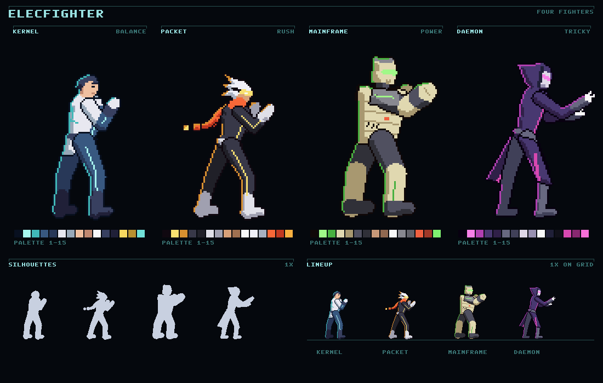

| | KERNEL | PACKET | MAINFRAME | DAEMON |
|---|---|---|---|---|
| 役 | バランス | ラッシュ | パワー | トリッキー |
| ひとこと | システムの核。回路の線の入ったスーツ、落ち着いた手 | 待たない配達人。マフラーからデータが流れ出る | 歩くサーバーの筐体。立ち上がりは遅いが落ちない | 誰も起動していない裏のプロセス。見た所で分かれる（fork） |
| 形（影絵） | 中背、白い短い上着、まっすぐ | 細身、後ろへ流れる銀の髪とマフラー | 幅の広い箱、小さな四角い頭 | 背が高く細い、尖ったフード、二つに割れた裾 |
| 光る色 | 青緑（TRON） | 琥珀（AMBER） | 緑（PHOSPHOR） | 赤紫 |
| 主な色 | 紺のスーツ、白い上着と手袋、黒い靴 | 炭色のスーツ、橙赤のマフラー、銀の髪、琥珀のゴーグル | クリームの外装、黒鉛色の関節、鋼の肩当て、赤い警告灯 | 濃い紫のコート、白い仮面、赤紫の裏地と目 |
| 立ちの背丈（ドット） | 90 | 90（髪を含む） | 100 | 96（フードを含む） |
| 1 ポーズのセル（平均 / 最大） | 15.9 / 18 | 17.4 / 20 | 20.4 / 23 | 18.6 / 21 |

- **見分け方**: 影絵だけで 4 人が分かる（上の図の左下）。明るさも分けた: KERNEL は白い上と紺の下、PACKET は暗い体に明るい橙、MAINFRAME は全体が明るい、DAEMON は全体が暗く顔だけ白い。同じ格闘家どうしの 2P の色はパレットだけで作る（2.1）
- 光る色を elecdex の 3 つのテーマに 1 人ずつ当てた（DAEMON だけテーマの外の赤紫）。HUD とステージは TRON のまま
- **KERNEL**: 体に沿う回路の線（脚、前腕、上着の前の縁）が青緑に光る。上着は前が開いて、胸の紺に線が通る。鉢巻や道着のような、ジャンルの有名な組み合わせは避けた（8 章）
- **PACKET**: マフラーの 2 本の端が後ろへ波打って流れ、端から四角い「パケット」（橙と琥珀の 4 点と 3 点の四角）がちぎれて続く。速さを形で見せる。手足に琥珀の線
- **MAINFRAME**: 胴が筐体（ラックの段の線、緑のランプの列、赤い警告灯、通気の溝）、頭は緑のスリットのバイザーの箱。前腕と拳が大きな外装。投げは相手を頭の上へ持ち上げる（11.3）
- **DAEMON**: フードの中は白い仮面と赤紫の 2 つの目。コートの裾は脚ごとに分かれ（fork）、動くと後ろへ広がって赤紫の裏地が見える。指は白い爪。手足が長く、届く距離が長い
- 背丈: 1.4 の勧め（88）に近いのは KERNEL と PACKET。MAINFRAME（100）と DAEMON（96）は形のために高くした。どちらもジャンプの頂点で HUD にかからない。セルは 4 人の平均で 1 ポーズ 18.1 と、1.4 の見積もり（18 セル、4 人で約 655 KB）どおり

### 11.2 ポーズとセル

1 人 14 ポーズ（立ち、歩き、しゃがみ、ジャンプ、弱パンチ、強パンチ、弱キック、強キック、ガード、やられ、投げ、対空、KO、勝ち）。それぞれの図の上の段が**等倍**（画面の大きさ）、下の段が 2 倍で **16×16 のセルの格子**を薄く重ね、セルの数を書いた（空のセルは持たない。格子の位置はポーズごとにセルがいちばん少なくなる所に置く。ポーズの表がセルの位置を持つので、ほかと揃える必要はない）。右が立ちの 3 倍とパレット（1〜15）。

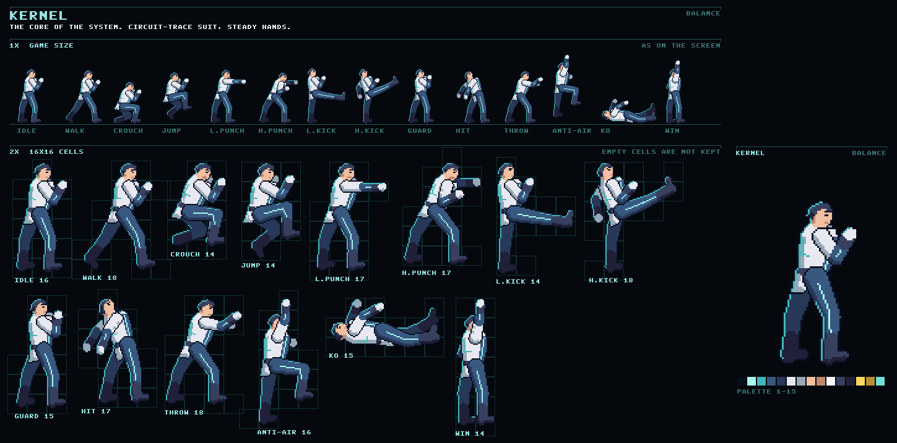
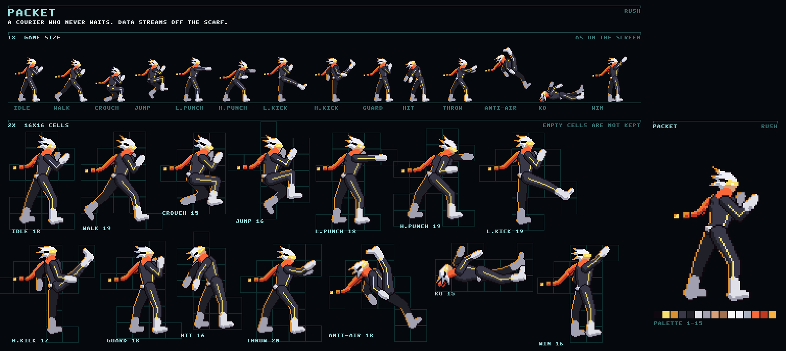
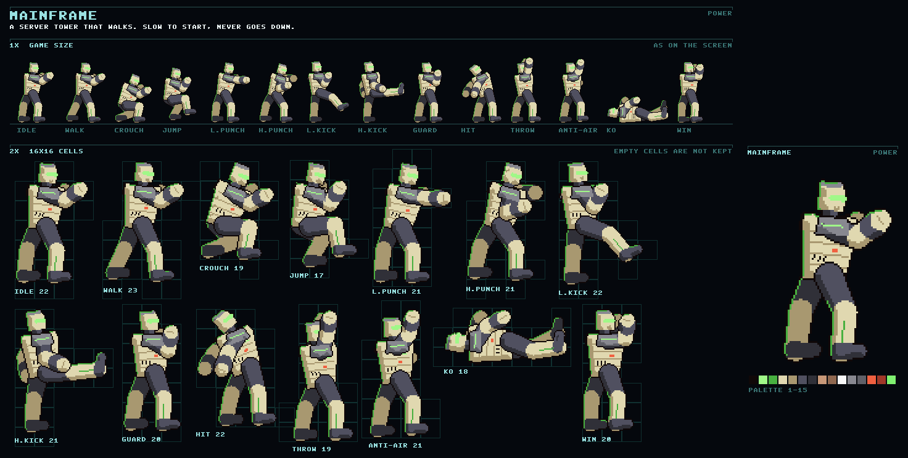
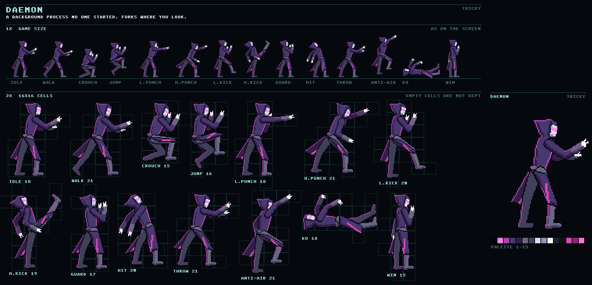

| ポーズ | KERNEL | PACKET | MAINFRAME | DAEMON |
|---|---|---|---|---|
| 立ち | 16 | 18 | 22 | 18 |
| 歩き | 18 | 19 | 23 | 21 |
| しゃがみ | 14 | 15 | 19 | 15 |
| ジャンプ | 14 | 16 | 17 | 16 |
| 弱パンチ | 17 | 18 | 21 | 18 |
| 強パンチ | 17 | 19 | 21 | 21 |
| 弱キック | 14 | 19 | 22 | 20 |
| 強キック | 18 | 17 | 21 | 19 |
| ガード | 15 | 18 | 20 | 17 |
| やられ | 17 | 16 | 22 | 20 |
| 投げ | 18 | 20 | 19 | 21 |
| 対空 | 16 | 18 | 21 | 21 |
| KO | 15 | 15 | 18 | 18 |
| 勝ち | 14 | 16 | 20 | 15 |

- どれも 1.4 の上限（32 セル、枠 128×112）に入る。いちばん大きな枠は MAINFRAME の KO（100×45）と投げ（50×108、腕を上げる）
- パレットは 1 輪郭、2 光、3 光の暗い方（外の縁の線）、4〜5 主、6〜7 差し色、8〜9 肌（MAINFRAME は使わない）、10 白、11〜12 髪（MAINFRAME は鋼、DAEMON はフードの内）、13〜14 3 つ目の材質（マフラー、警告灯、裏地）、15 技の軌跡の予備。2.5 の案（1 輪郭、2〜3 縁の光、4〜5 主、6〜7 差し色、8〜9 肌、10 目と光）どおり

### 11.3 画面（3 倍）

等倍の 10 枚を並べたもの（実際の大きさで読めるかの確かめ）:

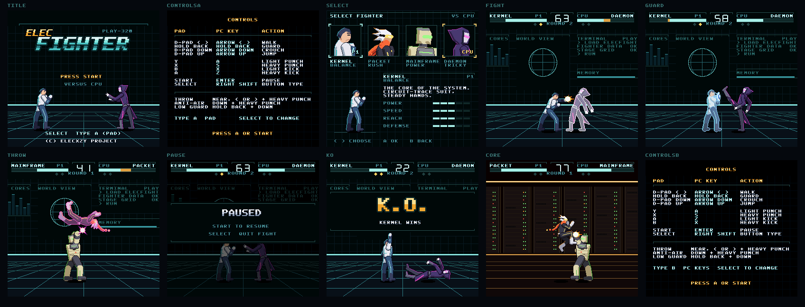

**タイトル**: 地平線と格子の床だけのステージ（壁を外した GRID）の上に、ロゴ「ELEC / FIGHTER」。FIGHTER は ELECAIRCOMBAT と同じく ELECLANCE の字体を 4 倍にした斜体で、白から青緑の平らな段、暗い縁と外の光の縁、ELEC は琥珀。ロゴの上に elecdex のペインの罫線と両端の目盛り、右に暗い副題 PLAY-320。両脇に KERNEL と DAEMON が向き合う。PRESS START、VERSUS CPU、ボタンの組（SELECT で替える）、(C) ELECXZY PROJECT。

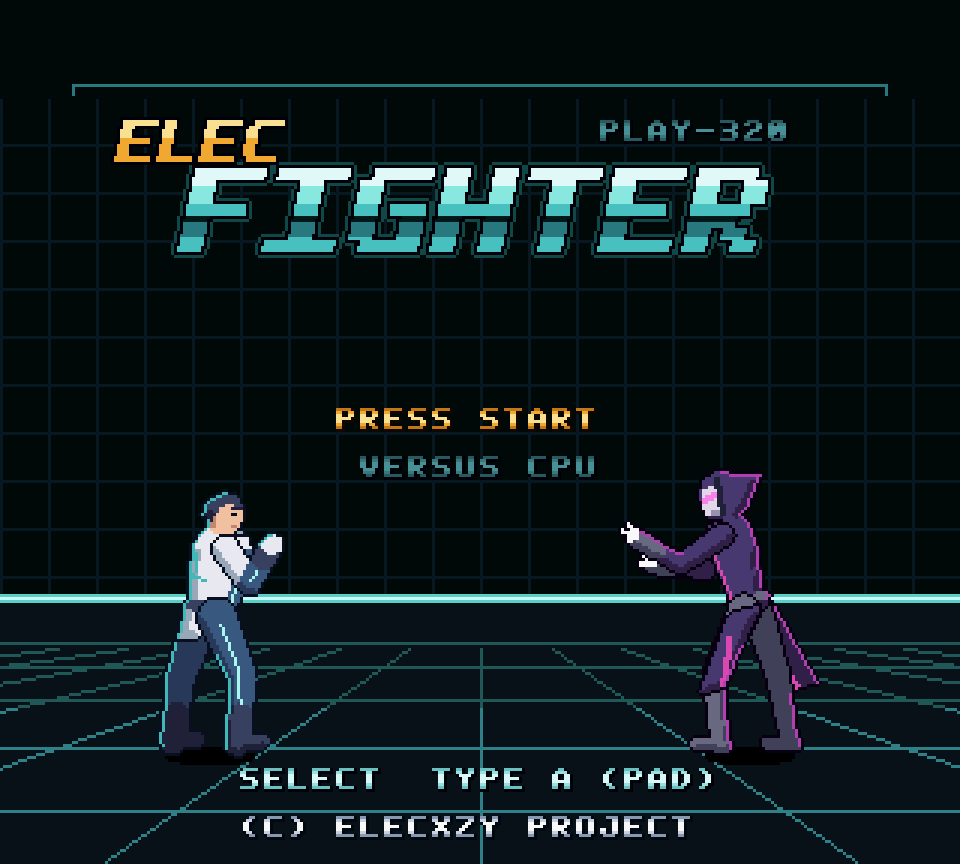

**操作の画面**（ELECAIRCOMBAT、ELECDRILL と同じ PAD | PC KEY | ACTION の表）: TYPE A（パッドの並び）と TYPE B（キックを入れ替えた PC のキーの並び）。投げ、対空、下段ガードを下に 3 行。


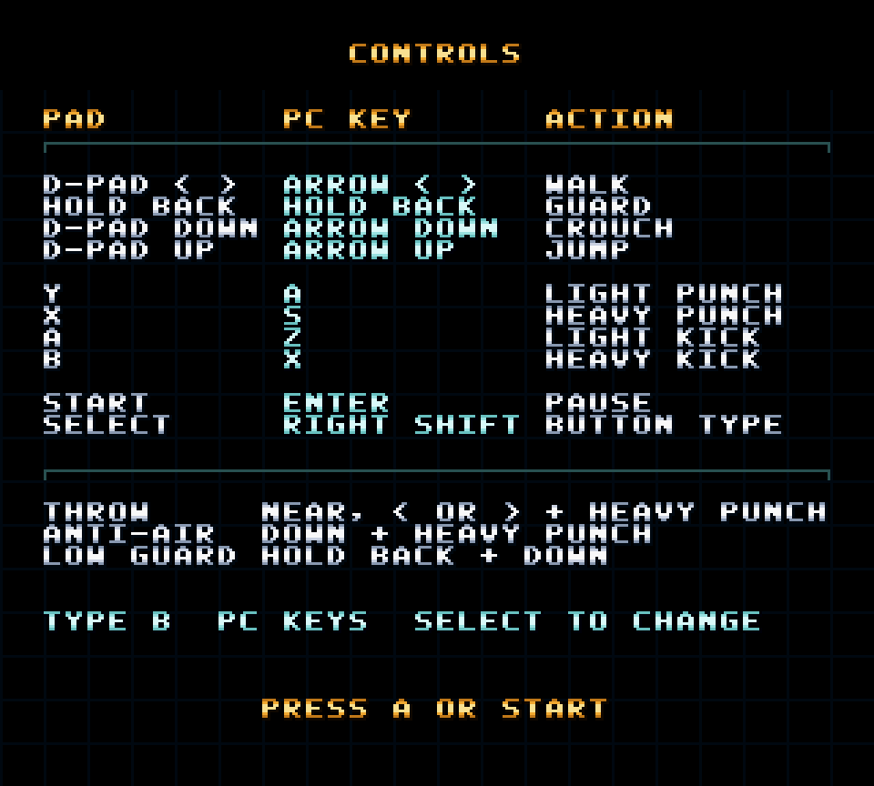

**格闘家の選択**: 4 人の胸像（64×64、背景のタイル。体を 2.2 倍の大きさで描き直したもので、拡大ではない）、P1 のカーソル（青緑の角）と CPU のカーソル（琥珀の角）、選んだ格闘家の全身（スプライト）、役、ひとこと、4 本の 1 色のバー（POWER、SPEED、REACH、DEFENSE、5 段）。

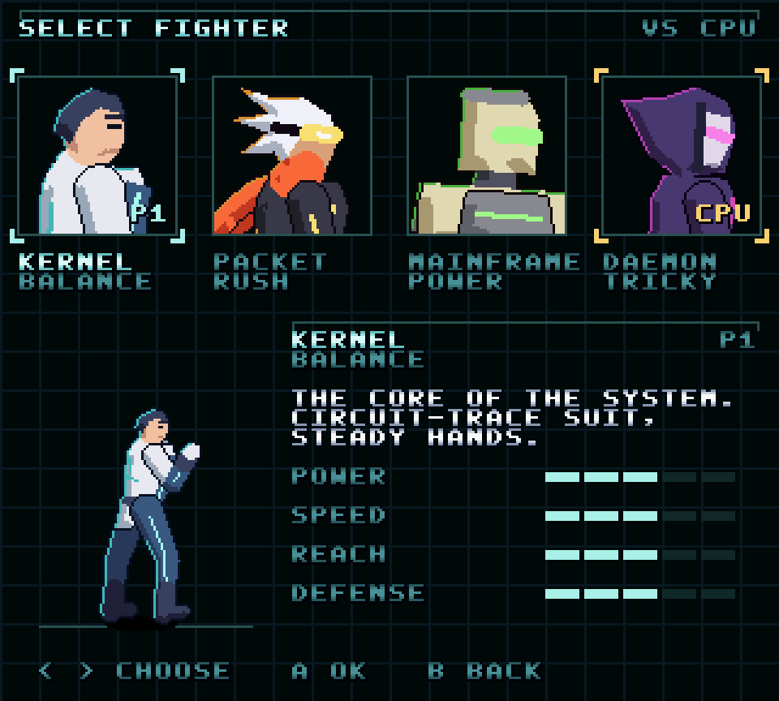

**戦い（GRID）**: KERNEL の強パンチが DAEMON に当たったヒットストップの瞬間。当たった側のパレットを白い輪郭と明るい塗りに替え（2.5）、拳の先にヒットの火花（32×32）。HUD は上の 40 ドット: 両側に elecdex のペインの見出し（罫線と目盛り、名前、暗い P1 / CPU）、その下に 1 色の LIFE のバー（減ったばかりの分は琥珀で、少し遅れて縮む）、真ん中に細い線の TIME（16×16 の数字）と ROUND、内側に取ったラウンドの菱形の灯。奥の壁は elecdex のペイン（CPU のコアのバー、地球、端末、メモリ、プロセス）を暗い色で、地平線は光る線、床は遠近の格子（6.3 の (a)）。揺れ（1〜2 ドット）は止まった絵では見えないので描いていない。

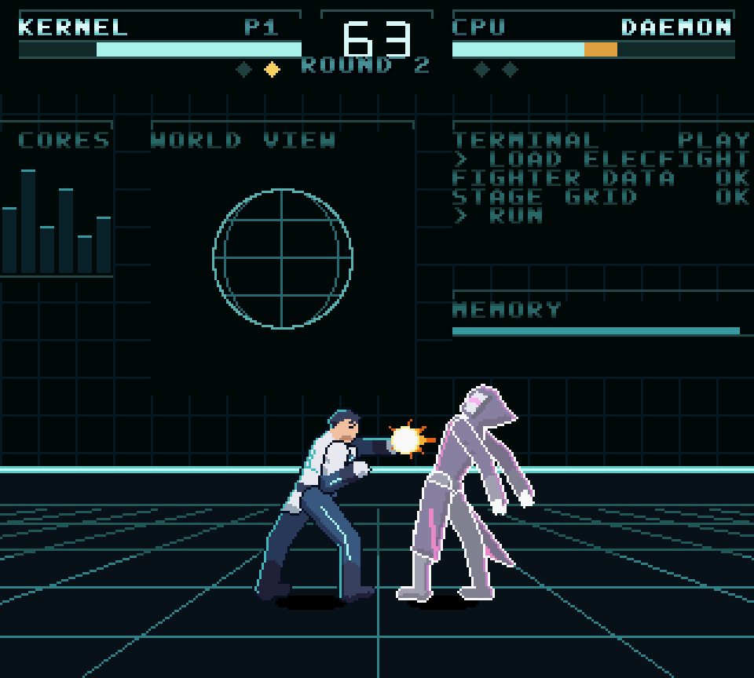

**ガード**: DAEMON の強キックを KERNEL がガード。ガードした側のパレットを青白に寄せ、青白の弧の火花。体力は削りの分だけ琥珀。

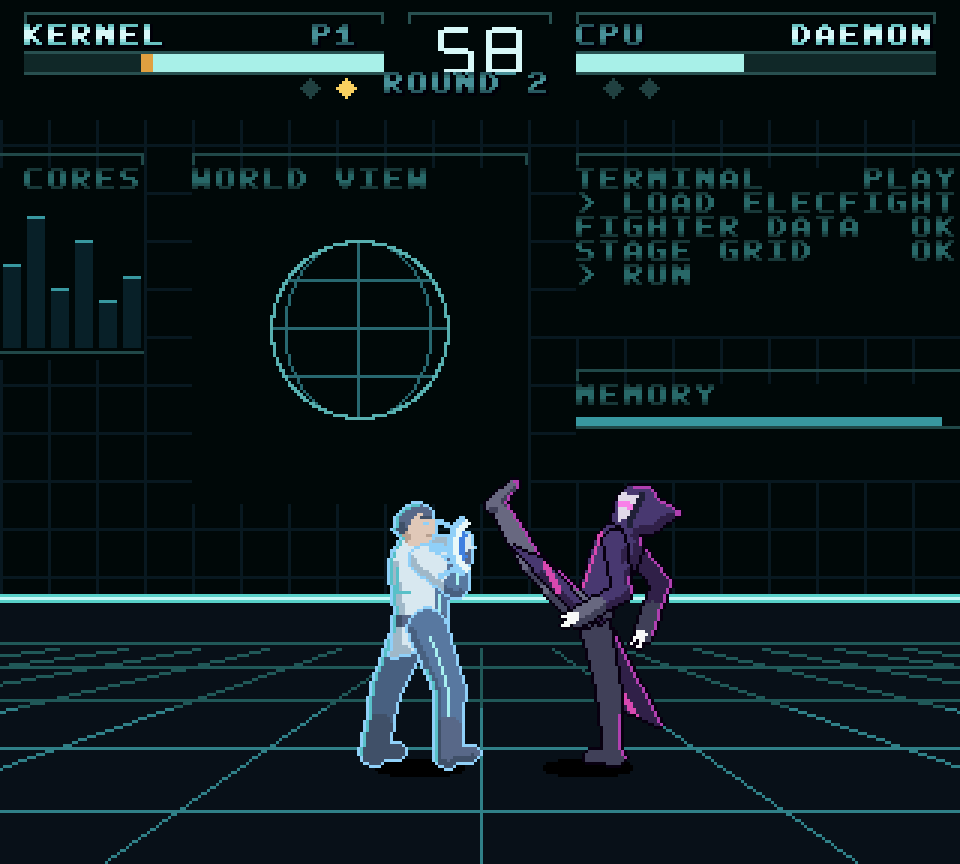

**投げ**: MAINFRAME が PACKET を頭の上へ持ち上げる。投げられた側を赤紫に寄せ、赤紫の閃光。

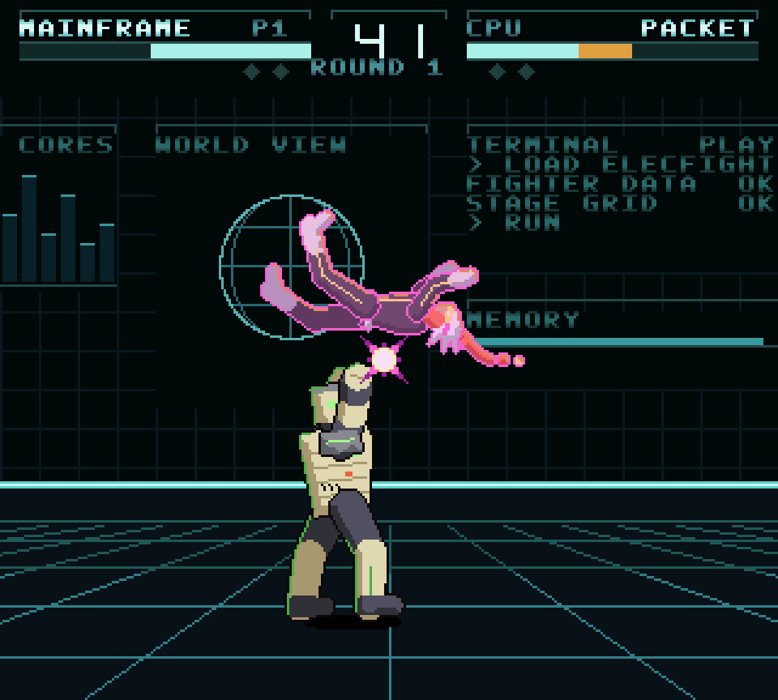

**一時停止**: ステージと格闘家と効果のパレットを黒へ 60% 混ぜる（`palMix`。HUD はそのまま）。真ん中に BG1 の帯（スプライトより前、地を塗り、上下に罫線と目盛り）で PAUSED、START TO RESUME、SELECT QUIT FIGHT。

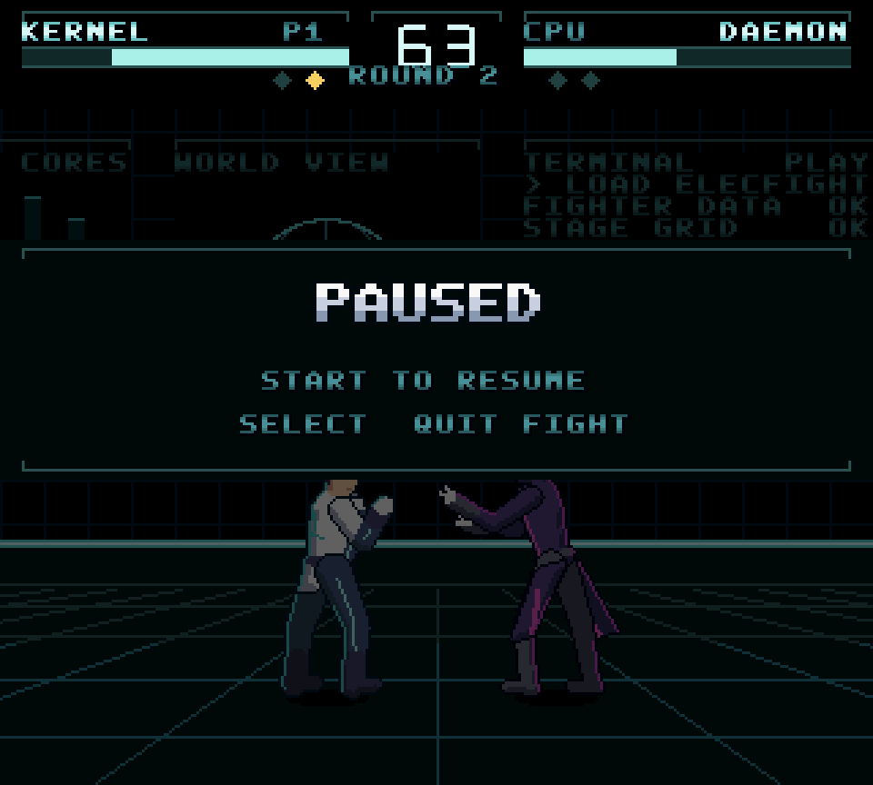

**KO**: 同じ帯に K.O.（字体を 4 倍、琥珀）と KERNEL WINS。KERNEL の 2 つ目の灯が点き、DAEMON の体力は空。勝ちのポーズと KO のポーズ。

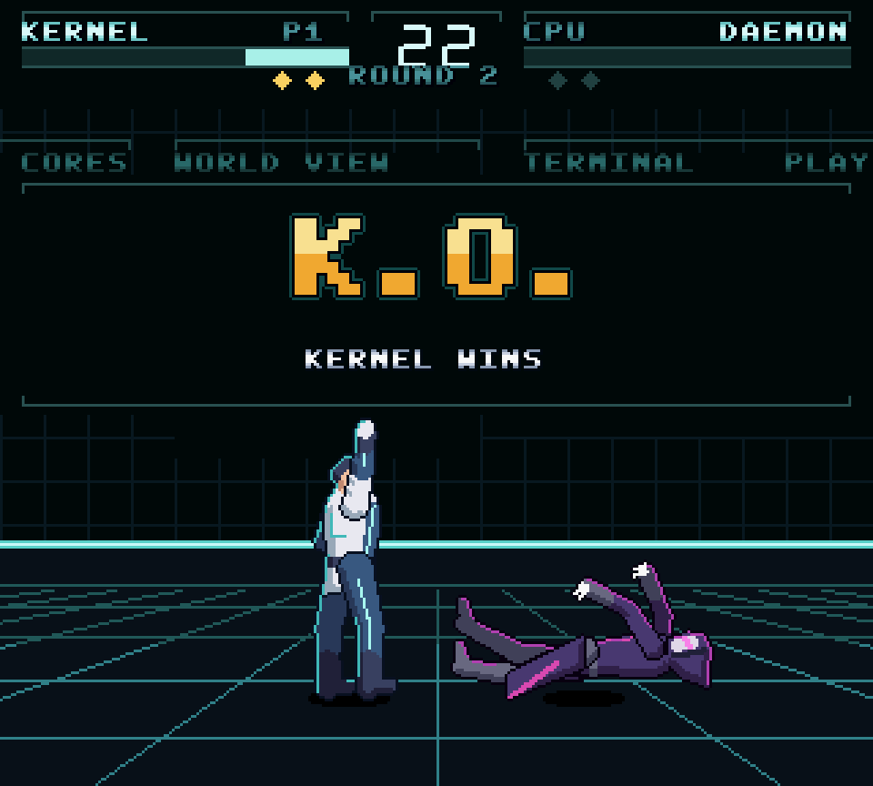

**CORE**（2 つ目のステージ）: サーバーの棚の通路、ラックの段と緑・琥珀・赤のランプ、天井の光の帯。床は 6.3 の (b)（縦の線のない、奥ほど詰まる横の線）で、琥珀の色。PACKET の跳び込みを MAINFRAME の対空が迎える。

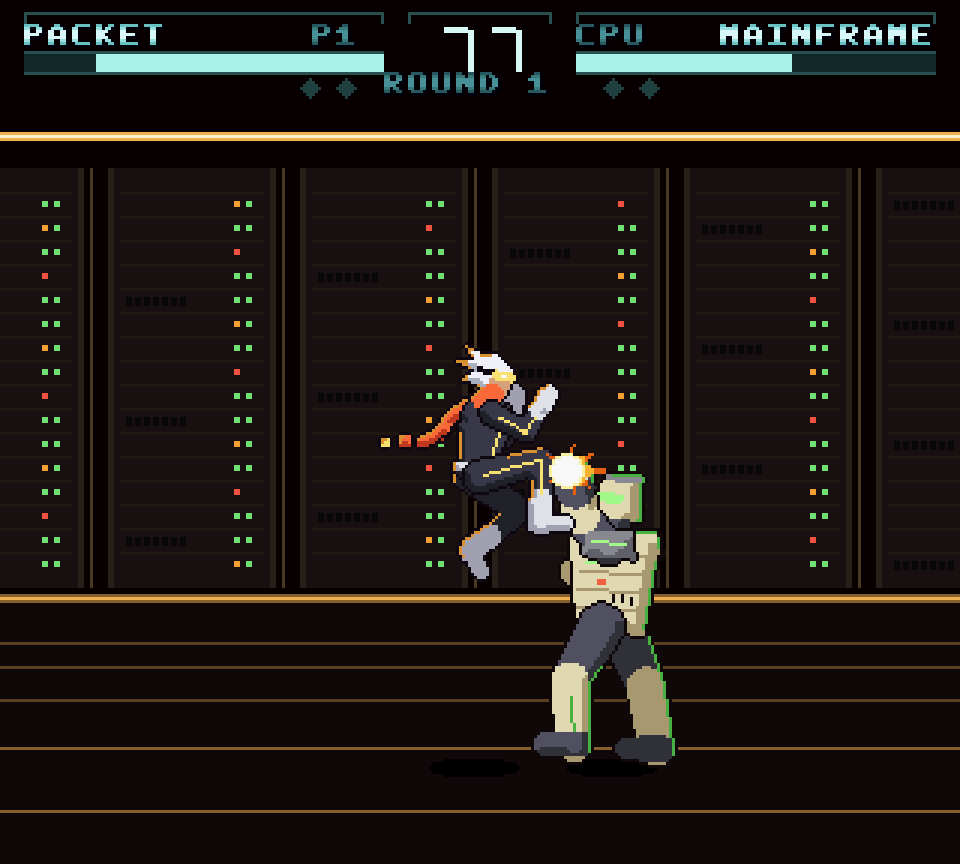

### 11.4 数（スクリプトが数えたもの）

| 画面 | スプライト | いちばん混んだ行 | タイル（字体 + BG0 + BG1 + スプライト） | パレット（背景 / スプライト） |
|---|---|---|---|---|
| タイトル | 38 | 10 | 64 + 127 + 90 + 140 = 421 | 6 / 3 |
| 操作 A、B | 0 | 0 | 64 + 4 + 2 = 70 | 4 / 0 |
| 選択 | 31 | 5 | 64 + 177 + 10 + 69 = 320 | **8** / 3 |
| 戦い | 42 | 11 | 64 + 260 + 25 + 168 = 517 | 4 / 4 |
| ガード | 39 | 9 | 64 + 260 + 24 + 156 = 504 | 4 / 4 |
| 投げ | 41 | 8 | 64 + 260 + 19 + 164 = 507 | 4 / 4 |
| 一時停止 | 38 | 10 | 64 + 260 + 69 + 140 = 533 | 5 / 3 |
| KO | 36 | 13 | 64 + 260 + 55 + 132 = 511 | 6 / 3 |
| CORE | 42 | 8 | 64 + 18 + 14 + 168 = 264 | 3 / 4 |

- **1 行のスプライト**: いちばん混んだ行で 13（上限 32）。1.3 の見積もり（最悪 22）の内側。スプライトは 2 人のセル、影（1 人 16×16 を 2 個、片方は `FLIP_H`）、火花
- **タイル**: GRID と CORE の BG0 は 512 ドット幅のステージ全部の数（その画面に見えている分ではない）。字体（64）と同じタイルは数えない。スプライトはいま見せているポーズのセル × 4 と効果。戦いの画面は 2.2 の割り当てのとおり、P1 と P2 の部屋（各 128）を取った上で、字体 64、ステージ 260（割り当て 320）、HUD 25（割り当て 32 と大きな数字 40）、効果で収まる
- **GRID の床のタイル**: 最初の素直な絵（縦の線を 40 ドットごと、地平線のすぐ下から）はステージだけで 570 枚ほどと、割り当ての 320 を越えた。床の縦の線は 1 本ずつ傾きが違い、通るマスがほぼすべて別のタイルになるため。**縦の線を 80 ドットごとに、地平線の 16 行下から、カメラが動いても見えない所には描かない**で 260 枚（床 207、壁 51、地平線 2）。壁のグラフは 1 マス幅のバー（満ちたマス、空のマス、上端のマスだけ）、地球は線を減らして左右対称（反転でタイルを共有）、文字は字体のタイル
- **パレット**: 選択の画面だけ背景の 8 本を全部使う（ステージ、白い字、4 人の胸像、HUD、暗い字）。P1 と CPU の印はカーソルと同じスプライトのパレット（13）の字。戦いは背景 0 ステージ、1 壁の字、3 HUD、4 暗い字（5 白い字、6 琥珀の字、7 ロゴと KO は場面で）、スプライト 8 P1、9 P2、10 火花、11 影（2.5 どおり）
- 当たり、ガード、投げの色は格闘家のスロット（8 か 9）にパレットを書くだけ（2.5）。輪郭を白、青白、赤紫にし、塗りを 25〜35% その色へ寄せた

### 11.5 elecdex の中で

ELEC-16 のペイン（README の PLAY-320 の画面）の液晶に、11.3 の戦いの画面を等倍で置いた（液晶は 1 倍の 320×288）。

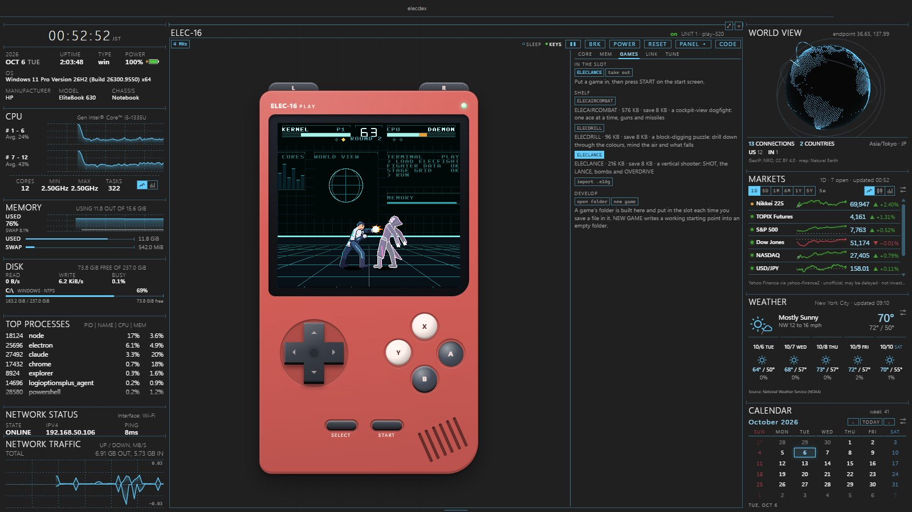
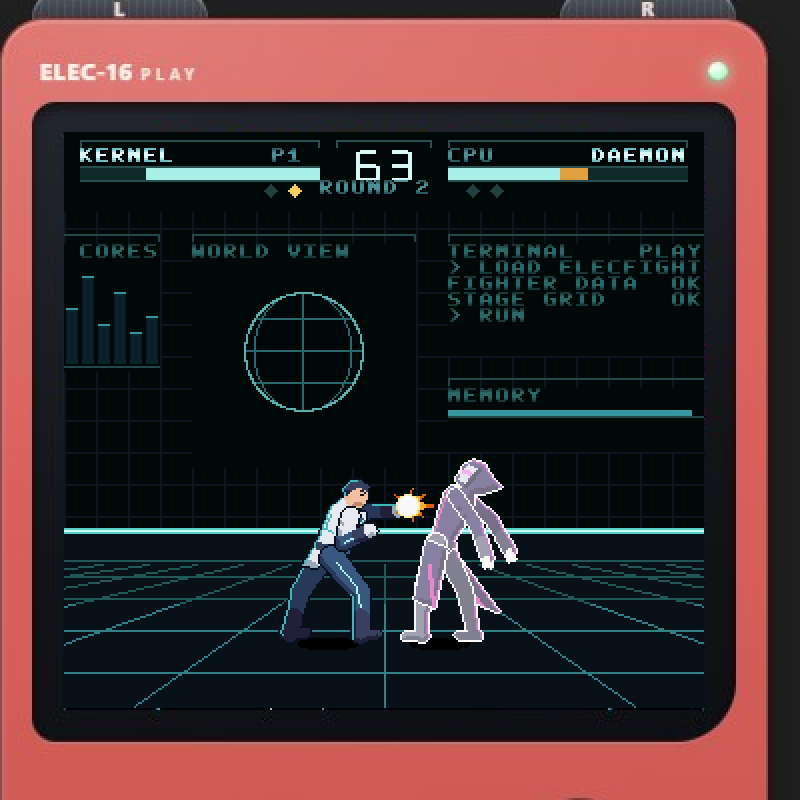

### 11.6 モックから分かったこと、決めてほしいこと

- 等倍で見て、88〜100 ドットの格闘家は 2 人と火花で手応えのある大きさ。顔の細部（目は 2 点の線）は等倍ではほとんど見えないので、**誰かは形と色で分かるようにした**（影絵、明るさ、光る色）
- 文字の多い壁（端末の行）は HUD の字と同じ字体なので、K.O. や PAUSED の字と重なると読みにくかった。**帯（BG1 の前、地を塗る）**で切り分けた。帯は塗りのタイル 1 枚と罫線だけ
- 操作の画面は壁も床もない格子だけにした（ELECAIRCOMBAT の暗い空と同じ考え。地平線が表の行を横切ったため）

| | 問い | 案 |
|---|---|---|
| Q11 | 4 人の見た目と名前（KERNEL、PACKET、MAINFRAME、DAEMON） | このまま。直したい所（顔、服、色）があれば姿勢と部品の数で描き直せる |
| Q12 | 背丈をそろえるか | 形の違いを優先して、MAINFRAME 100、DAEMON 96 のまま（カートリッジの見積もりは変わらない） |
| Q13 | 光る色をテーマに 1 人ずつ当てる（KERNEL 青緑、PACKET 琥珀、MAINFRAME 緑、DAEMON 赤紫） | 当てる。HUD とステージの色を替える設定（Q6）とは別 |
| Q14 | GRID の床の縦の線の間隔（80 ドット、地平線の 16 行下から） | このまま（タイルが割り当てに収まる細かさ）。CORE は縦の線のない床 |
| Q15 | 選択の画面の胸像を背景のタイル（4 人で背景のパレット 4 本）にするか | する。スプライトにすると 1 行の数とスプライトのパレットを取る |
| Q16 | KO と一時停止の帯 | このまま。ROUND と FIGHT の始まりも同じ帯にする |
| Q17 | 投げを格闘家ごとの絵にするか（MAINFRAME は持ち上げ、ほかは掴んで後ろへ） | する。投げられる側の絵（2.1 の「投げられ 2」）は共通の骨の姿勢から 4 人とも描ける |
